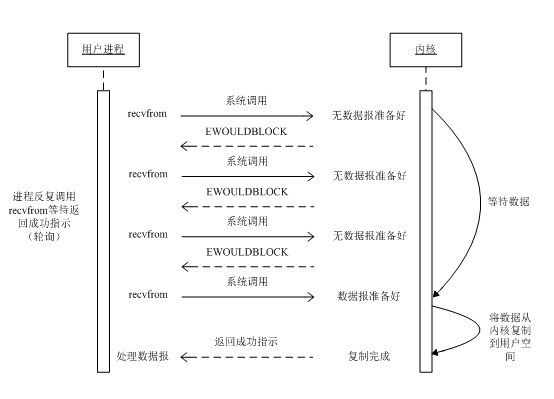
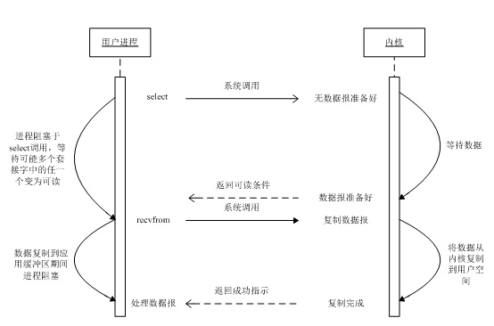
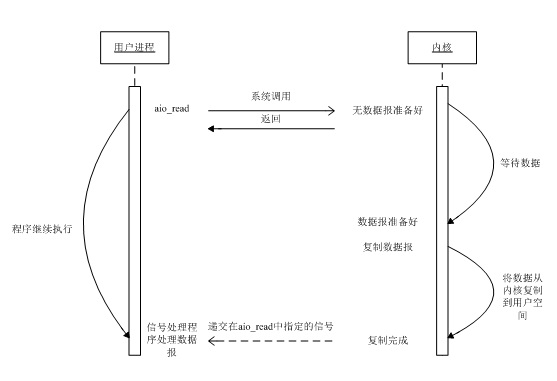

# BIO,NIO,AIO总结

通过对Linux系统的网络IO模型映射到java的IO实现.从而解释为什么BIO是同步阻塞,NIO是同步非阻塞,AIO是异步.

## Linux系统I/O基础

### Linux系统用户态与内核态

系统内存分为： 用户态内存  系统内核态内存

如上图所示，从宏观上来看，Linux操作系统的体系架构分为用户态和内核态（或者用户空间和内核）。<u>内核从本质上看是一种软件——控制计算机的硬件资源，并提供上层应用程序运行的环境。</u>用户态即上层应用程序的活动空间，应用程序的执行必须依托于内核提供的资源，包括CPU资源、存储资源、I/O资源等。为了使上层应用能够访问到这些资源，内核必须为上层应用提供访问的接口：即系统调用。

1. linux进程有4GB地址空间，如图所示：

   

   3G-4G大部分是共享的，是内核态的地址空间。这里存放整个内核的代码和所有的内核模块以及内核所维护的数据。

2. 特权级的概念：对于任何操作系统来说，创建一个进程是核心功能。创建进程要做很多工作，会消耗很多物理资源。比如分配物理内存，父子进程拷贝信息，拷贝设置页目录页表等等，这些工作得由特定的进程去做，所以就有了特权级别的概念。最关键的工作必须交给特权级最高的进程去执行，这样可以做到集中管理，减少有限资源的访问和使用冲突。inter x86架构的cpu一共有四个级别，0-3级，0级特权级最高，3级特权级最低。

3. 用户态和内核态的概念：

   1. 当一个进程在执行用户自己的代码时处于用户运行态（用户态），此时特权级最低，为3级，是普通的用户进程运行的特权级，大部分用户直接面对的程序都是运行在用户态。Ring3状态不能访问Ring0的地址空间，包括代码和数据；当一个进程因为系统调用陷入内核代码中执行时处于内核运行态（内核态），此时特权级最高，为0级。执行的内核代码会使用当前进程的内核栈，每个进程都有自己的内核栈。
   2. 用户运行一个程序，该程序创建的进程开始时运行自己的代码，处于用户态。<u>如果要执行文件操作、网络数据发送等操作必须通过write、send等系统调用，这些系统调用会调用内核的代码。进程会切换到Ring0，然后进入3G-4G中的内核地址空间去执行内核代码来完成相应的操作。内核态的进程执行完后又会切换到Ring3，回到用户态。</u>这样，用户态的程序就不能随意操作内核地址空间，具有一定的安全保护作用。这说的保护模式是指通过内存页表操作等机制，保证进程间的地址空间不会互相冲突，一个进程的操作不会修改另一个进程地址空间中的数据。

### Linux系统socket通信

应用首先在用户态内存中存储socket发送内容,然后通过用户态内存将发送内容复制到系统内核态内存,系统内核操控物理硬件网卡发送内容.

**socket()**,监听自己的网卡 网卡接收到内容 交给系统内核态  用户态内存从系统内核态内存读取内容
**send()**,从用户态内存复制到内核态内存放 通过物理网卡发送

### Linux系统网络I/O模型简介

Linux的内核将所有外部设备都看作一个文件来操作,对一个文件的读写操作会调用内核提供的系统命令,返回一个file descriptor(fd,文件描述符).而对一个socket的读写也会有相应的描述符,称为socketfd(socket描述符),描述符就是一个数字,它指向内核中的一个结构体(文件路径,数据区等一些属性).

在实际应用中，数据操作通常分为输入和输出，那么以输入为例，在操作系统中，一个数据的输入通常分为以下两个过程：

1. **等待数据准备好.**
2. **将准备好的数据从内核拷贝到用户空间**

根据Unix网络编程模型对I/O模型的分类,Unix提供了5种I/O模型,分别如下:

#### **同步阻塞I/O模型**

最常用的一个模型是同步阻塞 I/O 模型。其行为非常容易理解，其用法对于典型的应用程序来说都非常有效。在调用 `read` 系统调用时，应用程序会阻塞并对内核进行上下文切换。然后会触发读操作，当响应返回时（从我们正在从中读取的设备中返回），数据就被移动到用户空间的缓冲区中。然后应用程序就会解除阻塞（`read` 调用返回）

**该模型对应java中的BIO.**

#### **同步非阻塞I/O模型:**

 同步阻塞 I/O 的一种效率稍低的变种是同步非阻塞 I/O。在这种模型中，设备是以非阻塞的形式打开的。这意味着 I/O 操作不会立即完成，`read`操作可能会返回一个错误代码，说明这个命令不能立即满足（`EAGAIN` 或 `EWOULDBLOCK`）

当一个应用进程像这样对一个非阻塞描述符循环调用recvfrom时，我们称之为轮询(polling)。应用进程只需轮询内核，以查看某个操作是否就绪。这么做往往耗费大量CPU时间。

#### **I/O复用模型:**

I/O 复用有时又被称为 事件驱动 I/O, 它的最大优势在于，我们可以将感兴趣的多个I/O事件（更精确的说，应该是 I/O 所对应的文件描述符）注册到 select/poll/epoll/kqueue 之中某一个系统调用上（很多时候，这些系统调用又被称为**多路复用器。**假设此时我们选择了 select() ）。此后，调用进程会阻塞在 select() 系统调用之上（而不是阻塞在真正的 I/O 系统调用（如 read(), write() 等）上）。select() 会负责监视所有已注册的 I/O 事件，一旦有任意一个事件的数据准备好，那么 select() 会立即返回，此时我们的用户进程便能够进行数据的复制操作。

**该模型对应java的NIO**

总而言之，I/O 复用的优点就在于可以同时等待多个I/O事件；而缺点是会进行两次系统调用（一次 select(), 一次 read() ）。

#### **信号驱动I/O模型:**

在这种模型下，我们首先开启套接字的信号驱动式I/O功能，并通过sigaction系统调用安装一个信号处理函数。改系统调用将立即返回，我们的进程继续工作，也就是说他没有被阻塞。当数据报准备好读取时，内核就为该进程产生一个SIGIO信号。我们随后就可以在信号处理函数中调用read读取数据报，并通知主循环数据已经准备好待处理，也可以立即通知主循环，让它读取数据报。

无论如何处理SIGIO信号，这种模型的优势在于等待数据报到达期间进程不被阻塞。主循环可以继续执行，只要等到来自信号处理函数的通知：既可以是数据已准备好被处理，也可以是数据报已准备好被读取。

#### **异步非阻塞I/O模型**

异步非阻塞 I/O 模型是一种处理与 I/O 重叠进行的模型。读请求会立即返回，说明 `read` 请求已经成功发起了。在后台完成读操作时，应用程序然后会执行其他处理操作。当 `read` 的响应到达时，就会产生一个信号或执行一个基于线程的回调函数来完成这次 I/O 处理过程。

在一个进程中为了执行多个 I/O 请求而对计算操作和 I/O 处理进行重叠处理的能力利用了处理速度与 I/O 速度之间的差异。当一个或多个 I/O 请求挂起时，CPU 可以执行其他任务；或者更为常见的是，在发起其他 I/O 的同时对已经完成的 I/O 进行操作。

**java中的AIO对应使用此模型**

#### I/O模型的比较

 通过上面的讨论可以清楚的看到，同步 I/O 总会有阻塞的过程，这就是“同步”最本质的特征。而如前文所说，异步 I/O 的最大特点在于用户进程均不阻塞。 用户进程告知内核启动某一 I/O 操作， 并让内核全权代为执行（包括等待数据及拷贝数据至用户空间），此后用户进程可以立即执行其它的任何操作。等到所有 I/O 过程执行完成后， 内核会通知用户程。由此可见，在整个过程中，用户进程均不阻塞。

本段内容来自:[Linux 网络I/O模型](https://www.cnblogs.com/lojunren/p/3850057.html)	

#### java的I/O的演进

​		在JDK1.4推出Java NIO之前，基于Java的所有Socket通信都采用了同步阻塞模式（BIO），这种一请求一应答的通信模型简化了上层的应用开发，但是在性能和可靠性方面却存在着巨大的瓶颈。因此，在很长一段时间里，大型的应用服务器都采用C或者C++语言开发，因为它们可以直接使用操作系统提供的异步I/O或者AIO能力。当并发访问量增大、响应时间延迟增大之后，采用Java BIO开发的服务端软件只有通过硬件的不断扩容来满足高并发和延时，极大地增加了企业的成本，并且随着集群规模的不断膨胀，系统的可维护性也面临巨大的挑战，只能通过采购性能更高的硬件服务器来解决问题，这会导致恶性循环。

　　正是由于Java传统BIO的拙劣表现，才使得Java支持非阻塞I/O的呼声日渐高涨，最终，JDK1.4版本提供了新的NIO类库，Java终于也可以支持非阻塞I/O了。

**JDK1.4推出 NIO 1.0 。**新增java.nio包，提供了很多进行异步I/O开发的API和类库，主要的类和接口如下。

- 进行异步I/O操作的缓冲区ByteBuffer等；
- 进行异步I/O操作的管道Pipe；
- 进行各种I/O操作（异步或者同步）的Channel，包括ServerSocketChannel和SocketChannel;
- 多种字符集的编码能力和解码能力；
- 实现非阻塞I/O操作的多路复用器selector;
- 基于流行的Perl实现的正则表达式类库；
- 文件通道FileChannel。

　　新的NIO类库的提供，极大地促进了基于Java的异步非阻塞编程的发展和应用，但是，它依然有不完善的地方，特别是对文件系统的处理能力仍显不足，主要问题如下。

- 没有统一的文件属性（例如读写权限）；
- API能力比较弱，例如目录的级联创建和递归遍历，往往需要自己实现；
- 底层存储系统的一些高级API无法使用；
- 所有的文件操作都是同步阻塞调用，不支持异步文件读写操作。

　　**JDK1.7推出 NIO 2.0。**主要提供了如下三个方面的改进。

- 提供能够批量获取文件属性的API，这些API具有平台无关性，不与特性的文件系统相耦合，另外它还提供了标准文件系统的SPI，供各个服务商扩展实现；
- 提供AIO功能，支持基于文件的异步I/O操作和针对网络套接字的异步操作；
- 完成JSR定义的通道功能，包括对配置和多播数据报的支持等。

 　　到目前为止大家对Java的I/O演进有了一个更加直观的认识。后面将会对阻塞I/O和非阻塞I/O进行详细讲解，同时给出代码示例。大家就能够对传统的阻塞I/O的弊端和非阻塞I/O的优点有更加深刻的体会。

## java的I/O通信

### BIO(同步阻塞)

##### 线程池缓冲的同步阻塞

### NIO(同步非阻塞)

### AIO(异步)

## 总结

## 几种IO模型的功能和特性对比

### 