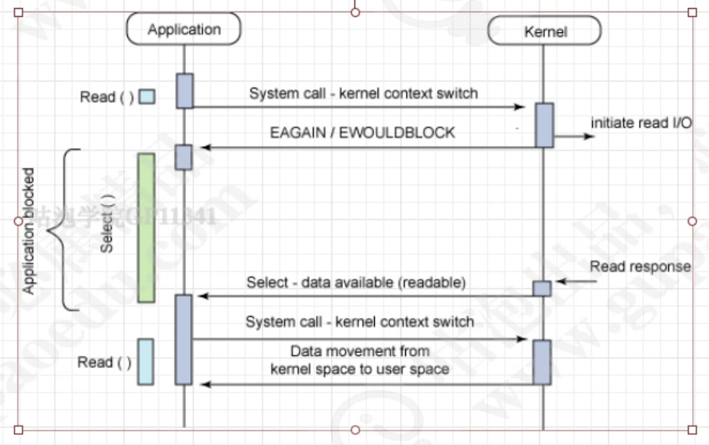
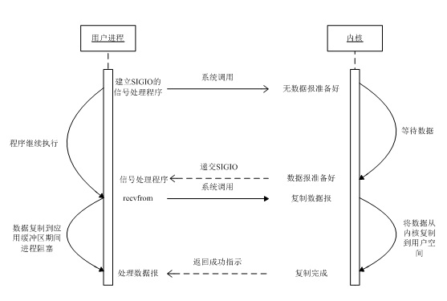
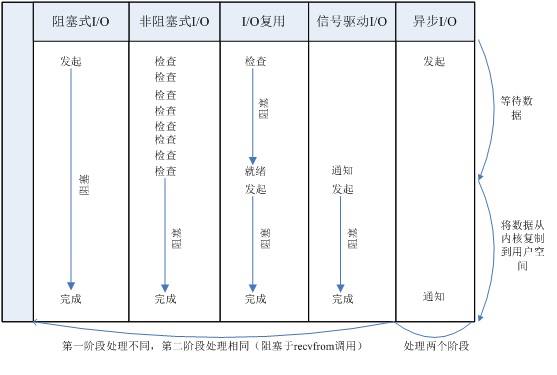

# BIO,NIO,AIO总结

通过对Linux系统的网络IO模型映射到java的IO实现.从而解释为什么BIO是同步阻塞,NIO是同步非阻塞,AIO是异步.

## Linux系统I/O基础

### Linux系统用户态与内核态

系统内存分为： 用户态内存  系统内核态内存


如上图所示，从宏观上来看，Linux操作系统的体系架构分为用户态和内核态（或者用户空间和内核）。<u>内核从本质上看是一种软件——控制计算机的硬件资源，并提供上层应用程序运行的环境。</u>用户态即上层应用程序的活动空间，应用程序的执行必须依托于内核提供的资源，包括CPU资源、存储资源、I/O资源等。为了使上层应用能够访问到这些资源，内核必须为上层应用提供访问的接口：即系统调用。

1. linux进程有4GB地址空间，如图所示：

   

   3G-4G大部分是共享的，是内核态的地址空间。这里存放整个内核的代码和所有的内核模块以及内核所维护的数据。

2. 特权级的概念：对于任何操作系统来说，创建一个进程是核心功能。创建进程要做很多工作，会消耗很多物理资源。比如分配物理内存，父子进程拷贝信息，拷贝设置页目录页表等等，这些工作得由特定的进程去做，所以就有了特权级别的概念。最关键的工作必须交给特权级最高的进程去执行，这样可以做到集中管理，减少有限资源的访问和使用冲突。inter x86架构的cpu一共有四个级别，0-3级，0级特权级最高，3级特权级最低。

3. 用户态和内核态的概念：

   1. 当一个进程在执行用户自己的代码时处于用户运行态（用户态），此时特权级最低，为3级，是普通的用户进程运行的特权级，大部分用户直接面对的程序都是运行在用户态。Ring3状态不能访问Ring0的地址空间，包括代码和数据；当一个进程因为系统调用陷入内核代码中执行时处于内核运行态（内核态），此时特权级最高，为0级。执行的内核代码会使用当前进程的内核栈，每个进程都有自己的内核栈。
   2. 用户运行一个程序，该程序创建的进程开始时运行自己的代码，处于用户态。<u>如果要执行文件操作、网络数据发送等操作必须通过write、send等系统调用，这些系统调用会调用内核的代码。进程会切换到Ring0，然后进入3G-4G中的内核地址空间去执行内核代码来完成相应的操作。内核态的进程执行完后又会切换到Ring3，回到用户态。</u>这样，用户态的程序就不能随意操作内核地址空间，具有一定的安全保护作用。这说的保护模式是指通过内存页表操作等机制，保证进程间的地址空间不会互相冲突，一个进程的操作不会修改另一个进程地址空间中的数据。


### Linux系统socket通信

发送:应用首先在用户态内存中存储socket发送内容,然后通过用户态内存将发送内容复制到系统内核态内存,系统内核操控物理硬件网卡发送内容.

接收:tcp连接创建后,网卡收到内容 交给系统内核态  用户态内存从系统内核态内存读取内容

**socket()**,监听自己的网卡 网卡接收到内容 交给系统内核态  用户态内存从系统内核态内存读取内容
**send()**,从用户态内存复制到内核态内存放 通过物理网卡发送

### Linux系统网络I/O模型简介

Linux的内核将所有外部设备都看作一个文件来操作,对一个文件的读写操作会调用内核提供的系统命令,返回一个file descriptor(fd,文件描述符).而对一个socket的读写也会有相应的描述符,称为socketfd(socket描述符),描述符就是一个数字,它指向内核中的一个结构体(文件路径,数据区等一些属性).

在实际应用中，数据操作通常分为输入和输出，那么以输入为例，在操作系统中，一个数据的输入通常分为以下两个过程：

1. **等待数据准备好.**
2. **将准备好的数据从内核拷贝到用户空间**

根据Unix网络编程模型对I/O模型的分类,Unix提供了5种I/O模型,分别如下:

#### **同步阻塞I/O模型**

最常用的一个模型是同步阻塞 I/O 模型。其行为非常容易理解，其用法对于典型的应用程序来说都非常有效。在调用 `read` 系统调用时，应用程序会阻塞并对内核进行上下文切换。然后会触发读操作，当响应返回时（从我们正在从中读取的设备中返回），数据就被移动到用户空间的缓冲区中。然后应用程序就会解除阻塞（`read` 调用返回）

**该模型对应java中的BIO.**


#### **同步非阻塞I/O模型:**

 同步阻塞 I/O 的一种效率稍低的变种是同步非阻塞 I/O。在这种模型中，设备是以非阻塞的形式打开的。这意味着 I/O 操作不会立即完成，`read`操作可能会返回一个错误代码，说明这个命令不能立即满足（`EAGAIN` 或 `EWOULDBLOCK`）


当一个应用进程像这样对一个非阻塞描述符循环调用recvfrom时，我们称之为轮询(polling)。应用进程只需轮询内核，以查看某个操作是否就绪。这么做往往耗费大量CPU时间。

#### **I/O复用模型:**

I/O 复用有时又被称为 事件驱动 I/O, 它的最大优势在于，我们可以将感兴趣的多个I/O事件（更精确的说，应该是 I/O 所对应的文件描述符）注册到 select/poll/epoll/kqueue 之中某一个系统调用上（很多时候，这些系统调用又被称为**多路复用器。**假设此时我们选择了 select() ）。此后，调用进程会阻塞在 select() 系统调用之上（而不是阻塞在真正的 I/O 系统调用（如 read(), write() 等）上）。select() 会负责监视所有已注册的 I/O 事件，一旦有任意一个事件的数据准备好，那么 select() 会立即返回，此时我们的用户进程便能够进行数据的复制操作。

**该模型对应java的NIO**




总而言之，I/O 复用的优点就在于可以同时等待多个I/O事件；而缺点是会进行两次系统调用（一次 select(), 一次 read() ）。

#### **信号驱动I/O模型:**

在这种模型下，我们首先开启套接字的信号驱动式I/O功能，并通过sigaction系统调用安装一个信号处理函数。改系统调用将立即返回，我们的进程继续工作，也就是说他没有被阻塞。当数据报准备好读取时，内核就为该进程产生一个SIGIO信号。我们随后就可以在信号处理函数中调用read读取数据报，并通知主循环数据已经准备好待处理，也可以立即通知主循环，让它读取数据报。



无论如何处理SIGIO信号，这种模型的优势在于等待数据报到达期间进程不被阻塞。主循环可以继续执行，只要等到来自信号处理函数的通知：既可以是数据已准备好被处理，也可以是数据报已准备好被读取。

#### **异步非阻塞I/O模型**

异步非阻塞 I/O 模型是一种处理与 I/O 重叠进行的模型。读请求会立即返回，说明 `read` 请求已经成功发起了。在后台完成读操作时，应用程序然后会执行其他处理操作。当 `read` 的响应到达时，就会产生一个信号或执行一个基于线程的回调函数来完成这次 I/O 处理过程。


在一个进程中为了执行多个 I/O 请求而对计算操作和 I/O 处理进行重叠处理的能力利用了处理速度与 I/O 速度之间的差异。当一个或多个 I/O 请求挂起时，CPU 可以执行其他任务；或者更为常见的是，在发起其他 I/O 的同时对已经完成的 I/O 进行操作。

**java中的AIO对应使用此模型**

#### I/O模型的比较

 通过上面的讨论可以清楚的看到，同步 I/O 总会有阻塞的过程，这就是“同步”最本质的特征。而如前文所说，异步 I/O 的最大特点在于用户进程均不阻塞。 用户进程告知内核启动某一 I/O 操作， 并让内核全权代为执行（包括等待数据及拷贝数据至用户空间），此后用户进程可以立即执行其它的任何操作。等到所有 I/O 过程执行完成后， 内核会通知用户程。由此可见，在整个过程中，用户进程均不阻塞。



本段内容来自:[Linux 网络I/O模型](https://www.cnblogs.com/lojunren/p/3850057.html)	

#### java的I/O的演进

​		在JDK1.4推出Java NIO之前，基于Java的所有Socket通信都采用了同步阻塞模式（BIO），这种一请求一应答的通信模型简化了上层的应用开发，但是在性能和可靠性方面却存在着巨大的瓶颈。因此，在很长一段时间里，大型的应用服务器都采用C或者C++语言开发，因为它们可以直接使用操作系统提供的异步I/O或者AIO能力。当并发访问量增大、响应时间延迟增大之后，采用Java BIO开发的服务端软件只有通过硬件的不断扩容来满足高并发和延时，极大地增加了企业的成本，并且随着集群规模的不断膨胀，系统的可维护性也面临巨大的挑战，只能通过采购性能更高的硬件服务器来解决问题，这会导致恶性循环。

　　正是由于Java传统BIO的拙劣表现，才使得Java支持非阻塞I/O的呼声日渐高涨，最终，JDK1.4版本提供了新的NIO类库，Java终于也可以支持非阻塞I/O了。

**JDK1.4推出 NIO 1.0 。**新增java.nio包，提供了很多进行异步I/O开发的API和类库，主要的类和接口如下。

- 进行异步I/O操作的缓冲区ByteBuffer等；
- 进行异步I/O操作的管道Pipe；
- 进行各种I/O操作（异步或者同步）的Channel，包括ServerSocketChannel和SocketChannel;
- 多种字符集的编码能力和解码能力；
- 实现非阻塞I/O操作的多路复用器selector;
- 基于流行的Perl实现的正则表达式类库；
- 文件通道FileChannel。

　　新的NIO类库的提供，极大地促进了基于Java的异步非阻塞编程的发展和应用，但是，它依然有不完善的地方，特别是对文件系统的处理能力仍显不足，主要问题如下。

- 没有统一的文件属性（例如读写权限）；
- API能力比较弱，例如目录的级联创建和递归遍历，往往需要自己实现；
- 底层存储系统的一些高级API无法使用；
- 所有的文件操作都是同步阻塞调用，不支持异步文件读写操作。

　　**JDK1.7推出 NIO 2.0。**主要提供了如下三个方面的改进。

- 提供能够批量获取文件属性的API，这些API具有平台无关性，不与特性的文件系统相耦合，另外它还提供了标准文件系统的SPI，供各个服务商扩展实现；
- 提供AIO功能，支持基于文件的异步I/O操作和针对网络套接字的异步操作；
- 完成JSR定义的通道功能，包括对配置和多播数据报的支持等。

 　　到目前为止大家对Java的I/O演进有了一个更加直观的认识。后面将会对阻塞I/O和非阻塞I/O进行详细讲解，同时给出代码示例。大家就能够对传统的阻塞I/O的弊端和非阻塞I/O的优点有更加深刻的体会。


## java的I/O通信

### BIO(同步阻塞)

Client代码:

```java
package com.wenbin.bio2;

import java.io.BufferedReader;
import java.io.IOException;
import java.io.InputStreamReader;
import java.io.PrintWriter;
import java.net.Socket;

/**
 * @Auther: wenbin
 * @Date: 2019/6/12 06:10
 * @Description:
 */
public class TimeClient {

    public static void main(String[] args) {
        int port = 8080;

        try {
            // 连接
            Socket socket = new Socket("127.0.0.1", port);

            // 从socket中获得输入流
            BufferedReader in = new BufferedReader(new InputStreamReader(socket.getInputStream()));
            // 从socket中获得输出流
            PrintWriter out = new PrintWriter(socket.getOutputStream(), true);

            // 把消息写入输出流
            out.println("QUERY TIME ORDER");
            System.out.println("Send order 2 server succeed.");
            // 从输入流读取消息,因为都是英文不涉及enCode deCode
            String resp = in.readLine();
            System.out.println("Now is :" + resp);
        } catch (IOException e) {
            e.printStackTrace();
        }
    }
}

```

Server代码:

```java
package com.wenbin.bio2;

import java.io.IOException;
import java.net.ServerSocket;
import java.net.Socket;

/**
 * @Auther: wenbin
 * @Date: 2019/6/12 05:55
 * @Description:
 */
public class TimeServer {

    public static void main(String[] args) {
        int port = 8080;
        try {
            // 监听端口
            ServerSocket serverSocket = new ServerSocket(port);
            Socket socket = null;

            while (true) {
                // 没有连接接入的时候阻塞在这里等待连接.
                socket = serverSocket.accept();
                // 将连接交给线程处理
                new Thread(new TimeServerHandler(socket)).start();
            }
        } catch (IOException e) {
            e.printStackTrace();
        }
    }
}

```

TimeServerHandler代码:

```java
package com.wenbin.bio2;

import java.io.BufferedReader;
import java.io.IOException;
import java.io.InputStreamReader;
import java.io.PrintWriter;
import java.net.Socket;
import java.util.Date;

/**
 * @Auther: wenbin
 * @Date: 2019/6/12 05:59
 * @Description:
 */
public class TimeServerHandler implements Runnable {

    private Socket socket;

    public TimeServerHandler(Socket socket) {
        this.socket = socket;
    }

    @Override
    public void run() {
        BufferedReader in = null;
        PrintWriter out = null;

        try {
            // 从socket中获得输入流
            in = new BufferedReader(new InputStreamReader(socket.getInputStream()));
            // 从socket中获得输出流
            out = new PrintWriter(socket.getOutputStream(), true);

            String currentTime = null;
            String body = null;
            while ((body = in.readLine()) != null) {
                System.out.println("the time server receive order :" + body);

                currentTime = "QUERY TIME ORDER".equalsIgnoreCase(body)
                        ? new Date(System.currentTimeMillis()).toString() : "BAD ORDER";
                // 将相应消息写到输出流中
                out.println(currentTime);
            }
        } catch (IOException e) {
            e.printStackTrace();
        } finally {
            if (in != null) {
                try {
                    in.close();
                    in = null;
                } catch (IOException e1) {
                    e1.printStackTrace();
                }
            }
            if (out != null) {
                out.close();
                out = null;
            }
            if (this.socket != null) {
                try {
                    this.socket.close();
                } catch (IOException e1) {
                    e1.printStackTrace();
                }
                this.socket = null;
            }
        }
    }
}
```

##### 线程池缓冲的同步阻塞

这里只是将服务端接受到socket时候新建线程的代码改成了线程池实现所以只涉及服务端代码变更:

Server代码:

```java
package com.wenbin.bio2.thread.pool;

import com.wenbin.bio2.TimeServerHandler;

import java.io.IOException;
import java.net.ServerSocket;
import java.net.Socket;

/**
 * @Auther: wenbin
 * @Date: 2019/6/12 05:55
 * @Description:
 */
public class TimeServer {

    public static void main(String[] args) {
        int port = 8080;

        try {
            ServerSocket serverSocket = new ServerSocket(port);

            Socket socket = null;
            TimeServerHandlerExecutePool executor =
                    new TimeServerHandlerExecutePool(50, 10000);

            while (true) {
                // 没有连接接入的时候阻塞在这里等待连接.
                socket = serverSocket.accept();
                executor.execute(new TimeServerHandler(socket));
            }
        } catch (IOException e) {
            e.printStackTrace();
        }
    }
}
```

线程池代码:

```java
package com.wenbin.bio2.thread.pool;

import java.util.concurrent.ArrayBlockingQueue;
import java.util.concurrent.ExecutorService;
import java.util.concurrent.ThreadPoolExecutor;
import java.util.concurrent.TimeUnit;

/**
 * @Auther: wenbin
 * @Date: 2019/6/12 06:21
 * @Description:
 */
public class TimeServerHandlerExecutePool {

    private ExecutorService executorService;

    public TimeServerHandlerExecutePool(int maxPoolSize, int queueSizee) {
        executorService = new ThreadPoolExecutor(
                Runtime.getRuntime().availableProcessors()
                , maxPoolSize, 120L, TimeUnit.SECONDS
                , new ArrayBlockingQueue<Runnable>(queueSizee));
    }

    public void execute(Runnable task) {
        executorService.execute(task);
    }
}
```

### NIO(同步非阻塞)

Client代码:

```java
package com.wenbin.nio.echo;

import java.io.IOException;
import java.net.InetSocketAddress;
import java.nio.ByteBuffer;
import java.nio.CharBuffer;
import java.nio.channels.SelectionKey;
import java.nio.channels.Selector;
import java.nio.channels.SocketChannel;
import java.nio.charset.Charset;
import java.util.Iterator;
import java.util.Set;

/**
 * @Auther: wenbin
 * @Date: 2019/6/12 12:46
 * @Description:
 */
public class EchoClient {
    String host = "127.0.0.1";
    int port = 8089;

    private Selector selector;
    private SocketChannel socketChannel;

    private String msg;

    private Charset utf8 = Charset.forName("UTF-8");

    public EchoClient(String msg) {
        this.msg = msg;
        try {
            // 打开多路复用器
            selector = Selector.open();
            // 打开soket通道
            socketChannel = SocketChannel.open();
            // 设置为非阻塞
            socketChannel.configureBlocking(false);
        } catch (IOException e) {
            e.printStackTrace();
        }
    }


    public void start() {
        try {
            // 如果连接成功注册读事件.并肩消息通过通道写出去
            if (socketChannel.connect(new InetSocketAddress(host, port))) {
                socketChannel.register(selector, SelectionKey.OP_READ);

                byte[] bytes = msg.getBytes();
                ByteBuffer writeBuf = ByteBuffer.allocate(bytes.length);
                writeBuf.put(bytes);
                writeBuf.flip();

                socketChannel.write(writeBuf);
            } else {
                // 连接为成功注册连接时间,等待通知.
                socketChannel.register(selector, SelectionKey.OP_CONNECT);
            }
        } catch (IOException e) {
            e.printStackTrace();
        }

        boolean isClose = false;
        while (!isClose) {
            isClose = select(msg);
        }
    }

    private boolean select(String msg) {
        boolean rsp = false;
        try {
            // 没有事件会阻塞在这里
            selector.select();
            // 取出已经就绪的时间
            Set<SelectionKey> keySet = selector.selectedKeys();

            Iterator<SelectionKey> it = keySet.iterator();

            while (it.hasNext()) {
                SelectionKey key = it.next();
                it.remove();

                SocketChannel socketChannel = null;
                // 处理连接成功事件
                if (key.isConnectable()) {
                    // 获取事件对应的通道
                    socketChannel = (SocketChannel) key.channel();

                    // 这边等待三次握手成功
                    if (socketChannel.finishConnect()) {
                        // 如果连接成功则注册读事件
                        socketChannel.register(selector, SelectionKey.OP_READ);

                        // 将消息写入缓冲
                        byte[] bytes = msg.getBytes("UTF-8");
                        ByteBuffer byteBuffer = ByteBuffer.allocate(bytes.length);
                        byteBuffer.put(bytes);
                        byteBuffer.flip();

                        // 这里的byteBuffer为堆内存,也就是用户态,通道的write方法会将缓冲内的数据写入到内核态
                        socketChannel.write(byteBuffer);
                    }
                }
                // 处理读事件
                if (key.isReadable()) {
                    // 获取事件对应的通道
                    socketChannel = (SocketChannel) key.channel();

                    // 准备好接受信息的缓存
                    ByteBuffer readBuf = ByteBuffer.allocate(1024);

                    int readSize = socketChannel.read(readBuf);

                    if (readSize > 0) {
                        readBuf.flip();

                        CharBuffer charBuffer = utf8.decode(readBuf);
                        System.out.println("Client:" + charBuffer.toString());
                        rsp = true;
                    } else if (readSize < 0) {
                        key.cancel();
                        socketChannel.close();
                    }
                }
            }
            return rsp;
        } catch (IOException e) {
            e.printStackTrace();
        }
        return rsp;
    }

    public static void main(String[] args) {
        EchoClient echoClient = new EchoClient("我是要发送的信息");
        echoClient.start();
    }
}
```

Server代码:

```java
package com.wenbin.nio.echo;

import java.io.IOException;
import java.net.InetSocketAddress;
import java.nio.ByteBuffer;
import java.nio.CharBuffer;
import java.nio.channels.SelectionKey;
import java.nio.channels.Selector;
import java.nio.channels.ServerSocketChannel;
import java.nio.channels.SocketChannel;
import java.nio.charset.Charset;
import java.util.Iterator;
import java.util.Set;

/**
 * @Auther: wenbin
 * @Date: 2019/6/12 11:28
 * @Description:
 */
public class EchoServer {

    private int port = 8089;

    private Selector selector = null;

    private ServerSocketChannel serverSocketChannel = null;

    private Charset utf8 = Charset.forName("UTF-8");

    public EchoServer()  {
        try {
            selector = Selector.open();
            serverSocketChannel = ServerSocketChannel.open();
            serverSocketChannel.configureBlocking(false);
            serverSocketChannel.socket().bind(new InetSocketAddress(port), 1024);
            serverSocketChannel.register(selector, SelectionKey.OP_ACCEPT);
        } catch (IOException e) {
            e.printStackTrace();
        }

    }

    public void start() {
        try {
            selector.select();
            Set<SelectionKey> keySet = selector.selectedKeys();
            Iterator<SelectionKey> it = keySet.iterator();

            while (it.hasNext()) {
                SelectionKey key = it.next();
                it.remove();

                if (key.isAcceptable()) {
                    System.out.println("接到连接");
                    // 获得连接通道
                    ServerSocketChannel serverSocketChannel = (ServerSocketChannel)key.channel();
                    SocketChannel socketChannel = serverSocketChannel.accept();
                    socketChannel.configureBlocking(false);

                    int register = SelectionKey.OP_READ;
//                    int register = SelectionKey.OP_READ | SelectionKey.OP_WRITE;
                    socketChannel.register(selector, register);
                    System.out.println("连接读注册成功");
                }

                if (key.isReadable()) {
                    System.out.println("接到读事件");
                    SocketChannel socketChannel = (SocketChannel) key.channel();

                    ByteBuffer readBuffer = ByteBuffer.allocate(1024);
                    int readSize = socketChannel.read(readBuffer);

                    if (readSize > 0) {
                        readBuffer.flip();

                        CharBuffer charBuffer = utf8.decode(readBuffer);

                        System.out.println("收到消息:" + charBuffer.toString());

                        // 将回写消息放入附件
                        readBuffer.flip();

                        // 这种直接通过通道写回去
                        socketChannel.write(readBuffer);
                        /**
                         * 这里可以直接写回去.那还要写事件有什么用?
                         * 写事件何时触发?
                         *
                         * 写就绪相对有一点特殊，一般来说，你不应该注册写事件。写操作的就绪条件为底层缓冲区有空闲空间，
                         * 而写缓冲区绝大部分时间都是有空闲空间的，所以当你注册写事件后，写操作一直是就绪的，选择处理
                         * 线程全占用整个CPU资源。所以，只有当你确实有数据要写时再注册写操作，并在写完以后马上取消注册。
                         */
                        System.out.println("读事件处理成功");
                    } else if (readSize < 0) {
                        // 读取到小于0对方链路关闭
                        key.cancel();
                        socketChannel.close();
                    }
                }
            }
        } catch (IOException e) {
            e.printStackTrace();
        }

    }

    public static void main(String[] args) {
        EchoServer echoServer = new EchoServer();

        while (true) {
            echoServer.start();
        }
    }
}
```


### Netty-NIO

Client:

```java
package com.wenbin.netty.client;

import io.netty.bootstrap.Bootstrap;
import io.netty.channel.ChannelFuture;
import io.netty.channel.ChannelInitializer;
import io.netty.channel.EventLoopGroup;
import io.netty.channel.nio.NioEventLoopGroup;
import io.netty.channel.socket.SocketChannel;
import io.netty.channel.socket.nio.NioSocketChannel;

import java.net.InetSocketAddress;

/**
 * @Auther: wenbin
 * @Date: 2019/6/12 18:06
 * @Description:
 */
public class EchoClient {

    private final String host;

    private final int port;

    public EchoClient(String host, int port) {
        this.host = host;
        this.port = port;
    }

    public void start() throws InterruptedException {
        EventLoopGroup group = new NioEventLoopGroup();

        try {
            Bootstrap bootstrap = new Bootstrap();
            bootstrap.group(group)
                    .channel(NioSocketChannel.class)
                    .remoteAddress(new InetSocketAddress(host, port))
                    .handler(new ChannelInitializer<SocketChannel>() {
                        @Override
                        protected void initChannel(SocketChannel socketChannel) throws Exception {
                            socketChannel.pipeline().addLast(new EchoClientHandler());
                        }
                    });

            ChannelFuture f = bootstrap.connect().sync();
            f.channel().closeFuture().sync();
        } finally {
            group.shutdownGracefully().sync();
        }
    }

    public static void main(String[] args)
            throws Exception {

        final String host = "127.0.0.1";
        final int port = 8090;
        new EchoClient(host, port).start();
    }
}
```

EchoClientHandler:

```java
package com.wenbin.netty.client;

import io.netty.buffer.ByteBuf;
import io.netty.buffer.Unpooled;
import io.netty.channel.ChannelHandlerContext;
import io.netty.channel.SimpleChannelInboundHandler;
import io.netty.util.CharsetUtil;

/**
 * @Auther: wenbin
 * @Date: 2019/6/12 18:09
 * @Description:
 */
public class EchoClientHandler extends SimpleChannelInboundHandler<ByteBuf> {

    @Override
    public void channelActive(ChannelHandlerContext ctx) {
        ctx.writeAndFlush(Unpooled.copiedBuffer("Netty rocks!"
                , CharsetUtil.UTF_8));
    }

    @Override
    public void channelRead0(ChannelHandlerContext ctx, ByteBuf in) {
        System.out.println(
                "Client received: " + in.toString(CharsetUtil.UTF_8));
    }

    @Override
    public void exceptionCaught(ChannelHandlerContext ctx,
                                Throwable cause) {
        cause.printStackTrace();
        ctx.close();
    }
}
```

Server:

```java
package com.wenbin.netty.server;

import io.netty.bootstrap.ServerBootstrap;
import io.netty.channel.ChannelFuture;
import io.netty.channel.ChannelInitializer;
import io.netty.channel.EventLoopGroup;
import io.netty.channel.nio.NioEventLoopGroup;
import io.netty.channel.socket.SocketChannel;
import io.netty.channel.socket.nio.NioServerSocketChannel;

import java.net.InetSocketAddress;

/**
 * @Auther: wenbin
 * @Date: 2019/6/12 18:16
 * @Description:
 */
public class EchoServer {
    private final int port;

    public EchoServer(int port) {
        this.port = port;
    }


    public void start() throws InterruptedException {
        final EchoServerHandler serverHandler = new EchoServerHandler();

        EventLoopGroup group = new NioEventLoopGroup();

        try {
            ServerBootstrap serverBootstrap = new ServerBootstrap();
            serverBootstrap.group(group)
                    .channel(NioServerSocketChannel.class)
                    .localAddress(new InetSocketAddress(port))
                    .childHandler(new ChannelInitializer<SocketChannel>() {
                        @Override
                        protected void initChannel(SocketChannel socketChannel) throws Exception {
                            socketChannel.pipeline().addLast(serverHandler);
                        }
                    });
            ChannelFuture f = serverBootstrap.bind().sync();
            f.channel().closeFuture().sync();
        } finally {
            group.shutdownGracefully().sync();
        }
    }

    public static void main(String[] args)
            throws Exception {
        int port = 8090;
        new EchoServer(port).start();
    }
}
```

EchoServerHandler:

```java
package com.wenbin.netty.server;

import io.netty.buffer.ByteBuf;
import io.netty.buffer.Unpooled;
import io.netty.channel.ChannelFutureListener;
import io.netty.channel.ChannelHandlerContext;
import io.netty.channel.ChannelInboundHandlerAdapter;
import io.netty.util.CharsetUtil;

/**
 * @Auther: wenbin
 * @Date: 2019/6/12 18:20
 * @Description:
 */
public class EchoServerHandler extends ChannelInboundHandlerAdapter {
    @Override
    public void channelRead(ChannelHandlerContext ctx, Object msg) {
        ByteBuf in = (ByteBuf) msg;
        System.out.println(
                "Server received: " + in.toString(CharsetUtil.UTF_8));
        ctx.write(in);
    }

    @Override
    public void channelReadComplete(ChannelHandlerContext ctx) {
        ctx.writeAndFlush(Unpooled.EMPTY_BUFFER)
                .addListener(ChannelFutureListener.CLOSE);
    }

    @Override
    public void exceptionCaught(ChannelHandlerContext ctx, Throwable cause) {
        cause.printStackTrace();
        ctx.close();
    }
}
```

用netty实现,可以和JDK的实现做一下对比.使用netty要简单很多.

### AIO(异步)

jdk7中新增了一些与文件(网络)I/O相关的一些api。这些API被称为NIO.2，或称为AIO(Asynchronous I/O)。AIO最大的一个特性就是异步能力，这种能力对socket与文件I/O都起作用。AIO其实是一种在读写操作结束之前允许进行其他操作的I/O处理。AIO是对JDK1.4中提出的同步非阻塞I/O(NIO)的进一步增强。


jdk7主要增加了三个新的异步通道:

- AsynchronousFileChannel: 用于文件异步读写；

- AsynchronousSocketChannel: 客户端异步socket；

- AsynchronousServerSocketChannel: 服务器异步socket。

  

异步的处理:

异步无非是通知系统做一件事情。然后忘掉它，自己做其他事情去了。很多时候系统做完某一件事情后需要一些后续的操作。怎么办？这时候就是告诉异步调用如何做后续处理。通常有两种方式：

- 将来式: 当你希望主线程发起异步调用，并轮询等待结果的时候使用将来式;
- 回调式: 常说的异步回调就是它。

Client代码:

```java
package com.wenbin.aio;

/**
 * @Auther: wenbin
 * @Date: 2019/6/13 10:58
 * @Description:
 */
public class TimeClienAio {

    public static void main(String[] args) {
        int port = 8091;
        if (args != null && args.length > 0) {
            try {
                port = Integer.valueOf(args[0]);
            } catch (NumberFormatException e) {

            }
        }

        // 新建个线程不用管了请求发送和响应都会在内部处理
        new Thread(new AsyncTimeClientHandler("127.0.0.1", port),
                "AIO-AsyncTimeClientHandler-001").start();
    }
}
```

AsyncTimeClientHandler:

```java
package com.wenbin.aio;

import java.io.IOException;
import java.io.UnsupportedEncodingException;
import java.net.InetSocketAddress;
import java.nio.ByteBuffer;
import java.nio.channels.AsynchronousSocketChannel;
import java.nio.channels.CompletionHandler;
import java.util.concurrent.CountDownLatch;

/**
 * @Auther: wenbin
 * @Date: 2019/6/13 11:00
 * @Description:
 */
public class AsyncTimeClientHandler
        implements CompletionHandler<Void, AsyncTimeClientHandler>
        ,Runnable {
    private AsynchronousSocketChannel client;
    private String host;
    private int port;
    private CountDownLatch latch;

    public AsyncTimeClientHandler(String host, int port) {
        this.host = host;
        this.port = port;
        try {
            client = AsynchronousSocketChannel.open();
        } catch (IOException e) {
            e.printStackTrace();
        }
    }

    @Override
    public void run() {
        latch = new CountDownLatch(1);
        // 这里发起连接连接成功后内核会通知然后会调用completed方法
        client.connect(new InetSocketAddress(host, port), this, this);

        try {
            latch.await();
            client.close();
        } catch (InterruptedException e) {
            e.printStackTrace();
        } catch (IOException e) {
            e.printStackTrace();
        }
    }

    @Override
    public void completed(Void result, AsyncTimeClientHandler attachment) {
        byte[] req = "QUERY TIME ORDER".getBytes();
        ByteBuffer writeBuffer = ByteBuffer.allocate(req.length);
        writeBuffer.put(req);
        writeBuffer.flip();
        // 发起写操作,系统态完成后会调用completed
        client.write(writeBuffer, writeBuffer
                , new CompletionHandler<Integer, ByteBuffer>() {
                    @Override
                    public void completed(Integer result, ByteBuffer attachment) {
                        if (attachment.hasRemaining()) {
                            // 发现没写完继续发起写操作完成后的处理是调用自身
                            client.write(attachment, attachment, this);
                        } else {
                            ByteBuffer readBuffer = ByteBuffer.allocate(1024);
                            // 请求一发送等待响应,发起读操作.系统态完成后调用该Handler实现的completed方法
                            client.read(readBuffer, readBuffer, new CompletionHandler<Integer, ByteBuffer>() {
                                @Override
                                public void completed(Integer result, ByteBuffer attachment) {
                                    attachment.flip();
                                    byte[] bytes = new byte[attachment.remaining()];
                                    attachment.get(bytes);
                                    String body;

                                    try {
                                        body = new String(bytes, "UTF-8");
                                        System.out.println("Now is : " + body);

                                        latch.countDown();
                                    } catch (UnsupportedEncodingException e) {
                                        e.printStackTrace();
                                    }
                                }

                                @Override
                                public void failed(Throwable exc, ByteBuffer attachment) {
                                    try {
                                        client.close();
                                        latch.countDown();
                                    } catch (IOException e) {
                                        // ingnore on close
                                    }
                                }
                            });
                        }
                    }

                    @Override
                    public void failed(Throwable exc, ByteBuffer attachment) {
                        try {
                            client.close();
                            latch.countDown();
                        } catch (IOException e) {
                        }
                    }
                });

    }

    @Override
    public void failed(Throwable exc, AsyncTimeClientHandler attachment) {
        exc.printStackTrace();
        try {
            client.close();
            latch.countDown();
        } catch (IOException e) {
            e.printStackTrace();
        }
    }
}
```

TimeServerAio:

```java
package com.wenbin.aio;

/**
 * @Auther: wenbin
 * @Date: 2019/6/13 11:29
 * @Description:
 */
public class TimeServerAio {
    public static void main(String[] args) {
        int port = 8091;
        if (args != null && args.length > 0) {
            try {
                port = Integer.valueOf(args[0]);
            } catch (NumberFormatException e) {
                // 采用默认值
            }
        }
        AsyncTimeServerHandler timeServer = new AsyncTimeServerHandler(port);
        new Thread(timeServer, "AIO-AsyncTimeServerHandler-001").start();

    }
}
```


AsyncTimeServerHandler:

```java
package com.wenbin.aio;

import java.io.IOException;
import java.net.InetSocketAddress;
import java.nio.channels.AsynchronousServerSocketChannel;
import java.util.concurrent.CountDownLatch;

/**
 * @Auther: wenbin
 * @Date: 2019/6/13 11:30
 * @Description:
 */
public class AsyncTimeServerHandler implements Runnable {

    private int port;

    public CountDownLatch latch;

    public AsynchronousServerSocketChannel asynchronousServerSocketChannel;

    public AsyncTimeServerHandler(int port) {
        this.port = port;
        try {
            this.asynchronousServerSocketChannel = AsynchronousServerSocketChannel.open();
            this.asynchronousServerSocketChannel.bind(new InetSocketAddress(port));
        } catch (IOException e) {
            e.printStackTrace();
        }

    }

    @Override
    public void run() {
        latch = new CountDownLatch(1);

        doAccept();

        try {
            latch.await();
        } catch (InterruptedException e) {
            e.printStackTrace();
        }
    }

    public void doAccept() {
        // 监听客户端的连接
        this.asynchronousServerSocketChannel
                .accept(this, new AcceptCompletionHandler());
    }
}
```

AcceptCompletionHandler:

```java
package com.wenbin.aio;

import java.nio.ByteBuffer;
import java.nio.channels.AsynchronousSocketChannel;
import java.nio.channels.CompletionHandler;

/**
 * @Auther: wenbin
 * @Date: 2019/6/13 11:33
 * @Description:
 */
public class AcceptCompletionHandler
        implements CompletionHandler<AsynchronousSocketChannel, AsyncTimeServerHandler>{

    @Override
    public void completed(AsynchronousSocketChannel result, AsyncTimeServerHandler attachment) {
        // 次accept只能与一个客户端通信，并且处理接收请求的线程最后都被标记为interrupted。所以每次accept方法要重新注册使用。
        attachment.asynchronousServerSocketChannel.accept(attachment, this);
        ByteBuffer buffer = ByteBuffer.allocate(1024);
        // 连接进来了发起一个读操作
        result.read(buffer, buffer, new ReadCompletionHandler(result));
    }

    @Override
    public void failed(Throwable exc, AsyncTimeServerHandler attachment) {
        exc.printStackTrace();
        attachment.latch.countDown();
    }
}
```

ReadCompletionHandler:

```java
package com.wenbin.aio;

import java.io.IOException;
import java.io.UnsupportedEncodingException;
import java.nio.ByteBuffer;
import java.nio.channels.AsynchronousSocketChannel;
import java.nio.channels.CompletionHandler;
import java.util.Date;

/**
 * @Auther: wenbin
 * @Date: 2019/6/13 11:36
 * @Description:
 */
public class ReadCompletionHandler implements CompletionHandler<Integer, ByteBuffer> {

    private AsynchronousSocketChannel channel;

    public ReadCompletionHandler(AsynchronousSocketChannel channel) {
        if (this.channel == null) {
            this.channel = channel;
        }
    }

    @Override
    public void completed(Integer result, ByteBuffer attachment) {
        attachment.flip();
        byte[] body = new byte[attachment.remaining()];
        attachment.get(body);

        try {
            String req = new String(body, "UTF-8");
            System.out.println("The time server receive order:" + req);
            String currentTime = "QUERY TIME ORDER".equalsIgnoreCase(req) ?
                    new Date(System.currentTimeMillis()).toString() : "BAD ORDER";
            // 数据读取完毕,要响应,发起写操作.吧响应数据写个内核态
            doWrite(currentTime);
        } catch (UnsupportedEncodingException e) {
            e.printStackTrace();
        }
    }

    private void doWrite(String currentTime) {
        if (currentTime != null && currentTime.trim().length() > 0) {
            byte[] bytes = (currentTime).getBytes();
            ByteBuffer writeBuffer = ByteBuffer.allocate(bytes.length);
            writeBuffer.put(bytes);
            writeBuffer.flip();
            channel.write(writeBuffer, writeBuffer,
                    new CompletionHandler<Integer, ByteBuffer>() {
                        @Override
                        public void completed(Integer result, ByteBuffer buffer) {
                            // 如果没有发送完成，继续发送
                            if (buffer.hasRemaining())
                                channel.write(buffer, buffer, this);
                        }

                        @Override
                        public void failed(Throwable exc, ByteBuffer attachment) {
                            try {
                                channel.close();
                            } catch (IOException e) {
                                // ingnore on close
                            }
                        }
                    });
        }
    }

    @Override
    public void failed(Throwable exc, ByteBuffer attachment) {
        try {
            this.channel.close();
        } catch (IOException e) {
            e.printStackTrace();
        }
    }
}
```


文章所有代码:https://github.com/wenbin8/netty


### 总结

用一个个人感觉很形象的例子总结一下.如果你想吃一份宫保鸡丁盖饭：

- 同步阻塞：你到饭馆点餐，然后在那等着，还要一边喊：好了没啊！
- 同步非阻塞：在饭馆点完餐，就去遛狗了。不过溜一会儿，就回饭馆喊一声：好了没啊！
- 异步阻塞：遛狗的时候，接到饭馆电话，说饭做好了，让您亲自去拿。
- 异步非阻塞：饭馆打电话说，我们知道您的位置，一会给你送过来，安心遛狗就可以了。


### 

## 他山之石

- java中的NIO: [http://www.jianshu.com/p/a33f741fe450](https://www.jianshu.com/p/a33f741fe450)
- Unix下五种IO模型:
  [http://www.cnblogs.com/virusolf/p/4946975.html](https://link.jianshu.com/?t=http://www.cnblogs.com/virusolf/p/4946975.html)
- IO设计模式: Reactor和Proactor对比:
  [https://segmentfault.com/a/1190000002715832](https://link.jianshu.com/?t=https://segmentfault.com/a/1190000002715832)
- proactor: [http://www.laputan.org/pub/sag/proactor.pdf](https://link.jianshu.com/?t=http://www.laputan.org/pub/sag/proactor.pdf)
- Java7中增加的新特性:
  [http://wn398.github.io/2014/04/01/Java7%E4%B8%AD%E5%A2%9E%E5%8A%A0%E7%9A%84%E6%96%B0%E7%89%B9%E6%80%A7/](https://link.jianshu.com/?t=http://wn398.github.io/2014/04/01/Java7中增加的新特性/)
- 基于Java NIO2实现的异步非阻塞消息通信框架:
  [http://codepub.cn/2016/02/26/Asynchronous-non-blocking-message-communication-framework-based-on-Java-NIO2/](https://link.jianshu.com/?t=http://codepub.cn/2016/02/26/Asynchronous-non-blocking-message-communication-framework-based-on-Java-NIO2/)
- Java新一代网络编程模型AIO原理及Linux系统AIO介绍:
  [http://www.52im.net/thread-306-1-1.html](https://link.jianshu.com/?t=http://www.52im.net/thread-306-1-1.html)
- java aio 编程: [http://colobu.com/2014/11/13/java-aio-introduction/](https://link.jianshu.com/?t=http://colobu.com/2014/11/13/java-aio-introduction/)
- [高并发Java 八] NIO和AIO: [https://my.oschina.net/hosee/blog/615269](https://link.jianshu.com/?t=https://my.oschina.net/hosee/blog/615269)
- java中的AIO:https://blog.csdn.net/moakun/article/details/81042877