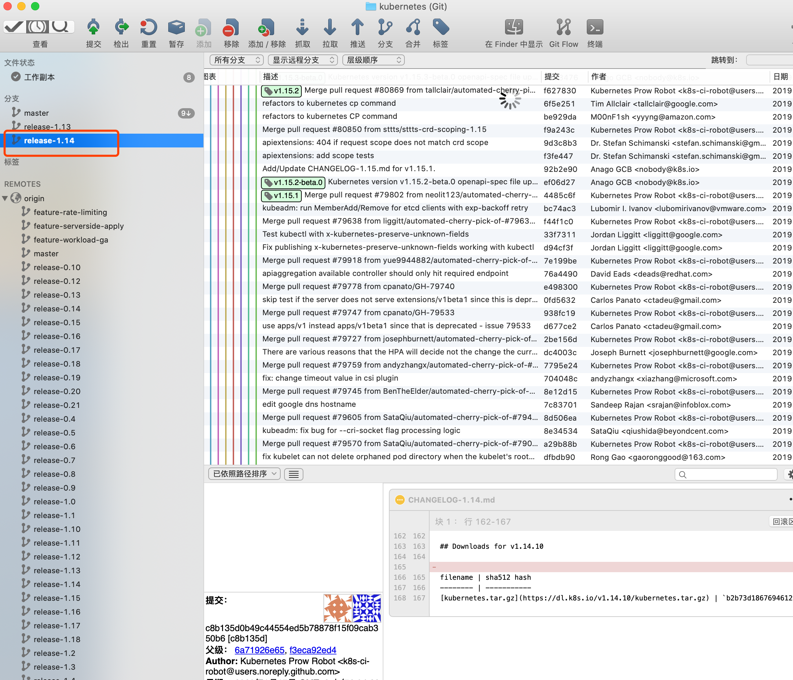
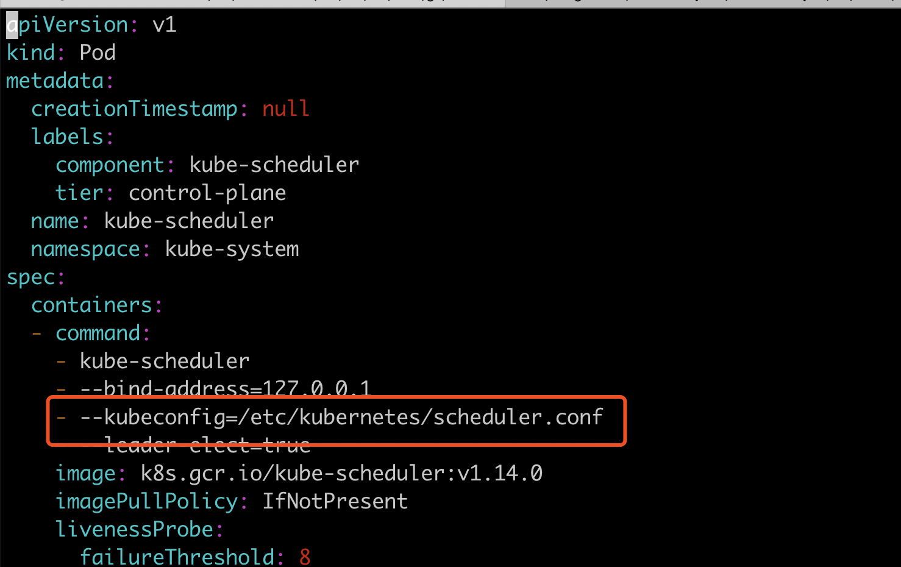
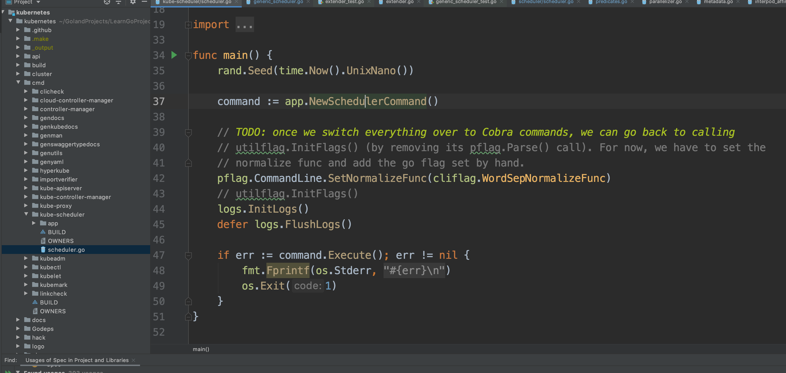
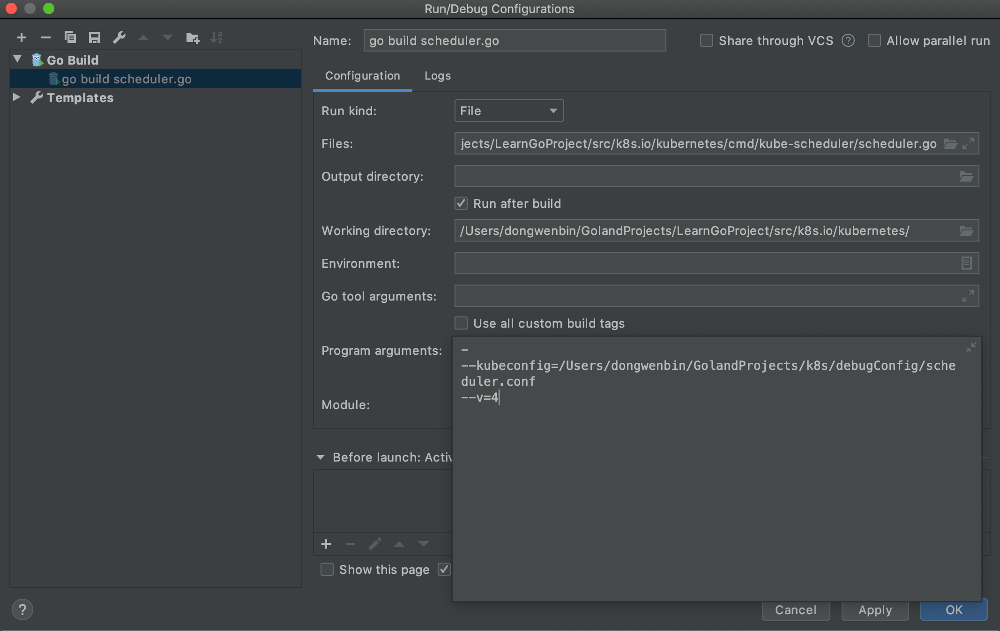
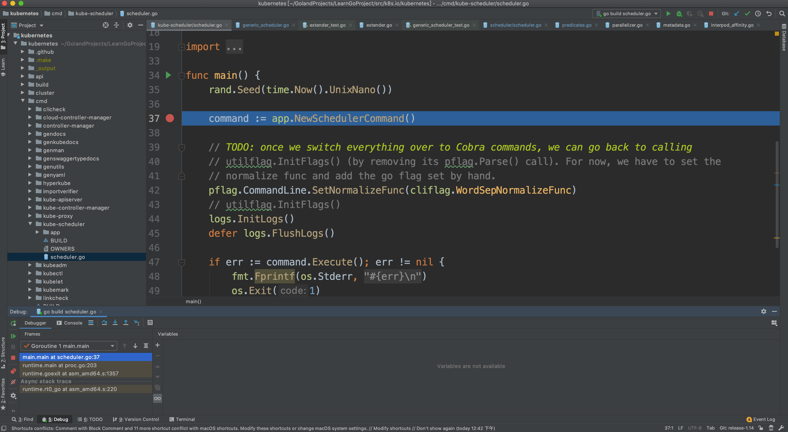
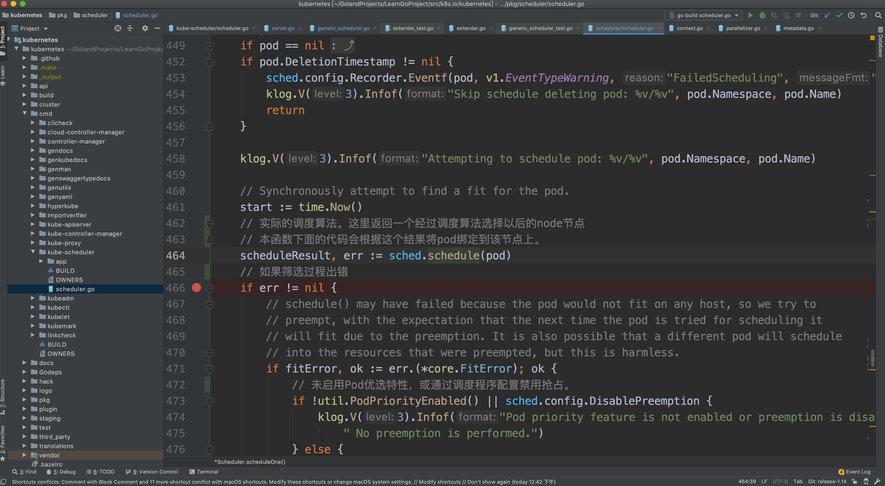
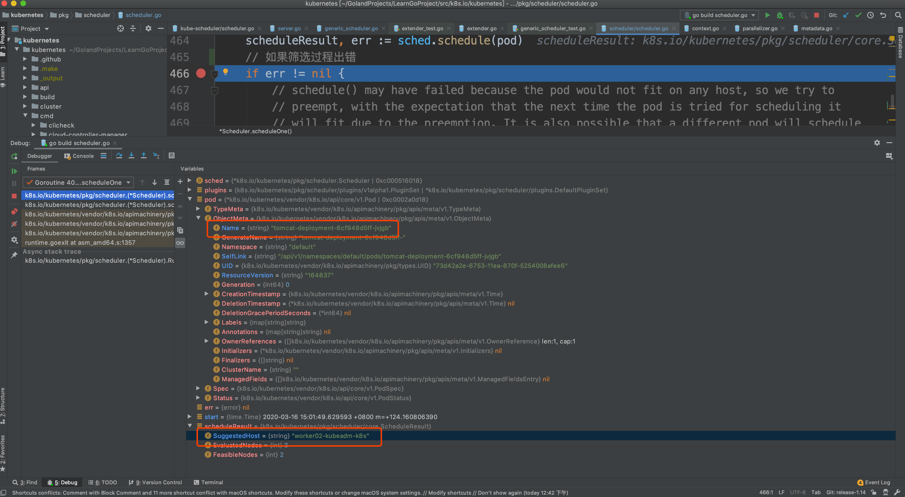

# Kubernetes-源码调试

在进行源码调试之前需要预选搭建好一个k8s集群，无论是单节点，还是三节点的集群。这里推荐使用三节点。因为能更好的感受到k8s是如何运行的。

具体的搭建步骤因为之前已经写过k8s的集群搭建，需要搭建集群的可以去参考：[01-Kubernetes集群搭建.md](https://github.com/wenbin8/doc/blob/master/分布式/CloudNative/Kubernetes/01-Kubernetes集群搭建.md)

## 概要

将需要调试的组件从搭建好的集群中下掉，用本地代码运行代替被下掉的组件从而实现本地代码调试，这里举例是使用的kube-scheduler组件。为方便我们后面分析kube-scheduler的源码。

调试环境并不是读源码的必要条件。在读完一遍源码后，对具体实现有了一定认识以后为了更深入的研究运行机制在回头来搭建调试环境也不晚。因为搭k8s集群环境，除了网络问题外还有各种各样的坑。很可能环境还没搭建好热情已经被消耗殆尽了。

### 环境

#### K8s

一个三节点的k8s集群，使用vagrant创建的三台虚拟机，节点信息如下：


**注意k8s的版本：v1.14.0**

#### 本地环境

本地系统：macOS 10.15.1 ，三体虚拟机也是运行在该系统中处于同一局域网。

从github上获取k8s源码。切换分支到v1.14.0版本如下图：




## 将需要调试的组件从k8s集群中停掉

- 登录到Master节点,切换目录到`/etc/kubernetes/manifests`

    

- 将`kube-scheduler.yaml`从该目录下移出，命令：`mv kube-scheduler.yaml ../`

    

- 然后确认k8s系统命名空间下的kube-scheduler的pod不在运行了。命令：`kubectl get pod -n kube-system -o wide`

    

- 查看`kube-scheduler.yaml`，找到`- --kubeconfig=/etc/kubernetes/scheduler.conf`，如下图：

    

- 将`scheduler.conf`文件拿到本地，本次示例我存放在了本地环境的：`/Users/dongwenbin/GolandProjects/k8s/debugConfig/scheduler.conf`

- 这里还需要给匿名用户clusterrole权限。但是要注意，提供匿名用户群集管理员角色是不推荐的做法。因为这里是本地环境为了节省时间和复杂度所以这么干。

    命令：`kubectl create clusterrolebinding the-boss --user system:anonymous --clusterrole cluster-admin`

到这里集群中的设置就做完了。

## 配置开发环境

我这里使用的IDE是`goland`。k8s是使用go语言开发的。go语言本身的安装及配置在这里不赘述。k8s源码可以去github中chechout出来。这里假设这些都已经完成。我们开始配置开发环境：

- 找到`kube-scheduler`的代码入口，如下图：

    

- 执行run方法，这里执行肯定不成功。但是执行后ide中会生成main方法的执行配置，如下图：

    

- 上图中`Program arguments`是空的。我们添加如下配置：

    ```
    -
    --kubeconfig=/Users/dongwenbin/GolandProjects/k8s/debugConfig/scheduler.conf
    --v=4
    ```

    其中`scheduler.conf`是从，

    

到这里配置完成。

## 调试

### 启动

将断点打到main函数入口处，我们可以看到一个熟悉的debug界面。如下图：



这里启动成功。只是成功了第一步。下面我们去测试一下本地调试环境是否能完成一个pod的调度。也就是说是否成功替换掉了原本在集群环境中的`kube-scheduler`。

### 测试是否能本地调度

在k8s环境的master节点上创建需要调度的pod，如下`myTomcat.yaml`的配置：

```yaml
apiVersion: apps/v1
kind: Deployment
metadata:
  name: tomcat-deployment
  labels:
    app: tomcat
spec:
  replicas: 2
  selector:
    matchLabels:
      app: tomcat
  template:
    metadata:
      name: tomcat
      labels:
        app: tomcat
    spec:
      containers:
        - name: tomcat
          image: tomcat
          ports:
            - containerPort: 8080
```

这里配置了一个`Deployment`的资源，其中包含两个tomcat的`replicas`

然后我们将断点打到如下图：****

然后执行命令：`kubectl create -f myTomcat.yaml`，执行后，查看pod，命令：`kubectl get pod`如下图：


可以看到2个tomcat的pod都在pending状态。我们现在启动本地的debug。如下图：


执行到这里我们可以看到`tomcat-deployment-6cf948d5ff-hcvpd`的pod被调度到了`worker01-kubeadm-k8s`节点。

然后我们继续执行。



可以看到`tomcat-deployment-6cf948d5ff-jvjgb`被调度到`worker02-kubeadm-k8s`。


