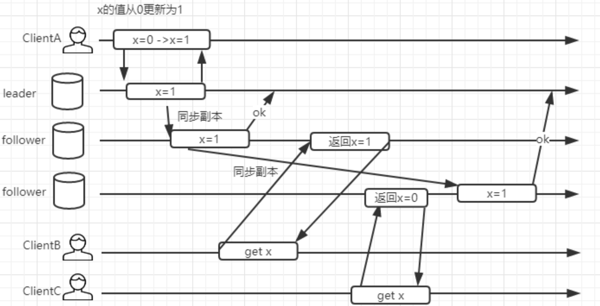
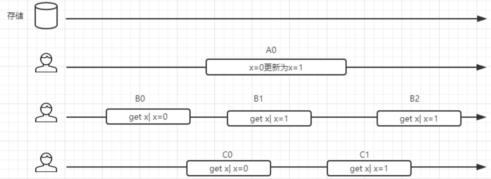
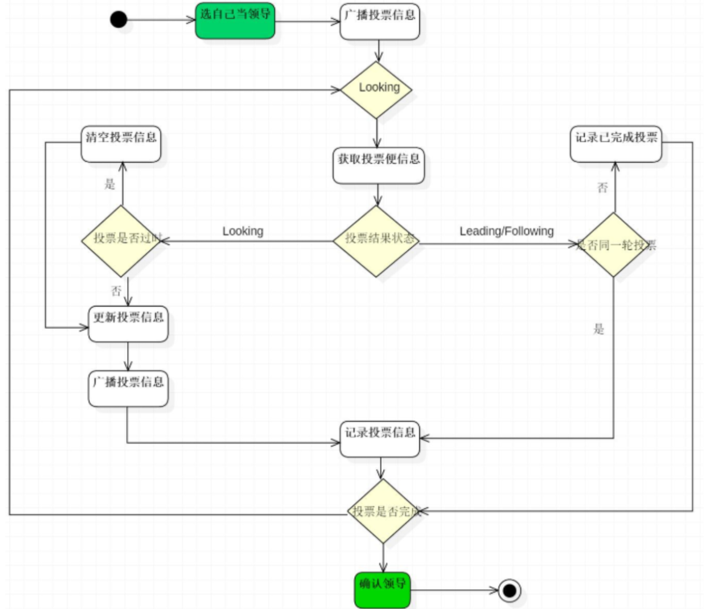

# zookeeper的Leader选举原理

## zookeeper的一致性

对于zookeeper的一致性问题，从来源层面梳理一下。

之前单独讨论过【[分布式系统与一致性协议](https://github.com/wenbin8/doc/blob/master/分布式/分布式协调服务/分布式系统与一致性协议.md)】，感兴趣的可以去看一下。根据之前我们讨论的ZAB协议，在zookeeper集群内部的数据副本同步，是基于过半提交的策略，意味着它是最终一致性。并不满足顺序一致性的要求。

其实正确来说，zookeeper是一个顺序一致性模型。由于zookeeper设计出来是提供分布式锁服务，那么意味着它本省需要实现顺序一致性。顺序一致性是在分布式环境中实现分布式锁的基本要求，比如当一个多个程序来争抢锁，如果clientA获得锁以后，后续所有来争抢锁的程序看的锁的状态都应该是被clientA锁定了，而不是其他状态。

### 顺序一致性

在说明顺序一致性之前，先思考一个问题，如果说zookeeper是一个最终一致性模型，那么它会发生什么情况？

ClientA/B/C假设只串行执行，clientA更新zookeeper上的一个值x。clientB和clientC分别读取集群的不同副本，返回的x的值是不一样的。clientC的读取操作是发生在clientB之后，但是却读到了过期的值。很明显，这是一种弱一致模型。如果用它来实现锁机制是有问题的。



顺序一致性提供了更强的一致性保证，我们来观察下面这个图，从时间轴来看，B0发生在A0之前，读取的值是0，B2发生在A0之后，读取到的x值为1。而读操作B1/C0/C1和写操作A0在时间轴上有重叠，因此他们可能读到旧的值为0，也可能读到新的值1.但是在强顺序一致性模型中，如果B1得到的x的值为1，那么C1看到的值也一定是1。



需要注意的是：由于网络的延迟以及系统本身执行请求的不确定性，会导致请求发起的早的客户端不一定会在服务端执行的早。最终以服务端执行的结果为准。

简单来说：顺序一致性是针对单个操作，单个数据对象。属于CAP中C这个范畴。一个数据被更新后，能够马上被后续的读操作读到。

但是，**zookeeper的顺序一致性实现是缩水版的**，在下面这张图里可以看到官网对于一致性这块做了解释：


zookeeper不保证在每个实例中，两个不同的客户端具有相同zookeeper数据视图，由于网络延迟等因素，一个客户端可能会在另一个客户端收到更改通知之前执行更新。

例如：2个客户端A和B的场景，如果A把znode /a的值从0设置为1，然后告诉客户端B读取/a，则客户端B可能会读取到旧的值0，具体取决于他连接到哪个服务器，如果客户端A和B要读取必须要读取到相同的值，那么clientB在读取操作之前执行sync方法。

除此之外，zookeeper基于zxid以及阻塞队列的方式来实现请求的顺序一致性。如果一个client连接到一个最新的follower上，那么它read读取到了最新的数据，然后client由于网络原因重新连接到了另外一个zookeeper节点，而这个时候连接到的是一个还没有完成同步的follower节点，那么这一次读到的数据就是旧的数据了。实际上zookeeper处理了这种情况，client会记录自己已经读取到的最大的zxid，如果client重连到server发现client的zxid比自己大。连接会失败。


### Single System Image的理解

zookeeper官网还说它保证了”Single System Image“，其解释为：”A client will see the same view of the service regardless of the server that it connects to. “。实际上来看这个解释还是有一些误导性的。其实由zxid原理可以看出，它表达的意思是”client只要连接过一次zookeeper，就不会有历史的倒退“。

## Leader选举的原理

我们基于源码来分析Leader选举的整个实现过程。

Leader选举存在于两个阶段中：

1. 服务器的启动时的Leader选举。
2. 运行过程中Leader节点宕机导致的Leader选举。

### 重要参数

在开发分析之前先了解几个重要的参数。

#### 服务器ID（myid）

比如服务器有三台服务器，编号分别是1，2，3。

编号越大在选择算法中的权重越大。

#### Zxid 事务ID

值越大说明数据越新，在选举算法中的权重也越大

#### 逻辑时钟（epoch-logicalclock）

或者叫投票次数，同一轮投票过程中的逻辑时钟值是相同的。每投完一次票这个数据就会增加，然后与接收到的其他服务器返回的投票信息中的数值相比，根据不同的值做出不同的判断。

#### 选举状态

- LOOKING：竞选状态。
- FOLLOWING：随从状态，同步Leader状态，参与投票。
- OBSERVING：观察状态，同步Leader状态，不参与投票。
- LEADING：领导者状态。

### 服务器启动时的Leader选举

每个节点启动的时候状态都是LOOKING，处于观望状态，接下来就开始进行选主流程。

若进行Leader选举，则至少需要两台机器，这里选取3台机器组成的服务器集群为例。在集群初始化阶段，当有一台服务器server1启动时，其单独无法进行和完成Leader选举，当第二台服务器server2启动时，此时两台机器可以相互通信，每台机器都视图找到Leader，于是进入Leader选举过程。选举过程如下：

#### 选举过程

1. 每个Server发出一个投票。由于是初始情况，server1和server2都会将自己作为Leader服务器来进行投票，每次投票会包含所推举的服务器的myid、zxid、epoch，使用（myid、zxid、epoch）来表示投票。此时server1的投票为（1，0），server2的投票为（2，0），然后各自将这个投票发给集群中其他机器。

2. 接收来自各个服务器的投票。集群的每个服务器收到投票后，首先判断该投票的有效性，如：检查是否是本轮投票（epoch）、是否来自LOOKING状态的服务器。

3. 处理投票。针对每一个投票，服务器都需要将别人的投票和自己的投票进行PK，PK规则如下：

   - 优先比较epoch
   - 其次检查zxid。zxid比较大的服务器有限作为Leader。
   - 如果zxid相同，那么比较myid。myid较大的服务器作为Leader服务器。

   对于server1而言，它的投票是（1，0），接收server2的投票为（2，0），首先会比较两者的zxid，均为0，在比较myid，此时server2的myid最大，于是更新自己的投票为（2，0），然后重新投票，对于server2而言，其无须更新自己的投票，只是再次向集群中所有机器发出上一次投票信息即可。

4. 统计投票。每次投票后，服务器都会统计投票信息，判断是否已经有过半机器接收到相同的投票信息，对于server1、server2而言，都统计出集群中已经有2台机器接收了（2，0）的投票信息，此时便任务已经选出了Leader。

5. 改变服务器状态。一旦确定了Leader，每个服务器就会更新自己的状态，如果是Follower，那么久变更为FOLLOWING，如果是Leader就变更为LEADING。

### 运行过程中的Leader选举

当集群中的Leader服务器出现宕机或者不可用的情况时，那么整个集群将无法对外提供服务，而是进入新一轮的Leader选举，服务器运行期间的Leader选举和启动时期的Leader选举基本过程是一致的。

#### 选举过程

1. 变更状态。Leader挂了以后，余下的非Observer服务器都会将自己的服务器状态变更为LOOKING,然后开始进入Leader选举过程。
2. 每个server会发出一个投票。在运行期间，每个服务器上的zxid可能不同，此时假定server1的zxid为123，server3的zxid为122。在第一轮投票中，server1和server3都会投自己，产生投票（1，123），（3，122），然后各自将投票发送给集群所有机器。接收来自各个服务器的投票。与启动时过程相同。
3. 处理投票。与启动时过程相同。此时，server1将会成为Leader。
4. 统计投票。与启动时过程相同。
5. 改变服务器的状态。与启动时过程相同。



## Leader选举的源码分析

源码分析，最关键的是要找到一个入口，对于 zk 的 leader 选举，并不 由客户端来触发，而是在启动的时候会触发一次选举。因此我们可以直 去看启动脚本 zkServer.sh 中的运行命令。

### QuorumPeerMain.main 方法 

```java
public static void main(String[] args) {
    QuorumPeerMain main = new QuorumPeerMain();
    try {
        //zoo.cfg
        main.initializeAndRun(args);
    } catch (IllegalArgumentException e) {
        LOG.error("Invalid arguments, exiting abnormally", e);
        LOG.info(USAGE);
        System.err.println(USAGE);
        System.exit(2);
    } catch (ConfigException e) {
        LOG.error("Invalid config, exiting abnormally", e);
        System.err.println("Invalid config, exiting abnormally");
        System.exit(2);
    } catch (Exception e) {
        LOG.error("Unexpected exception, exiting abnormally", e);
        System.exit(1);
    }
    LOG.info("Exiting normally");
    System.exit(0);
}
```

main 方法中，调用了 initializeAndRun 进行初始化并且运行 :

```java
protected void initializeAndRun(String[] args)
    throws ConfigException, IOException
{
    //保存zoo.cfg文件解析之后的所有参数（一定在后面有用到）
    QuorumPeerConfig config = new QuorumPeerConfig();
    if (args.length == 1) {
        config.parse(args[0]);
    }

     // 这里启动了一个线程，来定时对日志进行清理，从命名来看也很容易理解
    DatadirCleanupManager purgeMgr = new DatadirCleanupManager(config
            .getDataDir(), config.getDataLogDir(), config
            .getSnapRetainCount(), config.getPurgeInterval());
    purgeMgr.start();

    // 如果是集群模式，会调用runFromConfig.servers实际就是我们在zoo.cfg里面配置的集群节点
    if (args.length == 1 && config.servers.size() > 0) {
        runFromConfig(config);//如果args==1，走这段代码
    } else { // 否则直接运行单机模式
        LOG.warn("Either no config or no quorum defined in config, running "
                + " in standalone mode");
        // there is only server in the quorum -- run as standalone
        ZooKeeperServerMain.main(args);
    }
}
```