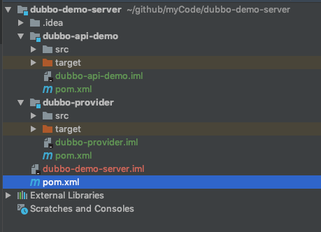
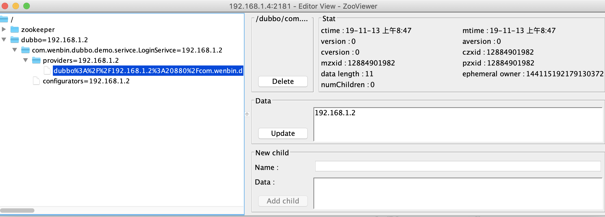
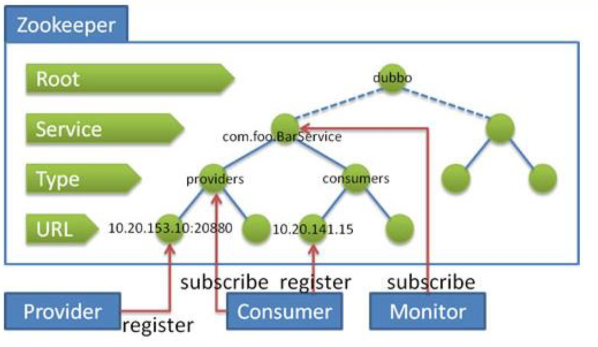

# 服务治理之Apache Dubbo的基本认识

## 为什么要用Dubbo

### 远程通信背景

技术架构的发展从单体到分布式，是一种顺势而为的架构演进，也是一种被逼无奈的技术变革。架构的复杂度能够体现公司的业务复杂度，也能从侧面体现公司的产品发展势头是向上的。

和传统的单体架构相比，分布式多了一个远程服务之间的通信，不管是SOA还是微服务，它们本质上都是对于业务服务的提炼和复用。那么远程服务之间的调用才是实现分布式的关键因素。

而在远程通信这个领域，其实由很多的技术，比如Java的RMI、WebSerivce、Hessian、Dubbo、Thrift等RPC框架，现在我们接触得比较多的应该就是RPC框架Dubbo以及应用协议Http。其实每一个技术都是在某一个阶段产生它的价值，随着架构的变化以及需求的变化，技术的解决方案也在变。所以我们才需要不断的学习。

在之前的分享中讲到了RPC的得层原理，服务与服务之间的调用无非就是跨进程通信而已，我们可以使用socket来实现通信，我们也可以使用NIO来实现高性能通信。我们不用这些开源的RPC框架，也可以完成通信的过程。但是为什么要用现成的框架呢？

原因是，如果我们自己去开发一个网络通信，需要考虑到：

1. 底层网络通信协议的处理。
2. 序列化和反序列化的处理工作。

但是这些工作本身应该是通用的，应该是一个中间件服务器。为整个公司提供远程通信的服务。而不应该由业务开发人员自己去实现，所以才有了这样的RPC框架，使得我们调用远程方法时就像调用本地方法那么简单，不需要关心底层的通信逻辑。

### 大规模服务化对服务治理的要求

到目前为止，还只是满足了通信的基础需求，但是当企业开始大规模的服务化以后，远程通信带来的弊端就越来越明显了。比如说：

1. 服务链路变长了，如何实现对服务链路的跟踪和监控呢？
2. 服务的大规模集群使得服务之间需要依赖第三方注册中心来解决服务的发现和服务的感知问题。
3. 服务通信之间的异常，需要有一种保护机制防止一个节点故障引发大规模的系统故障，所以要有容错机制。
4. 服务大规模集群会是客户端需要引入负载均衡机制实现请求分发。

而这些对于服务治理的要求，传统的RPC技术在这样的场景中显得有点力不从心，因此很多企业开始研发自己的RPC框架，比如阿里的HSF、Dubbo。京东的JSF框架、当当的Dubbox、新浪的motan、蚂蚁金服的sofa等等，有技术输出能力的公司，都会研发适合自己场景的RPC框架，要么是从0到1开发，要么是基于现有的思想结合公司业务特色进行改造。而没有技术输出能力的公司，遇到服务治理的需求时，会优先选择那些比较成熟的开源框架。而Dubbo就是其中一个。

不管是alibaba还是netfilx这些服务治理体系都是在致力于解决业务开发人员不应该关心底层服务治理的相关细节。Dubbo是属于Alibaba开源的一套服务治理组件的一部分。下面我们会详细介绍这套体系。

目前技术的发展解决最优雅的是docker+k8s+Service Mesh 这套服务治理体系。在后续的分享中也会涉及到这些技术。现在已经有一部分公司开始采用套体系。

### Dubbo的发展历史

Dubbo是阿里巴巴内部使用的一个分布式服务治理框架，2012年开源，因为Dubbo在公司内部经理过了很多的验证相对来说比较成熟，所以在很短的时间就被很多互联网公司使用，在加上阿里出来的很多技术大牛进入各个创业公司担任技术机构以后，都以Dubbo作为主推的RPC框架使得dubbo很快成为了很多互联网公司的首要选择。并且很多公司在应用dubbo时，会基于自身业务特性进行优化和改进，所以也衍生了很多版本，比如京东的JSF、比如新浪的Motan、比如当当的dubbox。

在2014-年10月份，Dubbo停止了维护。后来在2017年的9月份，阿里宣布重启Dubbo，并且对于Dubbo做好了长期投入的准备，并且在这段时间Duboo进行了非常多的更新，目前的版本已经到了2.7.x。

2018年1月8日，Dubbo创始人之一梁飞在Dubbo交流群里透露了Dubbo3.0正在动工的消息。Dubbo3.0内核于Dubbo2.0完全不同，但兼容Dubbo2.0。**Dubbo3.0将支持可选Service Mesh。**

2018年2月份，Dubbo捐给了Apache。另外，阿里巴巴对于Spring Cloud Alibaba生态的完善，以及Spring Cloud团队对于alibaba整个服务治理生态的支持，所以Dubbo未来依然是国内绝大多数公司的首要选择。


## Dubbo的基本使用

基于dubbo最新版本2.7.2的版本来讲解按照国际惯例，我们还是基于一个 demo，使用 dubbo 完成基本的远程通信。 

### 创建两个项目

创建一个server项目和一个client项目

#### Server项目

##### 添加jar包依赖

```xml
<dependency>
    <groupId>org.apache.dubbo</groupId>
    <artifactId>dubbo</artifactId>
    <version>2.7.2</version>
</dependency>

<dependency>
    <groupId>org.slf4j</groupId>
    <artifactId>slf4j-api</artifactId>
    <version>1.7.26</version>
</dependency>

<dependency>
    <groupId>ch.qos.logback</groupId>
    <artifactId>logback-classic</artifactId>
    <version>1.2.3</version>
</dependency>
```

##### 定义接口和实现

```java
package com.wenbin.dubbo.demo.serivce;

public interface LoginSerivce {

    String login(String userName, String password);
}
```

```java
package com.wenbin.dubbo.demo.impl;

import com.wenbin.dubbo.demo.serivce.LoginSerivce;

public class LoginServiceImpl implements LoginSerivce {
    public String login(String userName, String password) {
        if (userName.equals("admin") && password.equals("admin")) {
            return "SUCCESS";
        }
        return "FAILED";
    }
}
```

##### 创建配置文件

在resources/META-INF/spring下创建application.xml文件 

```xml
<?xml version="1.0" encoding="UTF-8"?>
<beans xmlns="http://www.springframework.org/schema/beans"
       xmlns:xsi="http://www.w3.org/2001/XMLSchema-instance"
       xmlns:dubbo="http://code.alibabatech.com/schema/dubbo"
       xsi:schemaLocation="http://www.springframework.org/schema/beans
       http://www.springframework.org/schema/beans/spring-beans.xsd
       http://code.alibabatech.com/schema/dubbo
       http://code.alibabatech.com/schema/dubbo/dubbo.xsd">

    <!-- 提供方应用信息，用于计算依赖关系-->
    <dubbo:application name="practice-server" />

    <!-- 使用直连 -->
    <dubbo:registry address="N/A" />

    <!-- 用dubbo协议在20880端口暴露服务 -->
    <dubbo:protocol name="dubbo" port="20880" />

    <!-- 声明需要暴露的服务接口 -->
    <dubbo:service interface="com.wenbin.dubbo.demo.serivce.LoginSerivce" ref="loginService" />

    <!-- 和本地Bean一样实现服务 -->
    <bean id="loginService" class="com.wenbin.dubbo.demo.impl.LoginServiceImpl" />

</beans>
```

在resources/目录下添加logback.xml文件

```xml
<?xml version="1.0" encoding="UTF-8"?>
<configuration>
    <appender name="STDOUT" class="ch.qos.logback.core.ConsoleAppender">
        <layout class="ch.qos.logback.classic.PatternLayout">
            <pattern>%date{ISO8601} %-5level [%thread] %logger{32} - %message%n</pattern>
        </layout>
    </appender>
    <root>
        <level value="DEBUG" />
        <appender-ref ref="STDOUT"/>
    </root>
</configuration>
```

##### 启动服务

添加启动参数：-Djava.net.preferIPv4Stack=true

```java
package com.wenbin.dubbo.app;

import org.springframework.context.support.ClassPathXmlApplicationContext;

import java.io.IOException;

public class App {

    public static void main(String[] args) throws IOException {
        ClassPathXmlApplicationContext context = new ClassPathXmlApplicationContext(new String[] {"/spring/application.xml"});
        context.start();
        System.in.read(); // 按任意键退出
    }

}
```

#### Client项目

##### 	添加jar包

和Server项目相同。

##### 定义接口

```java
package com.wenbin.dubbo.demo.service;

public interface LoginSerivce {

    String login(String userName, String password);
}
```

##### 创建配置文件

在resources/META-INF/spring下创建application.xml文件 

```java
<?xml version="1.0" encoding="UTF-8"?>
<beans xmlns="http://www.springframework.org/schema/beans"
       xmlns:xsi="http://www.w3.org/2001/XMLSchema-instance"
       xmlns:dubbo="http://code.alibabatech.com/schema/dubbo"
       xsi:schemaLocation="http://www.springframework.org/schema/beans
       http://www.springframework.org/schema/beans/spring-beans.xsd
       http://code.alibabatech.com/schema/dubbo
       http://code.alibabatech.com/schema/dubbo/dubbo.xsd">

    <!-- 提供方应用信息，用于计算依赖关系-->
    <dubbo:application name="practice-clent"/>


    <!-- 使用直连 -->
    <dubbo:registry address="N/A" />

    <!-- 使用直连 -->
    <dubbo:reference id="loginService" interface="com.wenbin.dubbo.demo.service.LoginSerivce"
                    url="dubbo://192.168.1.2:20880/com.wenbin.dubbo.demo.serivce.LoginSerivce"/>
</beans>
```

在resources/目录下添加logback.xml文件

```xml
<?xml version="1.0" encoding="UTF-8"?>
<configuration>
    <appender name="STDOUT" class="ch.
                                   qos.logback.core.ConsoleAppender">
        <layout class="ch.qos.logback.classic.PatternLayout">
            <pattern>%date{ISO8601} %-5level [%thread] %logger{32} - %message%n</pattern>
        </layout>
    </appender>
    <root>
        <level value="DEBUG" />
        <appender-ref ref="STDOUT"/>
    </root>
</configuration>
```

##### 访问远程服务

添加启动参数：-Djava.net.preferIPv4Stack=true

```java
package com.wenbin.dubbo.app;

import com.wenbin.dubbo.demo.service.LoginSerivce;
import org.springframework.context.support.ClassPathXmlApplicationContext;

public class App {
    public static void main(String[] args) throws Exception {
        ClassPathXmlApplicationContext context = new ClassPathXmlApplicationContext(new String[] {"/spring/application.xml"});
        context.start();
        LoginSerivce demoService = (LoginSerivce)context.getBean("loginService"); // 获取远程服务代理
        String res = demoService.login("admin", "admin"); // 执行远程方法
        System.out.println( res ); // 显示调用结果
    }
}
```

## 基于注册中心的Dubbo服务

作为主流的服务治理组件，Dubbo提供了很多丰富的功能，那么最根本的就是要解决大规模集群之后服务注册和发现的问题。而Dubbo中对于注册中心这块是使用zookeeper来支撑的。当然在目前最新的版本中。Dubbo能够支持注册中心有：Consul、etcd、nacos、sofa、zookeeper、readis、multicast。

### 使用zookeeper作为注册中心

#### 创建server项目

创建如下图结构的项目工程



##### dubbo-demo-server

POM文件：

```xml
<?xml version="1.0" encoding="UTF-8"?>
<project xmlns="http://maven.apache.org/POM/4.0.0"
         xmlns:xsi="http://www.w3.org/2001/XMLSchema-instance"
         xsi:schemaLocation="http://maven.apache.org/POM/4.0.0 http://maven.apache.org/xsd/maven-4.0.0.xsd">
    <modelVersion>4.0.0</modelVersion>

    <artifactId>dubbo-demo-server</artifactId>
    <groupId>com.wenbin.dubbo.demo</groupId>
    <packaging>pom</packaging>
    <version>1.0-SNAPSHOT</version>
    <modules>
        <module>dubbo-api-demo</module>
        <module>dubbo-provider</module>
    </modules>

    <name>dubbo-demo-server</name>
    <!-- FIXME change it to the project's website -->
    <url>http://www.example.com</url>

</project>
```

##### dubbo-api-demo

pom依赖：

```java
<?xml version="1.0" encoding="UTF-8"?>
<project xmlns="http://maven.apache.org/POM/4.0.0"
         xmlns:xsi="http://www.w3.org/2001/XMLSchema-instance"
         xsi:schemaLocation="http://maven.apache.org/POM/4.0.0 http://maven.apache.org/xsd/maven-4.0.0.xsd">
    <parent>
        <artifactId>dubbo-demo-server</artifactId>
        <groupId>com.wenbin.dubbo.demo</groupId>
        <version>1.0-SNAPSHOT</version>
    </parent>
    <modelVersion>4.0.0</modelVersion>

    <artifactId>dubbo-api-demo</artifactId>

    <name>dubbo-api-demo</name>
    <!-- FIXME change it to the project's website -->
    <url>http://www.example.com</url>
</project>
```

接口定义代码：

```java
public interface LoginSerivce {

    String login(String userName, String password);
}
```


##### dubbo-provider

的pom文件：

```java
<?xml version="1.0" encoding="UTF-8"?>
<project xmlns="http://maven.apache.org/POM/4.0.0"
         xmlns:xsi="http://www.w3.org/2001/XMLSchema-instance"
         xsi:schemaLocation="http://maven.apache.org/POM/4.0.0 http://maven.apache.org/xsd/maven-4.0.0.xsd">
    <parent>
        <artifactId>dubbo-demo-server</artifactId>
        <groupId>com.wenbin.dubbo.demo</groupId>
        <version>1.0-SNAPSHOT</version>
    </parent>
    <modelVersion>4.0.0</modelVersion>

    <artifactId>dubbo-provider</artifactId>

    <name>dubbo-provider</name>
    <!-- FIXME change it to the project's website -->
    <url>http://www.example.com</url>

    <dependencies>
        <dependency>
            <groupId>org.apache.dubbo</groupId>
            <artifactId>dubbo</artifactId>
            <version>2.7.2</version>
        </dependency>

        <dependency>
            <groupId>org.slf4j</groupId>
            <artifactId>slf4j-api</artifactId>
            <version>1.7.26</version>
        </dependency>

        <dependency>
            <groupId>org.apache.curator</groupId>
            <artifactId>curator-framework</artifactId>
            <version>4.0.0</version>
        </dependency>
        <dependency>
            <groupId>org.apache.curator</groupId>
            <artifactId>curator-recipes</artifactId>
            <version>4.0.0</version>
        </dependency>
        <dependency>
            <groupId>com.wenbin.dubbo.demo</groupId>
            <artifactId>dubbo-api-demo</artifactId>
            <version>1.0-SNAPSHOT</version>
            <scope>compile</scope>
        </dependency>
    </dependencies>

</project>
```

接口实现：

```java
package com.wenbin.dubbo.demo.impl;

import com.wenbin.dubbo.demo.serivce.LoginSerivce;

public class LoginServiceImpl implements LoginSerivce {
    public String login(String userName, String password) {
        if (userName.equals("admin") && password.equals("admin")) {
            return "SUCCESS";
        }
        return "FAILED";
    }
}
```

启动类：

```java
package com.wenbin.dubbo.app;

import org.springframework.context.support.ClassPathXmlApplicationContext;

import java.io.IOException;

public class App {

    public static void main(String[] args) throws IOException {
        ClassPathXmlApplicationContext context = new ClassPathXmlApplicationContext(new String[] {"/spring/application.xml"});
        context.start();
        System.in.read(); // 按任意键退出
    }

}
```

resources/spring/application.xml

```xml
<?xml version="1.0" encoding="UTF-8"?>
<beans xmlns="http://www.springframework.org/schema/beans"
       xmlns:xsi="http://www.w3.org/2001/XMLSchema-instance"
       xmlns:dubbo="http://code.alibabatech.com/schema/dubbo"
       xsi:schemaLocation="http://www.springframework.org/schema/beans
       http://www.springframework.org/schema/beans/spring-beans.xsd
       http://code.alibabatech.com/schema/dubbo
       http://code.alibabatech.com/schema/dubbo/dubbo.xsd">

    <!-- 提供方应用信息，用于计算依赖关系-->
    <dubbo:application name="practice-server" />

    <!-- 使用直连 -->
    <!--<dubbo:registry address="N/A" />-->
    <!-- 使用zookeeper注册中心暴露服务地址 -->
    <dubbo:registry address="zookeeper://192.168.1.4:2181?backup=192.168.1.4:2182,192.168.1.4:2183"  />

    <!-- 用dubbo协议在20880端口暴露服务 -->
    <dubbo:protocol name="dubbo" port="20880" />

    <!-- 声明需要暴露的服务接口 -->
    <dubbo:service interface="com.wenbin.dubbo.demo.serivce.LoginSerivce" ref="loginService" />

    <!-- 和本地Bean一样实现服务 -->
    <bean id="loginService" class="com.wenbin.dubbo.demo.impl.LoginServiceImpl" />

</beans>
```

resources/logback.xml

```xml
<?xml version="1.0" encoding="UTF-8"?>
<configuration>
    <appender name="STDOUT" class="ch.qos.logback.core.ConsoleAppender">
        <layout class="ch.qos.logback.classic.PatternLayout">
            <pattern>%date{ISO8601} %-5level [%thread] %logger{32} - %message%n</pattern>
        </layout>
    </appender>
    <root>
        <level value="DEBUG" />
        <appender-ref ref="STDOUT"/>
    </root>
</configuration>
```

#### 创建Client项目

pom文件：

```xml
<?xml version="1.0" encoding="UTF-8"?>
<project xmlns="http://maven.apache.org/POM/4.0.0"
         xmlns:xsi="http://www.w3.org/2001/XMLSchema-instance"
         xsi:schemaLocation="http://maven.apache.org/POM/4.0.0 http://maven.apache.org/xsd/maven-4.0.0.xsd">
    <modelVersion>4.0.0</modelVersion>

    <groupId>com.wenbin.dubbo.demo.client</groupId>
    <artifactId>dubbo-demo-client</artifactId>
    <version>1.0-SNAPSHOT</version>

    <dependencies>
        <dependency>
            <groupId>org.apache.dubbo</groupId>
            <artifactId>dubbo</artifactId>
            <version>2.7.2</version>
        </dependency>

        <dependency>
            <groupId>org.slf4j</groupId>
            <artifactId>slf4j-api</artifactId>
            <version>1.7.26</version>
        </dependency>

        <dependency>
            <groupId>ch.qos.logback</groupId>
            <artifactId>logback-classic</artifactId>
            <version>1.2.3</version>
        </dependency>

        <dependency>
            <groupId>org.apache.curator</groupId>
            <artifactId>curator-framework</artifactId>
            <version>4.0.0</version>
        </dependency>
        <dependency>
            <groupId>org.apache.curator</groupId>
            <artifactId>curator-recipes</artifactId>
            <version>4.0.0</version>
        </dependency>
        <dependency>
            <groupId>com.wenbin.dubbo.demo</groupId>
            <artifactId>dubbo-api-demo</artifactId>
            <version>1.0-SNAPSHOT</version>
            <scope>compile</scope>
        </dependency>

    </dependencies>
</project>
```

启动类：

```java
package com.wenbin.dubbo.app;

import com.wenbin.dubbo.demo.serivce.LoginSerivce;
import org.springframework.context.support.ClassPathXmlApplicationContext;

public class App {
    public static void main(String[] args) throws Exception {
        ClassPathXmlApplicationContext context = new ClassPathXmlApplicationContext(new String[] {"/spring/application.xml"});
        context.start();
        LoginSerivce demoService = (LoginSerivce)context.getBean("loginService"); // 获取远程服务代理
        String res = demoService.login("admin", "admin"); // 执行远程方法
        System.out.println( "调用结果：" + res ); // 显示调用结果
    }
}
```

resources/spring/application.xml

```xml
<?xml version="1.0" encoding="UTF-8"?>
<beans xmlns="http://www.springframework.org/schema/beans"
       xmlns:xsi="http://www.w3.org/2001/XMLSchema-instance"
       xmlns:dubbo="http://code.alibabatech.com/schema/dubbo"
       xsi:schemaLocation="http://www.springframework.org/schema/beans
       http://www.springframework.org/schema/beans/spring-beans.xsd
       http://code.alibabatech.com/schema/dubbo
       http://code.alibabatech.com/schema/dubbo/dubbo.xsd">

    <!-- 提供方应用信息，用于计算依赖关系-->
    <dubbo:application name="practice-clent"/>


    <!-- 使用直连 -->
    <!--<dubbo:registry address="N/A" />-->
    <!-- 使用zookeeper注册中心暴露服务地址 -->
    <dubbo:registry address="zookeeper://192.168.1.4:2181?backup=192.168.1.4:2182,192.168.1.4:2183"  />


     <!--使用直连 -->
    <!--<dubbo:reference id="loginService" interface="com.wenbin.dubbo.demo.service.LoginSerivce"-->
                     <!--url="dubbo://192.168.1.2:20880/com.wenbin.dubbo.demo.serivce.LoginSerivce"/>-->

    <!-- 使用zookeeper注册中心 -->
    <dubbo:reference id="loginService" interface="com.wenbin.dubbo.demo.serivce.LoginSerivce" />
</beans>
```

resources/logback.xml

```xml
<?xml version="1.0" encoding="UTF-8"?>
<configuration>
    <appender name="STDOUT" class="ch.qos.logback.core.ConsoleAppender">
        <layout class="ch.qos.logback.classic.PatternLayout">
            <pattern>%date{ISO8601} %-5level [%thread] %logger{32} - %message%n</pattern>
        </layout>
    </appender>
    <root>
        <level value="DEBUG" />
        <appender-ref ref="STDOUT"/>
    </root>
</configuration>
```

#### 执行结果


注册中心信息：



### Dubbo集成zookeeper的实现原理



#### Dubbo每次都访问都要连接zookeeper？

看上图Consumer想要访问需要通过注册中心获取调用信息才能访问到Provider，那是不是每一次请求的时候，都需要访问注册中呢？zookeeper通过缓存实现，在消费端的配置文件中增加如下配置：

```xml
<dubbo:registry address="zookeeper://192.168.1.4:2181?backup=192.168.1.4:2182,192.168.1.4:2183" file="/dubbo-server" />
```

其他注册中心的实现，核心的本质都和这里讨论的核心本质是一样的，都是为了管理服务地址。

### 多注册中心支持

Dubbo中可以支持多注册中心，有的时候，客户端需要调用的远程服务不在同一个注册中心上，那么客户端就需要配置多个注册中心来访问。

#### 配置多个注册中心

##### 服务端配置变化：

```xml
<!-- 使用zookeeper注册中心暴露服务地址 -->
<dubbo:registry id="registry1" address="zookeeper://192.168.1.4:2181?backup=192.168.1.4:2182,192.168.1.4:2183"  />
<dubbo:registry id="registry2" address="zookeeper://192.168.1.4:2181?backup=192.168.1.4:2182,192.168.1.4:2183"  />


<!-- 声明需要暴露的服务接口 -->
<dubbo:service interface="com.wenbin.dubbo.demo.serivce.LoginSerivce" registry="registry2" ref="loginService" />

```

##### 客户端配置变化

```xml
<!-- 使用zookeeper注册中心暴露服务地址 -->
<dubbo:registry id="registry1" address="zookeeper://192.168.1.4:2181?backup=192.168.1.4:2182,192.168.1.4:2183" file="/dubbo-server" />
<dubbo:registry id="registry2" address="zookeeper://192.168.1.4:2181?backup=192.168.1.4:2182,192.168.1.4:2183" file="/dubbo-server" />

<!-- 使用zookeeper注册中心  通过 registry 设置注册中心的 ID -->
<dubbo:reference id="loginService" interface="com.wenbin.dubbo.demo.serivce.LoginSerivce" registry="registry2" />
```

### 注册中心的其他支持

1. 当设置```<dubbo:registry check="false />"```时，记录失败注册和订阅请求，后台定时重试。
2. 可通过```<dubbo:registry username="admin" password="1234" />```设置zookeeper登录信息。
3. 可通过```<dubbo:registry group="dubbo"/>```设置zookeeper的根节点，默认使用dubbo作为dubbo服务注册的namespace。


## Dubbo仅仅是一个RPC框架？

到目前为止，我们了解到了**dubbo的核心功能，提供服务注册和服务发现以及基于Dubbo协议的远程通信。**Dubbo从另一个方面来看可以认为是一个服务治理生态。从目前已经学习过的内容上可以看到。

1. Dubbo可以支持市面上主流的注册中心。
2. Dubbo提供了Container的支持，默认提供了3总container。我们可以自行扩展。
3. Dubbo对于RPC通信协议的支持，不仅仅是原生的Dubbo协议，它还围绕着RMI、Hessian、http、webservice、thrift、rest。

有了多协议的支持，使得其他RPC框架的应用程序可以快速的切入到dubbo生态中。同时，对于多协议的支持，使得不同应用场景的服务，可以选择合适的协议来发布服务，并不一定要使用dubbo提供的长连接方式。

### 集成Webservice协议

webservice是一个短链接并且基于http协议的方式来实现的rpc框架。

#### 服务端配置

application.xml新增：

```xml
<dubbo:protocol name="webservice" port="8080" server="jetty"/>
```

服务声明新增：

```xml
<!-- 声明需要暴露的服务接口 -->
<dubbo:service interface="com.wenbin.dubbo.demo.serivce.LoginSerivce" registry="registry2" ref="loginService"
               protocol="dubbo,webservice"/>
```

添加多协议支持，一个服务可以发布多种协议的支持，也可以实现不同服务发布不同的协议。

启动服务之后，可以使用: http://localhost:8080/com.wenbin.dubbo.demo.serivce.LoginSerivce?wsdl来获得 Webservice 的 wsdl 描述文档 

#### 客户端配置

application.xml改造：

```xml
<dubbo:reference id="loginService" interface="com.wenbin.dubbo.demo.serivce.LoginSerivce" registry="registry2" protocol="webservice" />
```

这里改用了webservice。

#### 调用结果：


### Dubbo对于REST协议的支持

Dubbo中的REST（表述性资源转移）支持，是基于JAX-RS2.0(Java API for RESTful Web Services)来实现的。

REST是一种架构风格，简单来说就是对于API接口的约束，基于URL定位资源，使用http动词（GET/POST/DELETE）来描述操作。

#### JAX-RS协议说明

REST很早就提出来了，在早期开发人员为了实现REST，会使用各种工具来实现，比如Servlets就经常用来开发RESTful的程序。随着REST被越来越多的开发人员采用，所以JCP（Java community process）提出了JAX-RS规范，并且提供了一种新的基于注解的方式来开发RESTful服务。有了这样的一个规范，使得开发人员不需要关心通讯层的东西，只需要关注资源以及数据对象。

JAX-RS规范的实现有：Apache CXF、Jersey（由Sun公司提供的JAX-RS的参考实现）、RESTEasy（jboss实现）等。

而Dubbo里面实现的REST就是基于Jboss提供的RestEasy框架来实现的。SpringMVC中的RESTful实现我们用的比较多，它也是JAX-RS规范的一种实现。


> 在用REST协议发布服务的首，遇到一个Dubbo的坑，Dubbo启动时后写地方的服务直接被吞掉了，使得服务启动不了的同时，还看不到错误信息。
>
> 可以把resteasy-client包暂时不导入，看到这个效果。


#### 服务端

##### dubbo-api-demo

jar包依赖：

```xml
<dependency>
    <groupId>org.jboss.resteasy</groupId>
    <artifactId>resteasy-jaxrs</artifactId>
    <version>3.8.0.Final</version>
</dependency>
```

新增接口：

@Path("/users")：指定访问UserService的URL相对路径是/users，即http://localhost:8080/users。

@Path("/register")：指定访问register()方法的URL相对路径是/register再结合上一个@Path为UserService执行的路径，则调用UserService.register()的完整路径为：http://localhost:8080/users/register。

@POST：指定访问registerUser()用HTTP POST方法。

@Consumes({MediaType.APPLICATION_JSON}): 指定register()接收JSON格式的数据。REST框架会自动将JSON数据反序列化为User对象。(注解可以放在接口上，客户端需要根据接口的注解来进行解析和调用) 

```java
package com.wenbin.dubbo.demo.serivce;

import javax.ws.rs.GET;
import javax.ws.rs.Path;
import javax.ws.rs.PathParam;

@Path("/user")
public interface UserService {

    @GET
    @Path("/register/{id}")
    void register(@PathParam("id") int id);
}
```

##### dubbo-provider

jar包依赖：

```xml
<!--RESTful-->
<dependency>
    <groupId>org.jboss.resteasy</groupId>
    <artifactId>resteasy-jaxrs</artifactId>
    <version>3.8.0.Final</version>
</dependency>
<dependency>
    <groupId>org.jboss.resteasy</groupId>
    <artifactId>resteasy-client</artifactId>
    <version>3.8.0.Final</version>
</dependency>
```

新增接口实现：

```java
package com.wenbin.dubbo.demo.impl;

import com.wenbin.dubbo.demo.serivce.UserService;

public class UserServiceImpl implements UserService {


    public void register(int id) {
        System.out.println("注册Id:" + id);
    }
}
```

新增配置

```xml
<dubbo:protocol name="rest" port="8888" server="jetty"/>

<dubbo:service interface="com.wenbin.dubbo.demo.serivce.UserService" registry="registry1" ref="userService" protocol="rest"/>

<bean id="userService" class="com.wenbin.dubbo.demo.impl.UserServiceImpl" />
```

#### 客户端

新增配置：

```xml
<dubbo:protocol name="rest" port="8888" server="jetty"/>

<dubbo:reference id="userService" interface="com.wenbin.dubbo.demo.serivce.UserService" registry="registry1" protocol="rest" />
```

客户端调用代码：

```java
package com.wenbin.dubbo.app;

import com.wenbin.dubbo.demo.serivce.LoginSerivce;
import com.wenbin.dubbo.demo.serivce.UserService;
import org.springframework.context.support.ClassPathXmlApplicationContext;

public class App {
    public static void main(String[] args) throws Exception {
        ClassPathXmlApplicationContext context = new ClassPathXmlApplicationContext(new String[] {"/spring/application.xml"});
        context.start();
        LoginSerivce demoService = (LoginSerivce)context.getBean("loginService"); // 获取远程服务代理
        String res = demoService.login("admin", "admin"); // 执行远程方法
        System.out.println( "调用结果：" + res ); // 显示调用结果

        UserService userService = (UserService)context.getBean("userService"); // 获取远程服务代理
        userService.register(111122);
    }
}
```

调用结果：


其他协议我们就不一一演示了，除了协议本身的不同之外，其他所有的东西都是一样，包括负载均衡、服务注册、熔断、监控等。 

### **Dubbo** **监控平台安装** 

Dubbo 的监控平台也做了更新，不过目前的功能还没有完善， 在这个网站上下载Dubbo-Admin的包: https://github.com/apache/dubbo-admin 

1. 修 改 dubbo-admin-server/src/main/resources/application.properties 中的配置信息 

   ```properties
   # centers in dubbo2.7
   admin.registry.address=zookeeper://127.0.0.1:2181
   admin.config-center=zookeeper://127.0.0.1:2181
   admin.metadata-report.address=zookeeper://127.0.0.1:2181
   
   
   
   admin.registry.group=dubbo
   admin.apollo.token=e16e5cd903fd0c97a116c873b448544b9d086de9
   admin.apollo.appId=test
   admin.apollo.env=dev
   admin.apollo.cluster=default
   admin.apollo.namespace=dubbo
   ```

2. mvn clean package 进行构建

3. mvn –projects dubbo-admin-server spring-boot:run 

4. 访问 localhost:8080 

### Dubbo的终端操作方法

Dubbo里面提供了一种基于终端操作的方法来实现服务治理使用 **telnet localhost 20880** 连接到服务对应的端口。

#### 常用命令

##### ls

- ls: 显示服务列表

- ls -l: 显示服务详细信息列表

- ls XxxService: 显示服务的方法列表

- ls -l XxxService: 显示服务的方法详细信息列表 

##### ps

- ps: 显示服务端口列表
- ps -l: 显示服务地址列表

- ps 20880: 显示端口上的连接信息

- ps -l 20880: 显示端口上的连接详细信息

##### cd

- cd XxxService: 改变缺省服务，当设置了缺省服务，凡是需要输入服务名作 为参数的命令，都可以省略服务参数
- cd /: 取消缺省服务


##### pwd

- pwd: 显示当前缺省服务 

##### count 

- count XxxService: 统计 1 次服务任意方法的调用情况

- count XxxService 10: 统计 10 次服务任意方法的调用情况

- count XxxService xxxMethod: 统计 1 次服务方法的调用情况 count XxxService xxxMethod 10: 统计 10 次服务方法的调用情况 