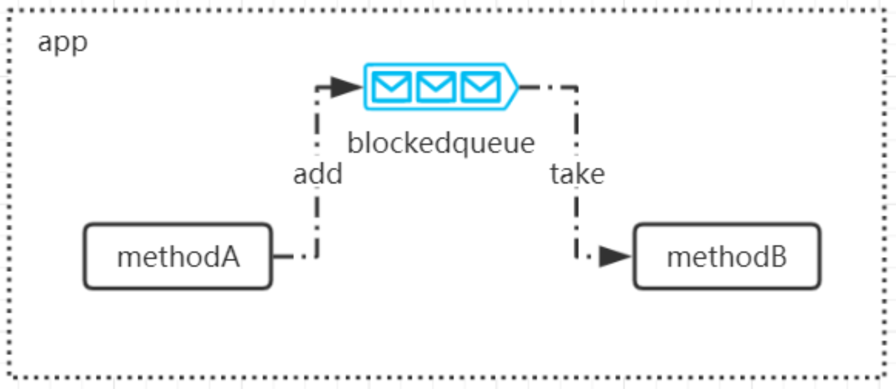

# 消息中间件的背景分析

我们知道并发编程中可以使用阻塞式队列+线程池来实现生产者消费者模式。比如说在一个应用中，A方法调用B方法去执行一些任务处理。我们可以同步调用。但是如果这个时候请求比较多的情况下，同步调用比较耗时会导致请求阻塞。我们会使用阻塞队列加线程池来实现异步任务处理。

那么，问题来了。如果是在分布式系统中，两个服务之间需要通过这种异步队列的方式来处理任务，那单进程级别的队列就无法解决这个问题了。

因此，引入了消息中间件，也就是把消息处理交给第三方的服务，这个服务能够实现数据的存储以及传输，使得在分布式架构下实现跨进程的远程消息通信。

所以，简单来说：消息中间件是指利用高效可靠的消息传输机制进行平台无关的数据交流，并且基于数据通信来进行分布式系统的集成。

## 思考一下消息中间件的设计

基本的需求：

- 能支持消息的发送和接受，需要涉及到网络通信就一定会涉及到NIO。
- 消息中心的消息存储（持久化、非持久化）
- 消息的序列化和反序列化
- 是否跨语言
- 消息的确认机制，如何避免消息重发

高级功能：

- 消息的有序性
- 是否支持事务消息
- 消息手法的性能，对高并发大数据量的支持
- 是否支持集群
- 消息的可靠性存储
- 是否支持多协议

这个思考的过程其实就是做需求的整理，然后在使用已有的技术体系进行技术实现。现在我们学习的中间件无非就是别人根据实际需求进行实现之后，我们如何使用他们提供的API进行应用而已。但是有了这样的一个全局的思考，那么对于后续学习这个技术本身而言，就会非常容易了。

## 发展过程

实际上消息中间件的发展也是挺有意思的，我们知道任何一个技术的出现都是为了解决问题，**这个问题是通过一种通用的软件”总线“也就是一种通信机制，解决应用程序之间繁重的信息通信工作。**最早的小白鼠就是金融交易领域，因为在当时这个领域中，交易员需要通过不同的终端完成交易，每台终端显示不同的信息。如果接入消息总线，那么交易员只需要在一台终端上操作，然后订阅其他终端感兴趣的消息。于是就诞生了发布订阅模型（pubsub），同时诞生了世界上第一个现代消息队列软件（TIB）The information Bus, TIB允许开发者建立一系列规则去描述消息内容，只要消息按照这些规则发布出去，任何消费者应用都能订阅感兴趣的消息。随着TIB带来的好处，被广泛应用在各大领域，IBM也开始研究开发自己的消息中间件，3年后IBM的消息队列IBM MQ产品系列发布，之后的一段时间MQ系列进化成了WebSphere MQ通知商业消息队列平台市场。

包括后期微软也研发了自己的消息队列（MSMQ）。

各大厂商纷纷研究自己的MQ，但是他们是以商业化模式运营自己的MQ软件，商业MQ想要解决的是应用互通的问题，而不是创建标准接口来允许不同MQ产品互通。所以有些大型的金融公司可能会使用来自多个供应商的MQ产品，来服务企业内部不同的应用。那么问题来了，如果应用已经订阅了TIB MQ的消息然后突然需要消费IBM MQ的消息，那么整个实现过程会很麻烦。为了解决这个问题，在2001年诞生了Java Message Service(JMS)，JMS通过提供公共的java API的方式，影藏单独MQ产品供应商的实现接口，从而跨越了不同MQ消费和解决互通问题。从技术层面来说，Java应用程序值需要针对JMS API编程，选择合适的MQ驱动即可。JMS会处理其他部分。这种方案实际是通过单独标准化接口来整合很多不同的接口，效果还是不错的，**但是碰到了互用性问题。两套使用两种不同编程语言的程序如何通过它们的异步消息传递机制相互通信呢。这个时候就需要定义一个异步消息传递的通用标准。**

所以AMQP（Advanced Message Queueing Protocol）高级消息队列协议产生了，它使用了一套标准的底层协议，加入了许多其他特征来支持互用性，为现代应用丰富了消息传递需求，针对标准编码的任何人都可以和任意AMQP供应商提供的MQ服务器进行交互。

除了JMS和AMQP规范以外，还有一种MQTT（Message Queueing Telemetry Transport）,它是专门为小设备设计的。因为计算性能不高的设备不能适应AMQP上的复杂操作，它们需要一种简单而且可互用的方式进行通信。这个MQTT的基本要求，而如今，MQTT是物联网（IOT）生态系统中主要成分之一。