# Volatile

## 初步认识Volatile

### 一段代码引发的思考

下面这段代码，演示了一个使用volatile以及没使用volatile这个关键字，对于变量更新的影响

```java
package jvm;

public class VolatileDemo {
    public /*volatile*/ static boolean stop = false;

    public static void main(String[] args) throws InterruptedException {
        Thread thread = new Thread(() -> {
            int i = 0;
            while (!stop) {
                i++;
            }
        });
        thread.start();
        System.out.println("begin starg thread");
        Thread.sleep(1000);
        stop = true;
    }
}
```

### volatile的作用

volatile可以使得在多处理器环境下保证共享变量的可见性。那么到底什么是可见性呢？

在单线程环境下，如果一个变量先写入一个值，然后在没有写干涉的情况下读取这个变量的值，那这个时候读取到的这个变量的值应该是之前写入的那个值。这本来是一个很正常的事情。但是多线程的环境下，读和写发生在不同的线程中的时候，可能会出现：读线程不能及时的读取到其他线程写入的最新的值。这就是所谓的可见性。为了实现跨线程写入的内存可见性，必须使用到一些机制来实现，而volatile就是这样一种机制。

### volatile关键字是如何保证可见性的？

我们可以使用【hsdis】这个工具，来查看前面演示的这段代码的汇编指令。具体使用请查看下面压缩包中的说明文档。

 [查看运行代码的汇编指令的工具.zip](assets/查看运行代码的汇编指令的工具.zip) 

然后在输出结果中，查找lock指令，会发现，在修改代码volatile修饰的成员变量时，会多一个lock指令。lock是一种控制指令，在多处理器环境下，**lock汇编指令可以基于总线锁或者缓存锁的机制来达到可见性的一个效果。**

## 硬件层面了解可见性

一台计算机中最核心的组件是CPU、内存、以及I/O设备。在整个计算机的发展历程中，处理器CPU、内存以及I/O设备不断迭代升级来提升计算机的处理性能之外，还有一个非常核心的矛盾点，就是三者在处理速度的差异。CPU的计算速度是非常快的，内存次之、最后是I/O设备比如磁盘。而绝大部分的程序中，一定会存在内存访问，有些可能还会存在I/O设备的访问。

为了提升计算性能，CPU从单核升级到了多核甚至用到了超线程技术最大化提高CPU的处理性能，但是仅仅提升CPU性能还不够，如果后面两者的处理性能没有跟上，意味着整体的计算效率取决于最慢的设备。为了平衡三者的速度差异，最大化的利用CPU提升性能，从硬件、操作系统、编译器等方面做出了很多的优化：

1. CPU增加了高速缓存。
2. 操作系统增加了进程、线程。通过CPU的时间片切换最大化的提升CPU的使用率。
3. 编译器的指令优化，更合理的去利用好CPU高速缓存。

然后每一种优化，都会带来相应的问题，而这些问题也是导致线程安全性问题的根源。为了了解前面提到的可见性问题的本质，我们有必要去了解这些优化的过程。

### CPU高速缓存

线程是CPU调度的最小单元，线程设计的目的最终仍然是更充分的利用计算机处理的效能，但是绝大部分的运算任务不能只依靠处理器“计算”就能完成，处理器还需要与内存交互，比如读取运算数据、存储运算结果，这个I/O操作是很难消除的。而**由于计算机的存储设备与处理器的运算速度差距非常大，所以现代计算机系统都会增加一层读写速度尽可能接近处理器运算速度的高速缓存来作为内存和处理器之间的缓冲：将运算需要使用的数据复制到缓存中，让运算能快速进行，当运算结束后在从缓存同步到内存中。**

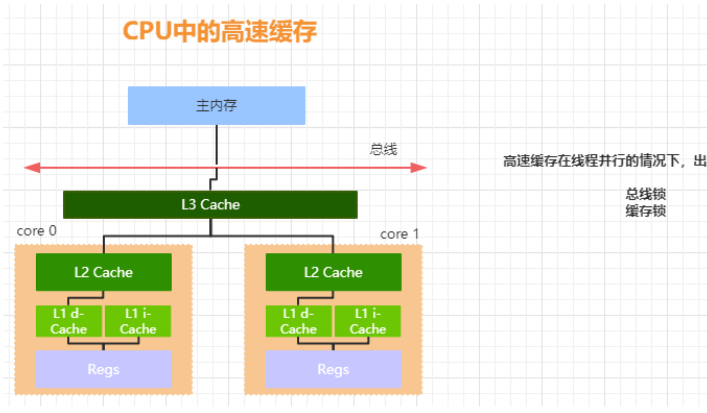

通过高速缓存的存储交互很好的解决了处理器与内存速度矛盾，但是也为计算机系统带来了更高的复杂度，因为它引入了一个新的问题，缓存一致性。

### 缓存一致性

首先，有了高速缓存的存在以后，每个CPU的处理过程是，先将计算需要用到的数据缓存在CPU高速缓存中，在CPU进行计算时，直接从高速缓存中读取数据并且在计算完成之后写入到缓存中。在整个运算过程完成后，在把缓存中的数据同步到主内存。

由于在多CPU中，每个线程可能会运行在不同的CPU内，并且每个线程拥有自己的高速缓存。同一份数据可能会被缓存到多个CPU中，如果在不同CPU中运行的不同线程看到同一份内存的缓存值不一样就会存在缓存不一致的问题。

为了解决缓存不一致的问题，在CPU层面做了很多优化，主要提供了两种解决办法：

1. 总线锁
2. 缓存锁

### 总线锁和缓存锁

总线锁，简单来说就是，在多CPU下，当其中一个处理器要对共享内存进行操作的时候，在总线上发出一个LOCK#信号，这个信号使得其他处理器无法通过总线来访问到共享内存中的数据，总线锁吧CPU和内存之间的通信锁住了，者使得锁定期间，其他处理器不能操作其他内存地址的数据，所以总线锁的开销比较大，这种机制显然不合适。

如何优化呢？最好的方法就是控制锁的保护粒度，我们只需要保证对于被多个CPU缓存的同一份数据是一致的就可以了。所以引入了**缓存锁，它的核心机制是基于缓存一致性协议来实现的。**

### 缓存一致性协议

为了达到数据访问的一致，需要各个处理器在访问缓存时遵循一些协议，在读写时根据协议来操作，常见的协议有MSI,MESI,MOSI等。最常见的就是MESI协议。接下来了解一下MESI协议。

MESI标识缓存行的四中状态，分别是：

1. M（Modify）表示共享数据只缓存在当前CPU缓存中，并且是被修改状态，也就是缓存的数据和主内存中的数据不一致。
2. E(Exclusive)表示缓存的独占状态，数据只缓存在当前CPU缓存中，并且没有被修改。
3. S(Shared)表示数据可能被多个CPU缓存，并且各个缓存中的数据和主内存数据一致。
4. I(Invalid)表示缓存已经失效。

在MESI协议中，每个缓存的缓存控制器不仅知道自己的读写操作，而且也监听（snoop）其他Cache的读写操作。

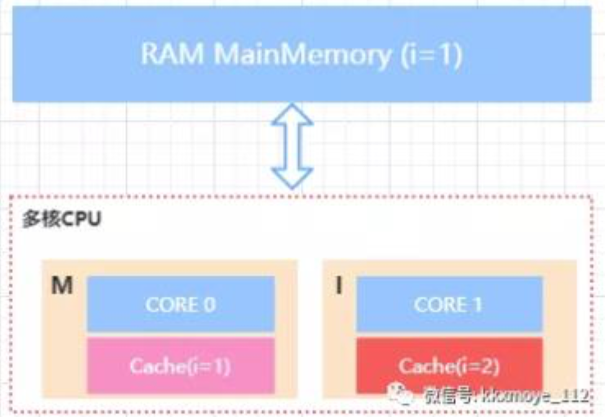


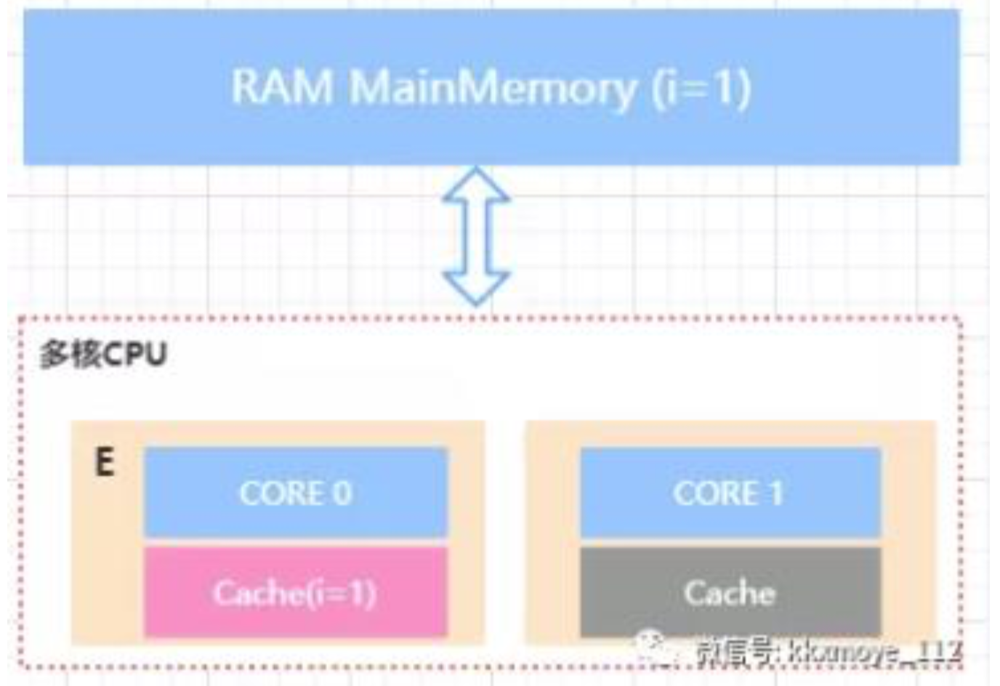

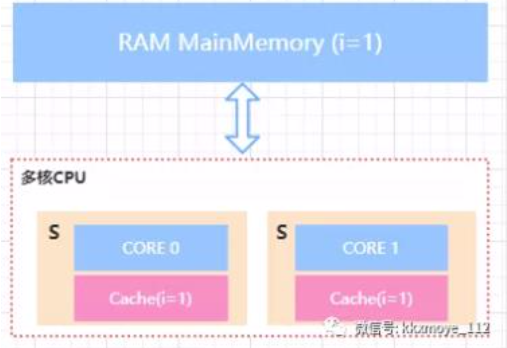

对于MESI协议，**从CPU读写角度来说会遵循以下的原则：**

- **CPU读请求：缓存处于M、E、S状态都可以被读取，I状态CPU只能从主内存中读取数据。**
- **CPU写请求：缓存处于M、E状态才可以被写。对于S状态的写，需要将其他CPU中缓存行置为无效（Invalid）才可写。**

使用总线锁和缓存锁机制之后，CPU对于内存的操作大概可以抽象成下面这样的结构。从而达到缓存一致性效果。

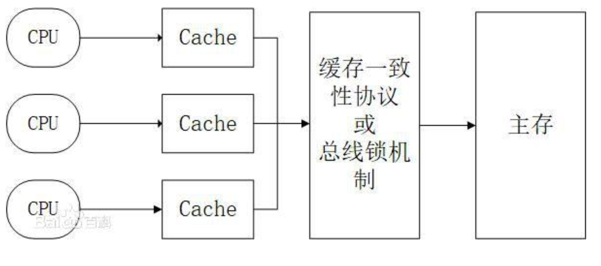

### 总体可见性的本质

由于CPU高速缓存的出现使得如果多个CPU同时缓存了相同的共享数据时，可能存在可见性问题。也就是CPU0修改了自己本地缓存的值对于CPU1不可见。不可见导致的后果是CPU1后续在对该数据进行写入操作时，是使用的脏数据。使得数据最终的结果不可预测。

这种可见性的问题很难通过代码模拟。因为我们无法让某个线程指定某个特定CPU，这是系统底层的算法，JVM应该也是没法控制的。还有最重要的一点，就是你无法预测CPU缓存什么时候会把值传给主存，可能这个时间间隔非常短，短到无法观察到。最后就是线程的执行的顺序问题，因为多线程我们无法控制那个线程的某语句代码会在另一个线程的某句代码后面马上执行。

所以我们只能基于它的原理去了解这样一个存在的客观事实。

了解到这里，大家应该会有一个疑问，刚刚不是说基于缓存一致性协议或者总线锁能够达到缓存一致性的要求吗？为什么还需要加volatile关键字？或者说为什么还会存在可见性问题呢？

### MESI优化带来的可见性问题

MESI协议虽然可以实现缓存的一致性，但是也会存在一些问题。

就是各个CPU缓存行的状态是通过消息传递来进行的。如果CPU0要对一个在缓存中共享的变量进行写入，首先需要发送一个失效的消息给其他缓存了该数据的CPU。并且要等到他们确认回执。CPU0在这段时间内都会处于阻塞状态。为了避免阻塞带来的资源浪费。在CPU中引入了Store Bufferes。

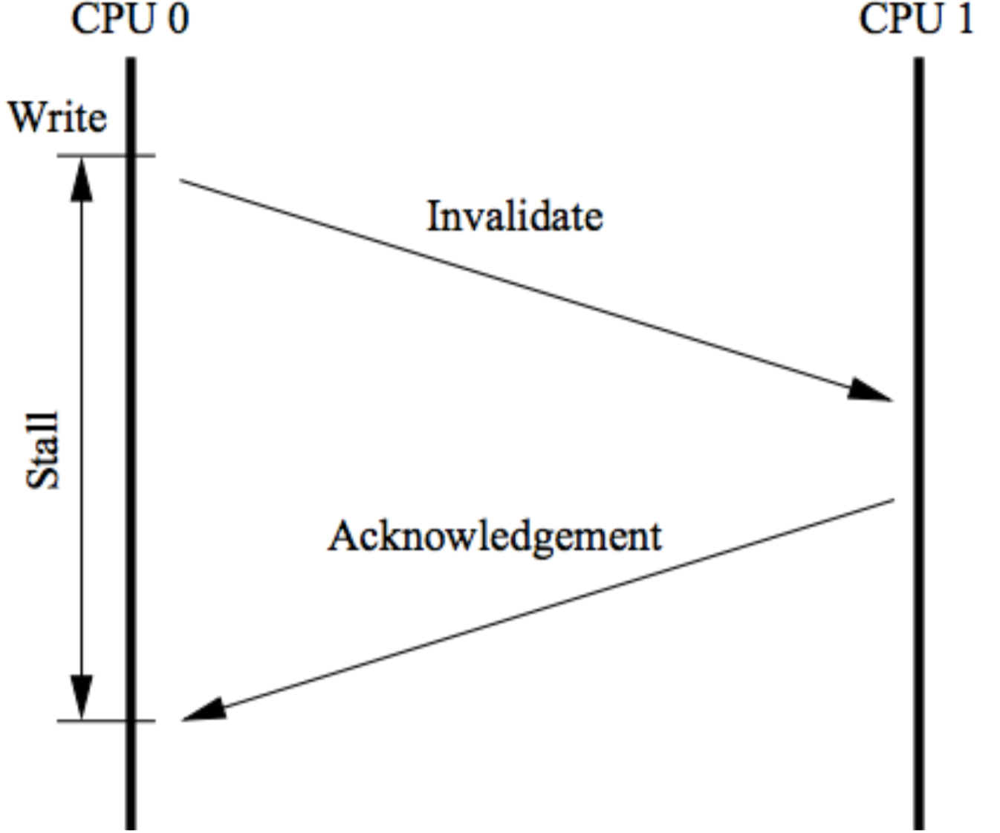

CPU0只需要在写入共享数据时，直接把数据写入到Store Bufferes中，同时发送invalidate消息，然后继续去处理其他指令。这样就中同步阻塞变成了一个异步执行。

当收到其他所有CPU发送了invalidate acknowledge消息时，再将store bufferes中的数据存储值cache line中。最后在从缓存行同步到主内存。


但是这种优化存在两个问题：

1. 数据什么时候提交是不确定的，因为需要等待其他CPU给回复才会进行数据同步。这里其实是一个异步操作。
2. 引入了StoreBufferes后，处理器会先尝试从StoreBufferes中读取值，如果StoreBufferes中有数据，则直接从StoreBufferes中读取，否则就在从缓存行中读取。


我们来看一个例子：


exeToCPU0和exeToCPU1分别在两个独立的CPU上执行。加入CPU0的缓存行中缓存了isFinish这个共享变量，并且状态为（E）、而Value可能是（S）状态。那么这个时候，CPU0在执行的时候，会先把value=10的指令写入到StoreBuffer中。并且通知给其他缓存了该value的变量的CPU。在等待其他CPU通知结果的时候，CPU0会继续执行isFinish=true这个指令。

而因为当前CPU0缓存了isFinish并且是Exclusive状态，所以可以直接修改isFinish=true。这个时候CPU1发起read操作去读取isFinish的值可能为true，但是value的值不等于10.

这种情况我们可以认为是CPU的乱序执行，也可以认为是一种重排序，而这种重排序会带来可见性的问题。

从硬件层面很难去知道软件层面上的这种前后依赖关系，所以没有办法通过某种手段自动去解决。

既然怎么优化都不符合要求，就在CPU层面提供了memory barrier（内存屏障）的指令，从硬件层面来看这个memory barrier就是CPU flush store bufferes中的指令。软件层面可以决定在适当的地方来插入内存屏障。

### CPU层面的内存屏障

什么是内存屏障？从前面的内容基本能有一个初步的猜想，内存屏障就是将store Bufferes中的指令写入到内存，从而保证其他访问同一共享内存的线程的可见性。

X86的momory barrier指令包括lfence(读屏障)、sfence(写屏障)、mefence（全屏障）

- **Store Memory Barrier（写屏障）**告诉处理器在写屏障之前的所有已经存储在储存缓存（store bufferes）中的数据同步到主内存，**简单的来说就是使得写屏障之前的指令的结果对屏障之后的读或者写是可见的。**
- **Load Memory Barrier（读没屏障）**处理器在读屏障之后的读操作，都在读屏障之后执行。配合写屏障，使得写屏障之前的内存更新对于读屏障之后的读操作是可见的。
- **Full Memory Barrier（全屏障）**确保屏障前的内存读写操作的结果提交到内存之后，再执行屏障后的读写操作。

有了内存屏障以后，对于上面这个例子，我们可以这么来该，从而避免出现可见性问题：

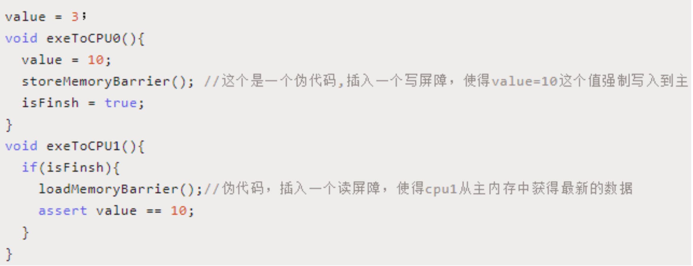

总的来说，内存屏障的作用可以通过防止CPU对内存的乱序访问来保证共享数据在多线程并行执行下的可见性但是这个屏障怎么来加呢？回到我们最开始讲volatile关键字的代码，这个关键字会生成一个Lock的汇编指令，这个指令其实就相当于实现了一种内存屏障。

这个时候问题又来了，内存屏障、重排序这些东西好像是和平台以及硬件架构相关的。作为Java语言的特性，一次编写多处运行。我们不应该考虑平台相关的问题，并且这些所谓的内存屏障也不应该让程序员来关系。


## JMM

### 什么是JMM

JMM全称是Java Memory Model。通过前面的分析发现，导致可见性问题的根本原因是缓存及重排序。而**JMM实际上就是提供了合理的禁用缓存以及重排序的方法。所以它最核心的价值在于解决可见性和有序性。**

**JMM属于语言级别的抽象内存模型，可以简单的理解为对硬件模型的抽象，它定义了共享内存中多线程程序读写操作的行为规范：在虚拟机中把共享变量存储到内存以及从内存中取出共享变量的底层实现细节。**

通过这些规则来规范对内存读写操作从而保证指令的正确性，它解决了CPU多级缓存、处理器优化、指令重排序导致的内存访问问题，保证了并发场景下的可见性。

需要注意的是，JMM并没有限制执行引擎使用处理器寄存器或者高速缓存来提升指令执行速度，也没有限制编译器对指令进行重排序，也就是说在JMM中，也会存在缓存一致性问题和指令重排序问题。只是**JMM把底层的问题抽象到JVM层面，在基于CPU层面提供的内存屏障指令，以及限制编译器的重排序来解决并发问题。**

JMM抽象模型分为主内存、工作内存。主内存是所有线程共享的，一般是实例对象、静态字段、数组对象等存储在堆内存中的变量。工作内存是每个线程独占的，线程对变量的所有操作都必须在工作内存中进行，不能直接读写主内存中的变量，线程之间的共享变量值的传递都是基于主内存来完成。

Java内存模型（JMM）底层实现可以简单的认为：通过内存屏障（memory barrier）禁止重排序，即时编译器根据具体的底层体系架构，将这些内存屏障替换成具体的CPU执行。对于编译器而言，内存屏障将限制它锁能做的重排序优化。而对于处理器而言，内存屏障将会导致缓存的刷新操作。比如，对于volatile，编译器将在volatile字段的读写操作前后各插入一些内存屏障。

### JMM如何解决顺序一致性问题

#### 重排序问题

为了提高程序的执行性能，编译器和处理器的都会对指令做重排序，其中处理器的重排序在前面已经分析过了。所谓的重排序其实就是指执行指令的顺序。

编译器的重排序指的是程序编写的指令在编译之后，指令可能会产生重排序来优化程序的执行性能。

从源代码到种种执行的指令，可能会经过三种重排序。


2和3属于处理器重排序。这些重排序可能会导致可见性问题。

编译器的重排序，JMM提供了禁止特定类型的编译器重排序。

处理器重排序，JMM会要求编译器生成指令时，会插入内存屏障来禁止处理器重排序。


当然并不是所有的程序都会出现重排序问题

编译器的重排序和CPU的重排序的原则一样，会遵守数据依赖性原则，编译器和处理器不会改变存在数据依赖关系的两个操作的执行顺序，比如线面的代码：

```
a=1; b=a;
a=1; a=2;
a=b; b=1;
```

这三种情况在单线程里面如果改变代码的执行顺序，都会导致结果不一致，所以重排序不会对这类的指令做优化。这种规则称为：**as-if-serial**。不管怎么重排序，对于单个线程来说执行结果不能改变。比如：

```
int a=2; //1
int b=3; //2
int rs=a*b; //3
```

1和3、2和3存在数据依赖，所以在最终执行的指令中，3不能重排序到1和2之前，否则程序会报错。由于1和2不存在数据依赖，所以可以重新排列1和2的顺序。

#### JMM层面的内存屏障

为了保证内存可见性，Java编译器在生成指令序列的适当位置会插入内存屏障来禁止特定类型的处理器的重排序，在JMM中把内存屏障分为四类：

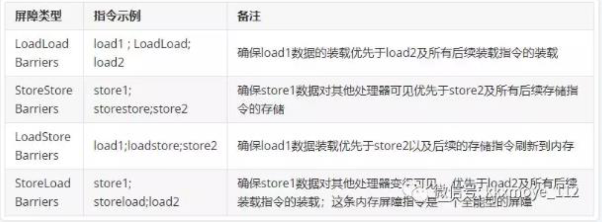

## HappenBefore

它的意思表示的是前一个操作的结果对于后续操作是课件的，所以它是一种表达多个线程之间对于内存的可见性。所以我们可以认为在JMM中，如果一个操作执行的结果需要对另一个操作可见，呢么这两个操作必须要存在happens-before关系。这两个操作可以是同一个线程，也可以是不同的线程。

### JMM中又哪些方法建立happen-before规则

#### 程序顺序规则

1. 一个线程中每个操作，happens-before于该线程中的任意后续操作。可以简单认为是as-if-serial。单个线程中的代码顺序不管怎么变，对于结果来说是不变的。顺序规则表示：1 happens-before 2； 3 happens-before 4;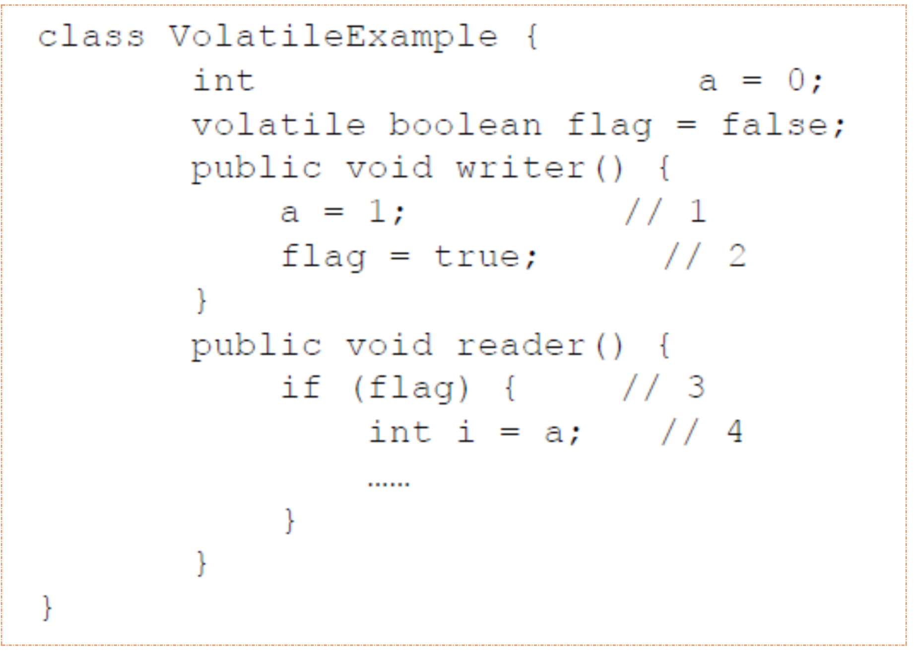
2. volatile变量规则，对于volatile修饰的变量的写操作，一定happens-before后续对于volatile的读操作；根据volatile规则，2 happens-before 3 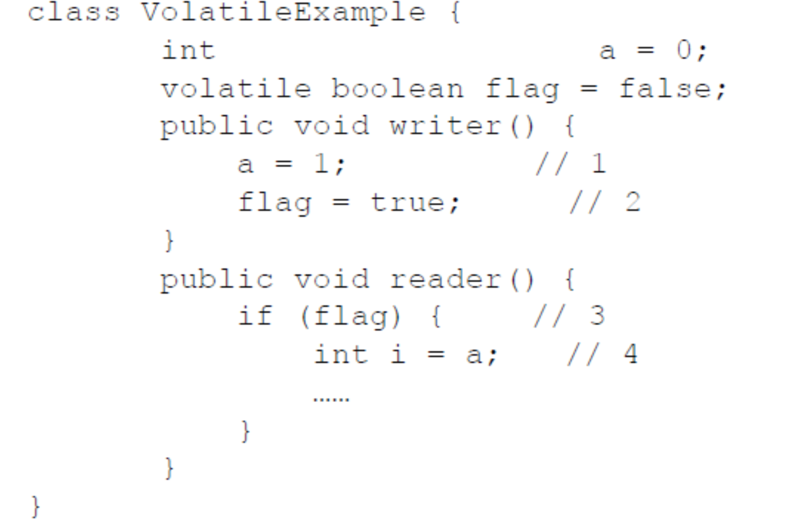
3. 传递性规则，如果 1 happens-before 2； 3 happens-before 4; 那么传递性规则标识：1 happens-before 4; 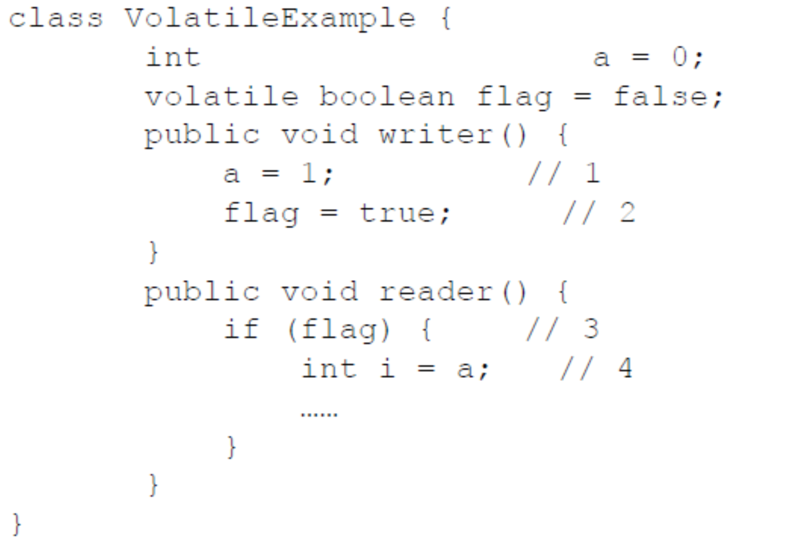
4. start规则，如果线程A执行操作ThreadB.start(),那么线程A的ThreadB.start()操作happens-before线程B中的任意操作。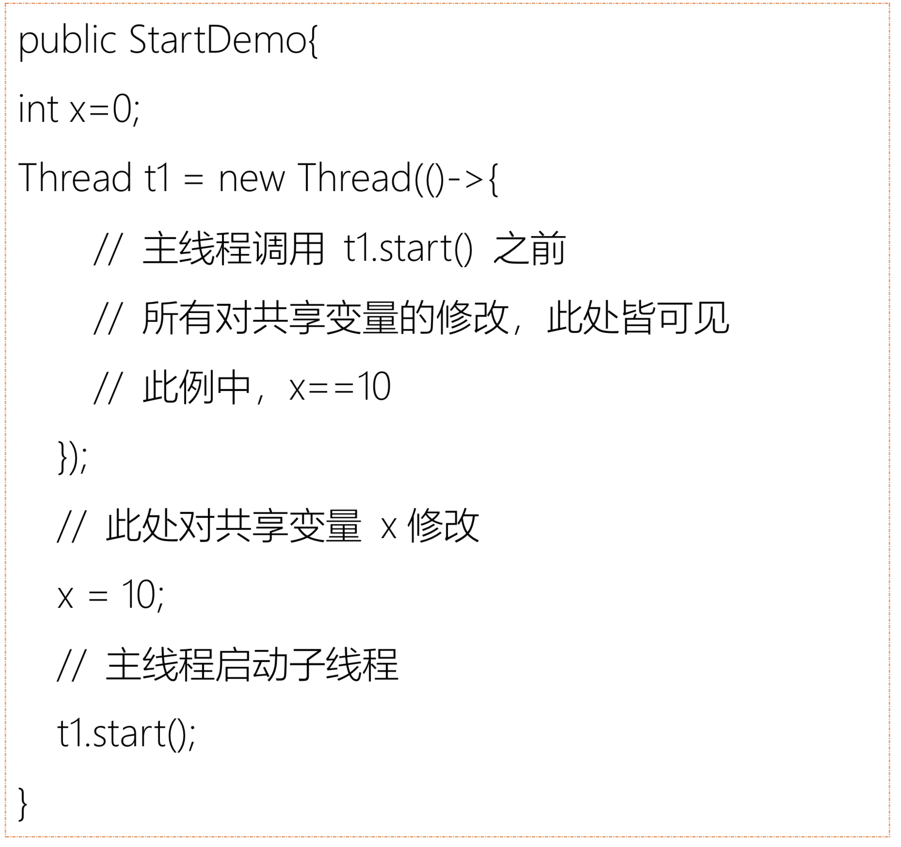
5. join规则，如果线程A执行操作ThreadB.join()并成功返回，那么线程B中的任意操作happens-before于线程A从ThreadB.join()操作成功返回。
6. 监视器锁的规则，对于一个锁的解锁，happens-before于随后对这个锁的加锁。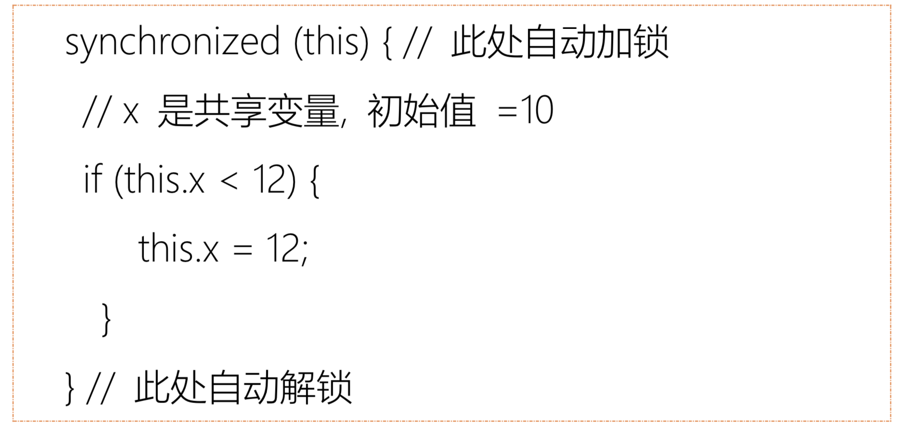假设x的初始值是10，线程A执行完代码后x的值会变成12（执行完自动释放锁），线程B进入代码块时，能够看到线程A对x的写操作，也就是线程B能够看到x=12.


