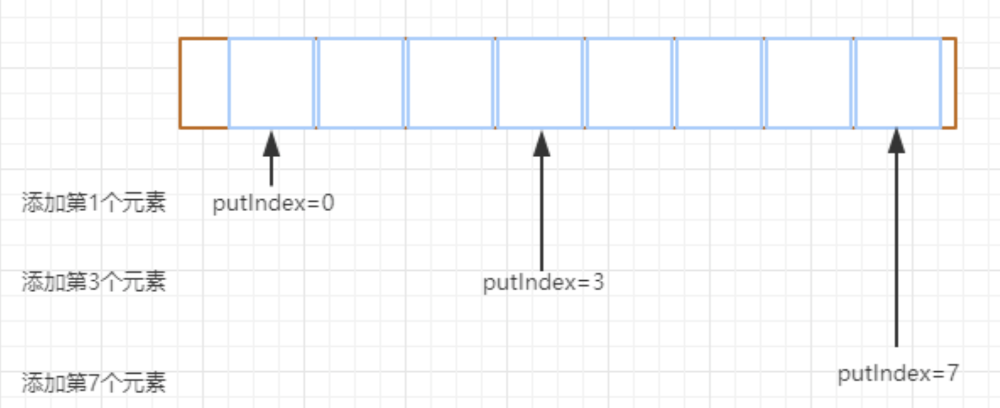
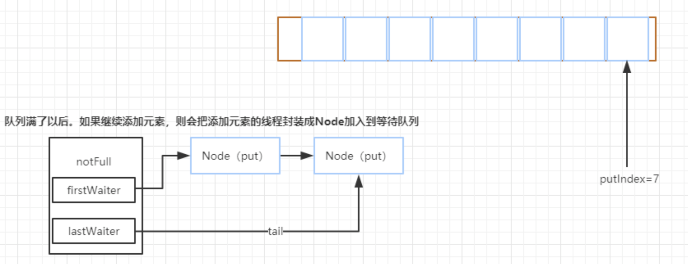
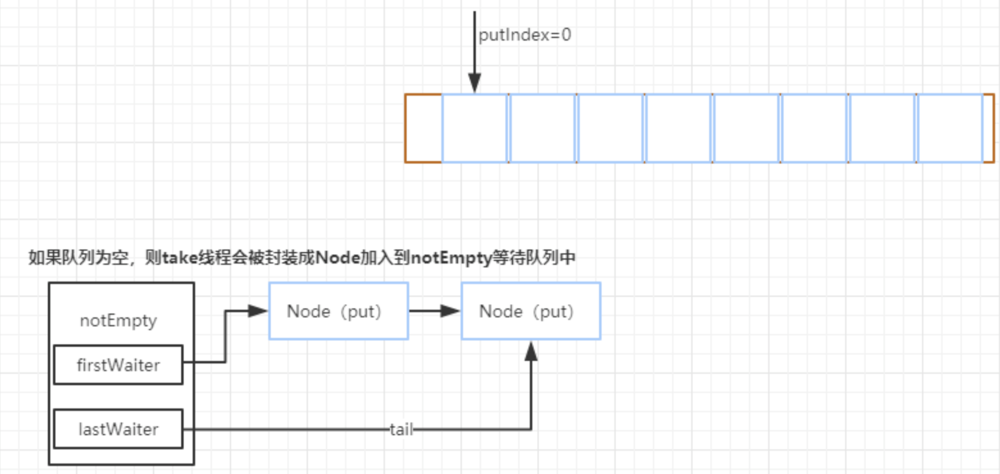
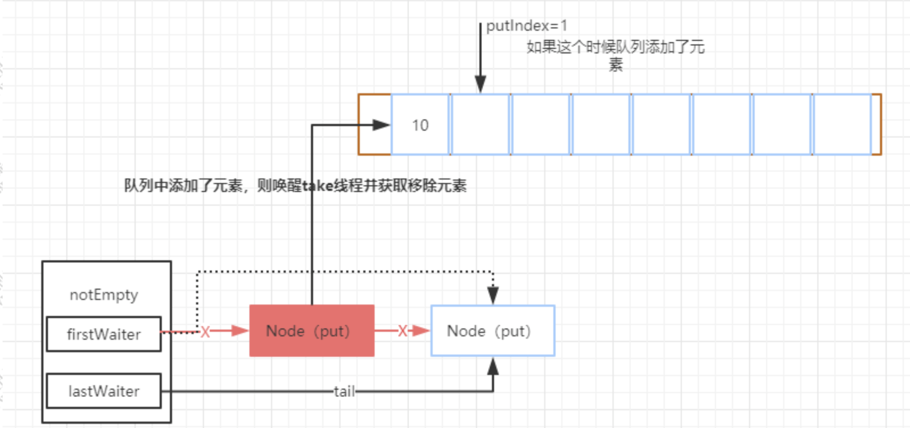
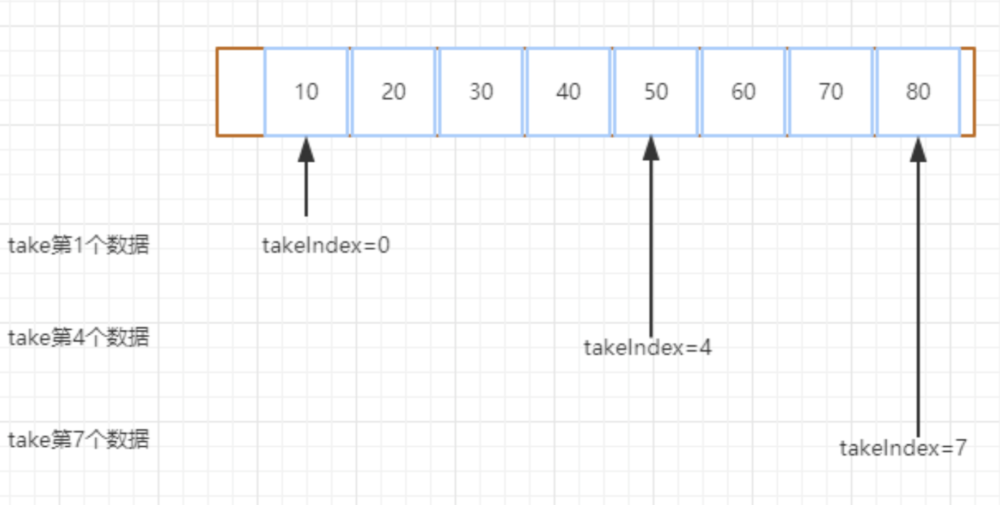

# 阻塞队列、原子操作的原理分析

## 生产者消费者的实际使用

相信大家都有使用过分布式消息队列，比如ActiveMQ、kafka、RabbitMQ等等，消息队列是可以使得程序之间实现解耦，提升程序响应的效率。

如果我们把多线程环境比作是分布式的话，那么线程于线程之间是不是也可以使用这种消息队列的方式进行数据通信和解耦呢？

## 阻塞队列的使用案例

### **注册成功后增加积分**

加入我们模拟一个场景，就是用户注册的时候，在注册成功以后发放积分。这个场景在一般来说，我们会这么去实现


但是实际上，我们需要考虑两个问题：

1. 性能，在注册这个环境里面，假如添加用户需要花费1秒钟，增加积分需要花费1秒钟，那么整个注册结果返回就可能需要大于2秒，虽然影响不是很大，但是在量比较大时候，我们需要做有些优化。
2. 耦合，添加用户和增加积分，可以认为是两个领域，也就是说增加积分并不是注册必须要具备的功能，但是一旦增加积分这个逻辑出现异常，就会导致注册失败。这种耦合在程序设计的时候一定要规避的。

因此我们可以通过异步的方式来实现。

### **改造前的代码逻辑：**

```java
package juc;

public class UserService {
    public boolean register() {
        User user = new User();
        user.setName("wenbin");
        addUser(user);
        sendPoints(user);

        return true;
    }

    private void addUser(User user) {
        System.out.println("添加用户：" + user);
        try {
            Thread.sleep(1000);
        } catch (InterruptedException e) {
            e.printStackTrace();
        }
    }

    private void sendPoints(User user) {
        System.out.println("发送积分给指定用户：" + user);

        try {
            Thread.sleep(1000);
        } catch (InterruptedException e) {
            e.printStackTrace();
        }
    }

    public static void main(String[] args) {
        UserService userService = new UserService();
        userService.register();
        System.out.println("注册完成");
    }
}
```

### 改造之后的逻辑：

```java
public class UserService2 {
    private final ExecutorService single = Executors.newSingleThreadExecutor();
    ArrayBlockingQueue<User> arrayBlockingQueue = new ArrayBlockingQueue(10);
    private volatile boolean isRunning = true;

    {
        init();
    }


    private void init() {
        single.execute(() -> {
            while (isRunning) {
                try {
                    // 阻塞的方式获取队列中的数据
                    User user = arrayBlockingQueue.take();
                    System.out.println("获取到添加积分任务：" + user);
                    sendPoints(user);
                } catch (InterruptedException e) {
                    e.printStackTrace();
                }
            }
        });
    }

    public boolean register() {
        User user = new User();
        user.setName("wenbin");
        addUser(user);
        // 添加到异步队列
        arrayBlockingQueue.add(user);

        return true;
    }

    private void addUser(User user) {
        System.out.println("添加用户：" + user);
        try {
            Thread.sleep(1000);
        } catch (InterruptedException e) {
            e.printStackTrace();
        }
    }

    private void sendPoints(User user) {
        System.out.println("发送积分给指定用户：" + user);

        try {
            Thread.sleep(1000);
        } catch (InterruptedException e) {
            e.printStackTrace();
        }
    }

    public static void main(String[] args) {
        UserService2 userService = new UserService2();
        userService.register();
        System.out.println("注册完成");
    }
}
```

优化以后，整个流程就变成了这样


在这个案例中，我们使用了 ArrayBlockingQueue 基于数组的阻塞队列，来优化代码的执行逻辑。 

### 阻塞队列的应用场景

阻塞队列这块的应用场景，比较多仍然是对于生产者消费这场景的应用，但是由于分布式架构的普及，是的大家更多的关注在分布式消息队列上。所以其实如果把阻塞队列比作成分布式消息队列的话，那么所谓的生产者和消费者其实就是基于阻塞队列的解耦。

另外，**阻塞队列是一个FIFO的队列，所以对于希望在线程级别需要实现对目标服务的顺序访问的场景中，也可以使用。**

## J.U.C中的阻塞队列

### J.U.C提供的阻塞队列

在Java8中，提供了7个阻塞队列：

| 名称                  | 解释                                                         |
| --------------------- | ------------------------------------------------------------ |
| ArrayBlockingQueue    | 数组实现的有界阻塞队列，此队列按照先进先出（FIFO）的原则对元素进行排序。 |
| LinkedBlockingQueue   | 链表实现的有界阻塞队列，此队列的默认和最大长度为Integer.MAX_VALUE。此队列按照先进先出的原则对元素进行排序 |
| PriorityBlockingQueue | 支持优先级排序的无界阻塞队列，默认情况下元素采取自然顺序升序排列。也可以自定义类试想compareTo()方法来执行元素排序规则，或者初始化PriorityBolckingQueue时，执行构造参数Comparator来对元素进行排序。 |
| DelayQueue            | 优先级队列实现的误解阻塞队列                                 |
| SynchronousQueue      | 不存储元素的阻塞队列，每一个put操作必须等待一个take操作，否则不能继续添加元素。 |
| LinkedTransferQueue   | 链表实现的无界阻塞队列                                       |
| LinkedBlockingDeque   | 链表实现的双向阻塞队列                                       |

### 阻塞队列的操作方法

在阻塞队列中，提供了四种处理方式：

1. 插入操作：
   - add(e)：添加元素到队列中，如果队列满了，继续插入元素会报错，IllegalStateException。
   - offer(e)：添加元素到队列，同时会返回元素是否插入成功的状态，如果成功则返回true。
   - put(e)：当阻塞队列满了以后，生产者继续通过put添加元素，队列会一致阻塞生产者线程，直到队列可用。
   - offer(e,time,unit)：当阻塞队列满了以后继续添加元素，生产者线程会被阻塞指定时间，如果超时，则线程直接退出。
2. 移除操作
   - remove()：当队列为空时，调用remove会返回false，如果元素移除成功，则返回true。
   - poll()：当队列中存在元素，则从队列中取出一个元素，如果队列为空，则直接返回null。
   - take()：基于阻塞方法的方式获取队列中的元素，如果队列为空，则take方法会一直阻塞，直到队列中有新的数据可以消费。
   - poll(time,unit)：带超时机制的获取数据，如果队列为空，则会等待指定的事件在去获取元素返回。

## ArrayBlockingQueue原理分析

### 构造方法

ArrayBlockingQueue提供了三个构造方法，分别如下：

capacity：表示数组的长度，也就是队列的长度。

fair：表示是否为公平的阻塞队列，默认情况下构造的是非公平的阻塞队列。

其中第三个构造方法就不解释了，它提供了接收一个或几个作为数据初始化的方法。

```java
public ArrayBlockingQueue(int capacity) {
    this(capacity, false);
}

public ArrayBlockingQueue(int capacity, boolean fair) {
    if (capacity <= 0)
        throw new IllegalArgumentException();
    this.items = new Object[capacity];
    // 重入锁，出队和入队持有这一把锁
    lock = new ReentrantLock(fair);
    // 初始化非空等待队列
    notEmpty = lock.newCondition();
    // 初始化非满等待队列
    notFull =  lock.newCondition();
}

public ArrayBlockingQueue(int capacity, boolean fair,
                          Collection<? extends E> c) {
    this(capacity, fair);

    final ReentrantLock lock = this.lock;
    lock.lock(); // Lock only for visibility, not mutual exclusion
    try {
        int i = 0;
        try {
            for (E e : c) {
                checkNotNull(e);
                items[i++] = e;
            }
        } catch (ArrayIndexOutOfBoundsException ex) {
            throw new IllegalArgumentException();
        }
        count = i;
        putIndex = (i == capacity) ? 0 : i;
    } finally {
        lock.unlock();
    }
}
```

items构造以后，大概是一个这样的数组结构：


### Add方法

以add方法作为入口，在add方法中会调用父类的add方法，也就是AbstractQueue如果看源码看的比较多的话，一般这种写法都是调用父类的末班方法来解决通用性问题

```java
public boolean add(E e) {
    return super.add(e);
}
```

从父类的add方法可以看到，这里做了一个队列是否满了的判断，如果队列满了直接抛出一个异常：

```java
public boolean add(E e) {
    if (offer(e))
        return true;
    else
        throw new IllegalStateException("Queue full");
}
```

#### offer方法

add方法最终还是调用offer方法来添加数据，返回一个添加成功或者失败的布尔值反馈。

```java
public boolean offer(E e) {
    checkNotNull(e);
    final ReentrantLock lock = this.lock;
    lock.lock();
    try {
        if (count == items.length)
            return false;
        else {
            enqueue(e);
            return true;
        }
    } finally {
        lock.unlock();
    }
}
```

这段代码做了几个事情：

1. 判断添加的数据是否为空
2. 添加重入锁
3. 判断队列长度，如果队列长度等于数组长度，表示满了直接返回false
4. 否则，直接调用enqueue将元素添加到队列中


#### enqueue

这个是最核心的逻辑，方法内部通过putIndex索引直接将元素添加到数组items。

```java
private void enqueue(E x) {
    // assert lock.getHoldCount() == 1;
    // assert items[putIndex] == null;
    final Object[] items = this.items;
    // 通过putIndex对数据赋值
    items[putIndex] = x;
    if (++putIndex == items.length)
        // 当putIndex等于数组长度时，将putIndex重置为0
        putIndex = 0;
    // 记录队列元素的个数
    count++;
    // 唤醒处于等待状态下的线程，表示当前队列中的元素不为空，如果存在消费者线程阻塞，就可以开始取出元素
    notEmpty.signal();
}
```

putIndex为什么会在等于数据长度的时候重新设置为0？

因为ArrayBlockingQueue是一个FIFO的队列，队列添加元素时，是从队尾获取putIndex来存储元素，当putIndex等于数组长度时，下次就需要从数组头部开始添加了。下面这个图模拟了添加到不同长度的元素时，putIndex的变化，当putIndex等于数组长度时，不可能让putIndex继续累加，否则会超出数组初始化容量大小。同时大家还需要思考两个问题：

1. 当元素满了以后是无法继续添加的，因为会报错。
2. 其次，队列中的元素肯定会有一个消费者线程通过take或者其他方法来获取数据，而获取数据的同时元素也会从队列中移除。



### put方法

put方法和add方法功能一样，差异是put方法如果队列满了，会阻塞。这个在最开始的时候说过。接下来看一下它的实现逻辑:

```java
public void put(E e) throws InterruptedException {
    checkNotNull(e);
    final ReentrantLock lock = this.lock;
    // 这个也是获得锁，但是和lock的区别是，这个方法优先允许等待时由其他线程调用等待线程的interrupt方法来中断等待直接返回。而lock方法是尝试获得锁成功后才响应中断。
    lock.lockInterruptibly();
    try {
        while (count == items.length)
            //队列满了的情况下，当前线程将会被 notFull 条件对象挂起加到等待队列中
            notFull.await();
        enqueue(e);
    } finally {
        lock.unlock();
    }
}
```




### take方法

take方法是一种阻塞获取队列中元素的方法它的实现原理很简单，有就删除没有就阻塞，注意这个阻塞是可以中断，如果队列没有数据那么就加入notEmpty条件队列等待（有数据就直接取走，方法结束），如果有新的put线程添加了数据，那么put操作将会唤醒take线程，执行take操作。

```java
public E take() throws InterruptedException {
    final ReentrantLock lock = this.lock;
    lock.lockInterruptibly();
    try {
        while (count == 0)
            //如果队列为空的情况下，直接通过 await 方法阻塞
            notEmpty.await();
        return dequeue();
    } finally {
        lock.unlock();
    }
}
```



如果队列中添加了元素，那么这个时候，会在enqueue中调用notEmpty.signal唤醒take线程来获得元素。



#### dequeue方法

这个是出队列的方法，主要是删除队列头部的元素并发返回给客户端。

takeIndex，是用来记录拿数据的索引值 。

```java
private E dequeue() {
    // assert lock.getHoldCount() == 1;
    // assert items[takeIndex] != null;
    final Object[] items = this.items;
    @SuppressWarnings("unchecked")
    // 默认获取0位置的元素
    E x = (E) items[takeIndex];
    // 将该位置的元素设置为空
    items[takeIndex] = null;
    // 这里的作用也是一样，如果拿到数组的最大值，那么重置为0，继续从头部位置开始获取数据
    if (++takeIndex == items.length)
        takeIndex = 0;
    count--;// 记录元素个数递减
    if (itrs != null)
        // 同时更新迭代器中的元素数据
        itrs.elementDequeued();
    // 触发因为队列满了以后导致的被阻塞的线程。
    notFull.signal();
    return x;
}
```

#### itrs.elementDequeued();

ArrayBlockingQueue中，实现了迭代器的功能，也就是可以通过迭代器来遍历阻塞队列中的元素。所以itrs.elementDequeued();是用来更新迭代器中的元素数据的。

takeIndex的索引表图如下，同时随着数据的移除，会唤醒处于put阻塞状态下的线程来继续添加数据。



### remove方法

remove方法是移除一个执行元素。看看它的实现代码：

```java
public boolean remove(Object o) {
    if (o == null) return false;
    // 获取数组元素
    final Object[] items = this.items;
    final ReentrantLock lock = this.lock;
    // 获得锁
    lock.lock();
    try {
        //如果队列不为空
        if (count > 0) {
            //获取下一个要添加元素时的索引
            final int putIndex = this.putIndex;
            // 获取当前要被移除的元素索引
            int i = takeIndex;
            do {
                // 从takeIndex下标开始，找到要被删除的元素
                if (o.equals(items[i])) {
                    // 移除指定元素
                    removeAt(i);
                    // 返回执行结果
                    return true;
                }
                // 当前删除索引执行加1后判断是否与数组长度相等，若为true，说明索引已到尽头，将i这只为0
                if (++i == items.length)
                    i = 0;
            } while (i != putIndex);//继续查找，直到找到最后一个元素
        }
        return false;
    } finally {
        lock.unlock();
    }
}
```

## 原子操作类

原子性这个概念，在多线程编程里是一个老生常谈的问题。所谓的原子性表示一个或者多个操作，要么全部执行完，要么一个也不执行。不能出现成功一部分失败一部分的情况。

在多线程中，如果多个线程同时更新一个共享变量，可能会得到一个意料之外的值。比如i=1。A线程更新i+1、B线程也更新i+1。

通过两个线程并行操作之后可能i的值不等于3.而可能等于2。因为A和B在更新变量i的时候拿到的i可能都是1这就是一个典型的原子性问题。

从前面的总结了解到，多线程里面，要实现原子性，有几种方法，其中一种就是加synchronized同步锁。

而从JDK1.5开始，在J.U.C包中提供了Atomic包，提供了对于常用数据结构的原子操作。它提供了简单、高效、以及线程安全的更新一个变量的方式。

### J.U.C中的原子操作类

由于变量类型的关系，在J.U.C中提供了12个原子操作的类。这12个类可以分为四大类：

1. 原子更新基本类型：AtomicBoolean、AtomicInteger、AtomicLong
2. 原子更新数组：AtomicReference、AtomicReferenceFieldUpdater、AtomicMarkableReference（更新带有标记位的引用类型）
3. 原子更新字段：AtomicIntegerFieldUpdater、AtomicLongFieldUpdater、AotmicStampedReference

#### getAndIncrement

getAndIncrement实际上是调用unsafe这个类里面提供的方法。

unsafe类我们前面在分析AQS的时候讲过，这个类相当于是一个后门，使得Java可以像C语言的指针一样直接操作内存空间。当然也会带来一些弊端，就是指针问题。实际上这个类在很多方面都有使用，除了J.U.C这个包以外，还有Netty、kafka等等。

这个类提供了很多功能，包括多线程同步（monitorEnter）、CAS操作（compareAndSwap）、线程的挂起和恢复（park/unpark）、内存屏障（loadFence/storeFence）、内存管理（内存分配、释放内存、获取内存地址） 等。

```java
public final int getAndIncrement() {
    return unsafe.getAndAddInt(this, valueOffset, 1);
}
```

valueOffset，也比较熟了。通过unsafe.objectFieldOffset()获取当前Value这个变量在内存中的偏移量，后续会基于这个偏移量从内存中得到value的值来和当前的值做比较，实现乐观锁。

```java
private static final long valueOffset;

static {
    try {
        valueOffset = unsafe.objectFieldOffset
            (AtomicInteger.class.getDeclaredField("value"));
    } catch (Exception ex) { throw new Error(ex); }
}
```

#### getAndAddInt

```java
public final int getAndAddInt(Object var1, long var2, int var4) {
    int var5;
    do {
        var5 = this.getIntVolatile(var1, var2);
    } while(!this.compareAndSwapInt(var1, var2, var5, var5 + var4));

    return var5;
}
```

通过do/while循环，基于CAS乐观锁来做原子递增。实际上前面的valueOffset的作用就是从主内存中获得当前value的值和预期值做一个比较，如果相等，对value做递增并结束循环。

#### get方法

get方法只需要直接返回value的值就行，这里的value是通过Volatile修饰的，用来保证可见性。

```java
public final int get() {
    return value;
}
```

#### 其他方法

AtomicInteger的实现非常简单，所以我们可以很快就分析完它的实现原理，淡然处理刚刚分析的两个方法之外还有其他的一些。

比如他提供了comparreAndset，允许客户端基于AtomicInteger来实现乐观锁操作：

```java
public final boolean compareAndSet(int expect, int update) {
    return unsafe.compareAndSwapInt(this, valueOffset, expect, update);
}
```