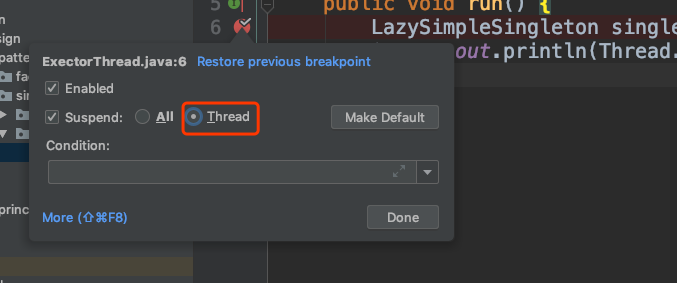
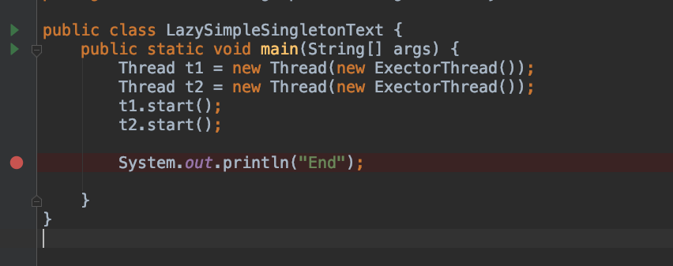
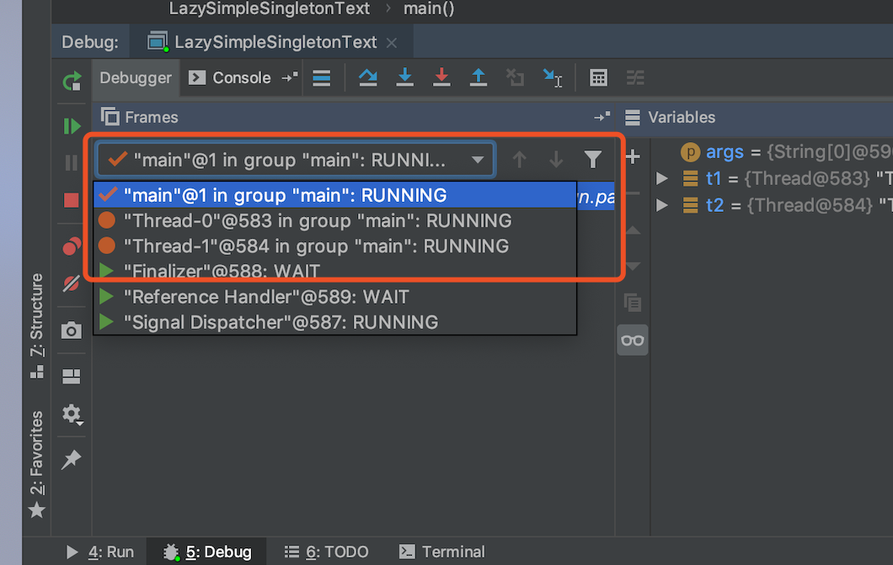
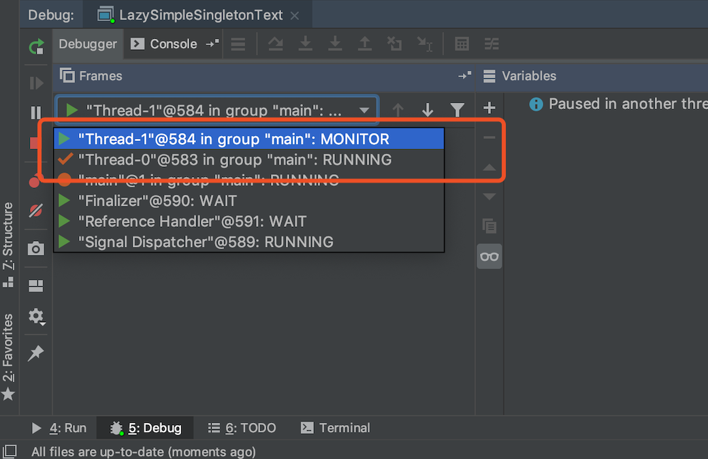

# 单例模式

## 单例模式的应用场景

​	**单例模式（Singleton Pattern）是指确保一个类在任何情况下都绝对只有一个实例，并提供一个全局的访问点。单例模式是创建型模式。**单例模式是非常经典的高频面试题，通过对单例模式的深入研究与理解可以很好的彰显技术深度。在J2EE标准中，ServletContext、ServletContextConfig等。在Spring框架中ApplicationContext等；数据库连接池也都是单例形式。

## 饿汉式单例

​	**饿汉式单例是在类加载的时候就立即初始化，并且创建单例对象。绝对线程安全，在线程还没出现以前就实例化了，不可能存在访问安全问题。**

**优点：没有加任何锁、执行效率比较高，在用户体验上来说，比懒汉式更好。**

**缺点：类加载的时候就初始化，不管用不用都占着空间，浪费了内存，有可能占着茅坑不拉屎。**

Spring中IOC容器ApplicationContext本身就是典型的饿汉式单例。

接下来看一段代码：

```java
public class HungrySingleton {
    
    private static final HungrySingleton hungrySingleton = new HungrySingleton();

    private HungrySingleton() {}

    public static HungrySingleton getInstance() {
        return hungrySingleton;
    }
}
```

还有另外一种写法，利用静态代码块机制：

```java
public class HungryStaticSingleton {
    private static final HungryStaticSingleton hungryStaticSingleton;

    static {
        hungryStaticSingleton = new HungryStaticSingleton();
    }

    private HungryStaticSingleton() { }

    public HungryStaticSingleton getInstance() {
        return hungryStaticSingleton;
    }
}
```

​	两种写法都非常简单，也非常好理解，**饿汉式适用在单例对象较少的情况。**

## 懒汉式单例

​	**懒汉式单例的特点是：被外部类调用的时候内部类才会加载**，下面看懒汉式单例的简单实现LazySimpleSingleton:

```java
package com.wenbin.design.pattern.singleton.lazy;

/**
 * 懒汉式单例
 * 在外部需要时候的时候才进行实例化
 */
public class LazySimpleSingleton {
    private LazySimpleSingleton() { }

    // 静态块，公共内存区域
    private static LazySimpleSingleton lazySimpleSingleton = null;

    public static LazySimpleSingleton getInstance() {
        if (lazySimpleSingleton == null) {
            lazySimpleSingleton = new LazySimpleSingleton();
        }

        return lazySimpleSingleton;
    }
}
```

​	然后写一个线程类ExetorThread类：

```java
package com.wenbin.design.pattern.singleton.lazy;

public class ExectorThread implements Runnable {

    public void run() {
        LazySimpleSingleton singleton = LazySimpleSingleton.getInstance();
        System.out.println(Thread.currentThread().getName() + ":" + singleton);
    }
}
```

客户端测试代码：

```java
package com.wenbin.design.pattern.singleton.lazy;

public class LazySimpleSingletonText {
    public static void main(String[] args) {
        Thread t1 = new Thread(new ExectorThread());
        Thread t2 = new Thread(new ExectorThread());
        t1.start();
        t2.start();

        System.out.println("End");
    }
}
```

运行结果：

```verilog
End
Thread-1:com.wenbin.design.pattern.singleton.lazy.LazySimpleSingleton@49cd2725
Thread-0:com.wenbin.design.pattern.singleton.lazy.LazySimpleSingleton@2b2be35b

Process finished with exit code 0
```

### 线程安全隐患

一定几率出现创建两个不同结果的情况，意味着上面的单例存在线程安全隐患。现在我们调用运行在具体看一下，用线程模式调试，手动控制线程的执行顺序来跟踪内存变化状态。先给ExectorThread类打上断点：


右键点击断点，切换为Thread模式，如下图：



然后给LazySimpleSingleton类打上断点，同样标记为Thread模式：


客户端测试代码，同样也打上断点，同事改为Thread模式，如下图：



开始debug之后，会看到debug控制台可以自由切换Thread的运行状态：



​	通过不断的切换线程，并观测其内存状态，我们发现在线程环境下LazySimpleSingleton被实例化了两次。有时，我们得到的运行结果可能是相同的两个对象，实际上是被后面执行的线程给覆盖了，我们看到了一个假象，线程安全隐患依旧存在。那么，我们如何来优化代码，使得懒汉式单例在线程环境下安全呢？

### Synchronized同步锁

来看下面的代码，给getInstance()加上Synchronized关键字，使这个方法编程同步方法：

```java
public class LazySimpleSingleton {
    private LazySimpleSingleton() { }

    // 静态块，公共内存区域
    private static LazySimpleSingleton lazySimpleSingleton = null;

    public synchronized static LazySimpleSingleton getInstance() {
        if (lazySimpleSingleton == null) {
            lazySimpleSingleton = new LazySimpleSingleton();
        }

        return lazySimpleSingleton;
    }
}
```

这时候，我们在来调试。当我们将其中一个线程执行并调用getInstance()方法时，另一个线程在调用getInstance()方法，线程的状态由RUNNING变成了MONITOR，出现阻塞。直到第一个线程执行完，第二个线程才回复RUNNING状态继续调用getInstance()方法，如下图：



完美的展现了synchronized监视锁的运行状态，线程安全问题便解决了。但是，用synchronized加锁，在线程数量比较多的情况下，如果CPU分配压力上升，会到时大批量线程出现阻塞，从而导致程序运行性能大幅下降。那么有没有一种更好的方式，既兼顾线程安全又提升程序性能呢？答案是肯定的。

### 双重检查锁

我们来看双重检查锁的单例模式：

```java
package com.wenbin.design.pattern.singleton.lazy;

public class LazyDoubleCheckSingleton {
    private volatile static LazyDoubleCheckSingleton lazyDoubleCheckSingleton;

    private LazyDoubleCheckSingleton() { }

    public static LazyDoubleCheckSingleton getInstance() {
        if (lazyDoubleCheckSingleton == null) {
            synchronized (LazyDoubleCheckSingleton.class) {
                if (lazyDoubleCheckSingleton == null) {
                    lazyDoubleCheckSingleton = new LazyDoubleCheckSingleton();
                }
            }
        }

        return lazyDoubleCheckSingleton;
    }
}
```

​	当第一个线程调用getInstance()方法时，第二个线程也可以调用getInstance()方法。当第一个线程执行到synchronized时会上锁，第二个线程就会变成MONITOR状态，出现阻塞。此时，阻塞并不是基于真个LazyDoubleCheckSingleton类的阻塞，而是在getInstance()方法内部阻塞，只要逻辑不是太复杂，对于调用者而言感知不到。但是，用到synchronized关键字，总归是要上锁，对于程序性能还是存在一定的影响。难道就真的没有更好的方案吗？当然是有的。

### 静态内部类

​	我们可以从类初始化角度来考虑，看下面代码，采用静态内部类的方式：

```java
package com.wenbin.design.pattern.singleton.lazy;

/**
 * 这种形式兼顾饿汉式的内存浪费，也兼顾synchronized性能问题
 * 完美的屏蔽了两个的缺点
 */
public class LazyInnerClassSingleton {
    // 默认使用LazyInnerClassSingleton的时候，会先初始化内部类
    // 如果没有使用的话，内部类是不加载的
    private LazyInnerClassSingleton(){}

    // 每一个关键字都不是多余的
    // static关键字是为了使单例的空间共享
    // final 保证这个方法不会被重写，重载
    public static final LazyInnerClassSingleton getInstance() {
        // 在返回结果以前，一定会先加载内部类
        return LazyHolder.lazy;
    }
    
    // 默认不加载
    private static class LazyHolder{
        private static final LazyInnerClassSingleton lazy = new LazyInnerClassSingleton();
    }
}
```

​	这种形式兼顾饿汉式的内存浪费，也兼顾synchronized性能问题。内部类一定是要在方法调用之前初始化，巧妙的避免了线程安全问题。

## 破坏单例

### 	反射破坏单例

​	上面介绍的单例模式的构造方法除了加上private以外，没有做任何处理。如果我们使用反射来调用其构造方法，然后，在调用getInstance()方法，应该就可以实例化两个不同的实例。现在来看一段测试代码，以LazyInnerClassSingleton为例：

```java
package com.wenbin.design.pattern.singleton.lazy;

import java.lang.reflect.Constructor;
import java.lang.reflect.InvocationTargetException;

public class LazyInnerClassSingletonTest {
    public static void main(String[] args) throws IllegalAccessException, InvocationTargetException, InstantiationException, NoSuchMethodException {
        // 很无聊的情况下，进行破坏。一般没人吃饱撑的。如果有那一定是工作不饱和。
        Class<?> clazz = LazyInnerClassSingleton.class;
        // 通过反射拿到私有的构造方法
        Constructor constructor = clazz.getDeclaredConstructor(null);
        // 强制访问，强吻，不愿意也要吻
        constructor.setAccessible(true);
        // 暴力初始化
        Object o1 = constructor.newInstance();
        // 调用两次构造方法，相当于new了两次
        Object o2 = constructor.newInstance();

        System.out.println(o1 instanceof LazyInnerClassSingleton);
        System.out.println(o2 instanceof LazyInnerClassSingleton);
        System.out.println(o1 == o2);
    }
}
```

运行结果如下：

```verilog
true
true
false
```

​	根据上面的运行结果，很显然是创建了两个不同的实例。现在，我们在其构造方法中做一些限制，一旦出现多次重复创建，则直接抛出异常。优化后的代码：

```java
package com.wenbin.design.pattern.singleton.lazy;

// 终极版单例
public class LazyUitimateSingleton {
    // 默认使用LazyInnerClassSingleton的时候，会先初始化内部类
    // 如果没有使用的话，内部类是不加载的
    private LazyUitimateSingleton(){
        if (LazyHolder.lazy != null) {
            throw new RuntimeException("不允许创建多个实例");
        }
    }

    // 每一个关键字都不是多余的
    // static关键字是为了使单例的空间共享
    // final 保证这个方法不会被重写，重载
    public static final LazyUitimateSingleton getInstance() {
        // 在返回结果以前，一定会先加载内部类
        return LazyUitimateSingleton.LazyHolder.lazy;
    }

    // 默认不加载
    private static class LazyHolder{
        private static final LazyUitimateSingleton lazy = new LazyUitimateSingleton();
    }
}
```

测试代码：

```java
package com.wenbin.design.pattern.singleton.lazy;

import java.lang.reflect.Constructor;
import java.lang.reflect.InvocationTargetException;

public class LazyUitimateSingletonTest {
    public static void main(String[] args) throws IllegalAccessException, InvocationTargetException, InstantiationException, NoSuchMethodException {
        // 很无聊的情况下，进行破坏。一般没人吃饱撑的。如果有那一定是工作不饱和。
        Class<?> clazz = LazyUitimateSingleton.class;
        // 通过反射拿到私有的构造方法
        Constructor constructor = clazz.getDeclaredConstructor(null);
        // 强制访问，强吻，不愿意也要吻
        constructor.setAccessible(true);
        // 暴力初始化
        Object o1 = constructor.newInstance();
        // 调用两次构造方法，相当于new了两次
        Object o2 = constructor.newInstance();

        System.out.println(o1 instanceof LazyUitimateSingleton);
        System.out.println(o2 instanceof LazyUitimateSingleton);
        System.out.println(o1 == o2);
    }
}
```

运行结果：


终极版单例完成。

### 序列化破坏单例

​	当我们将一个单例对象创建好，有时候需要将对象序列化然后写入到磁盘，下次使用时再从磁盘中读取到对象，反序列化转化为内存对象。反序列化后的对象会重新分配内存，即重新创建。那如果序列化的目标对象为单例对象，就违背了单例模式的初衷，相当于破坏了单例，来看一段代码：

```java
package com.wenbin.design.pattern.singleton.seriable;

import java.io.Serializable;

/**
 * 反序列化导致单例破坏
 */
public class SeriableSingleton implements Serializable {
    /**
     * 序列化就是说把内存中的状态通过转换成字节码的形式
     * 从而转换一个IO流。写入到其他地方（可以是磁盘、网络IO）
     * 内存中状态给永久保存下来了
     */

    /**
     * 反序列化
     * 讲已经持久化的字节码内容，转换为IO流
     * 通过IO流的读取，进而讲读取的内容转换为JAVA对象
     * 在转换的过程中会重新创建对象
     */
    public final static SeriableSingleton INSTANCE = new SeriableSingleton();

    private SeriableSingleton() { }

    public static SeriableSingleton getInstance() {
        return INSTANCE;
    }
}
```

测试代码：

```java
package com.wenbin.design.pattern.singleton.seriable;

import java.io.FileInputStream;
import java.io.FileOutputStream;
import java.io.ObjectInputStream;
import java.io.ObjectOutputStream;

public class SeriableSingletonTest {
    public static void main(String[] args) {
        SeriableSingleton s1 = null;

        SeriableSingleton s2 = SeriableSingleton.getInstance();

        FileOutputStream fos = null;

        try {
            fos = new FileOutputStream("SeriableSingleton.obj");
            ObjectOutputStream oos = new ObjectOutputStream(fos);
            oos.writeObject(s2);
            oos.flush();
            oos.close();


            FileInputStream fis = new FileInputStream("SeriableSingleton.obj");
            ObjectInputStream ois = new ObjectInputStream(fis);
            s1 = (SeriableSingleton) ois.readObject();
            ois.close();

            System.out.println(s1);
            System.out.println(s2);
            System.out.println(s1 == s2);

        } catch (Exception e) {
            e.printStackTrace();
        }
    }
}
```

运行结果：

```
com.wenbin.design.pattern.singleton.seriable.SeriableSingleton@5b480cf9
com.wenbin.design.pattern.singleton.seriable.SeriableSingleton@5e481248
false

Process finished with exit code 0
```

​	运行结果中，可以看出，反序列化后的对象和手动创建的对象是不一致的，实例化了两次，违背了单例的设计初衷。那么，我们如何保证序列化的情况下也能实现单例？其实很简单，只需要增加readResolve方法即可。来看代码：

```java
package com.wenbin.design.pattern.singleton.seriable;

import java.io.Serializable;

/**
 * 反序列化导致单例破坏
 */
public class SeriableSingleton implements Serializable {
    /**
     * 序列化就是说把内存中的状态通过转换成字节码的形式
     * 从而转换一个IO流。写入到其他地方（可以是磁盘、网络IO）
     * 内存中状态给永久保存下来了
     */

    /**
     * 反序列化
     * 讲已经持久化的字节码内容，转换为IO流
     * 通过IO流的读取，进而讲读取的内容转换为JAVA对象
     * 在转换的过程中会重新创建对象
     */
    public final static SeriableSingleton INSTANCE = new SeriableSingleton();

    private SeriableSingleton() { }

    public static SeriableSingleton getInstance() {
        return INSTANCE;
    }

    private Object readResolve() {
        return INSTANCE;
    }
}
```

在看运行结果：

```java
com.wenbin.design.pattern.singleton.seriable.SeriableSingleton@5e481248
com.wenbin.design.pattern.singleton.seriable.SeriableSingleton@5e481248
true

Process finished with exit code 0
```

​	这是什么原因呢？为什么要这样写？看上去很神奇的样子，也让人有些费解。不如，我们一起来看看JDK的源码实现。我们进入ObjectInputStream类的readObject()方法，代码如下：

```java
    public final Object readObject()
        throws IOException, ClassNotFoundException
    {
        if (enableOverride) {
            return readObjectOverride();
        }

        // if nested read, passHandle contains handle of enclosing object
        int outerHandle = passHandle;
        try {
            Object obj = readObject0(false);
            handles.markDependency(outerHandle, passHandle);
            ClassNotFoundException ex = handles.lookupException(passHandle);
            if (ex != null) {
                throw ex;
            }
            if (depth == 0) {
                vlist.doCallbacks();
            }
            return obj;
        } finally {
            passHandle = outerHandle;
            if (closed && depth == 0) {
                clear();
            }
        }
    }	
```

我们发现在readObject中又调用了我们重写的readObject0()方法。进入readObject()方法，代码如下：

```java
private Object readObject0(boolean unshared) throws IOException { 
  ...
  case TC_OBJECT:
  return checkResolve(readOrdinaryObject(unshared));
  ...                                                         
}
 
```

我们看到 TC_OBJECTD 中判断，调用了 ObjectInputStream 的 readOrdinaryObject() 方法，我们继续进入看源码:

```java
private Object readOrdinaryObject(boolean unshared)
        throws IOException
    {
        if (bin.readByte() != TC_OBJECT) {
            throw new InternalError();
        }

        ObjectStreamClass desc = readClassDesc(false);
        desc.checkDeserialize();

        Class<?> cl = desc.forClass();
        if (cl == String.class || cl == Class.class
                || cl == ObjectStreamClass.class) {
            throw new InvalidClassException("invalid class descriptor");
        }

        Object obj;
        try {
            obj = desc.isInstantiable() ? desc.newInstance() : null;
        } catch (Exception ex) {
            throw (IOException) new InvalidClassException(
                desc.forClass().getName(),
                "unable to create instance").initCause(ex);
        }

        passHandle = handles.assign(unshared ? unsharedMarker : obj);
        ClassNotFoundException resolveEx = desc.getResolveException();
        if (resolveEx != null) {
            handles.markException(passHandle, resolveEx);
        }

        if (desc.isExternalizable()) {
            readExternalData((Externalizable) obj, desc);
        } else {
            readSerialData(obj, desc);
        }

        handles.finish(passHandle);

        if (obj != null &&
            handles.lookupException(passHandle) == null &&
            desc.hasReadResolveMethod())
        {
            Object rep = desc.invokeReadResolve(obj);
            if (unshared && rep.getClass().isArray()) {
                rep = cloneArray(rep);
            }
            if (rep != obj) {
                handles.setObject(passHandle, obj = rep);
            }
        }

        return obj;
    }
```

发现调用了ObjectStreamClass的isInstantiable()方法，而isInstanitable()里面的代码如下：

```java
boolean isInstantiable() {
    requireInitialized();
    return (cons != null);
}
```

就是判断一下构造方法是否为空，构造方法不为空就返回true。意味着，只要有无参构造方法就会实例化。

这时候，其实还没找到为什么加上readResolve()方法就避免了单例被破坏的原因。我们回到ObjectInputStream的readOrdinaryObject()方法继续往下看：

```java
private Object readOrdinaryObject(boolean unshared)
    throws IOException
{
    if (bin.readByte() != TC_OBJECT) {
        throw new InternalError();
    }

    ObjectStreamClass desc = readClassDesc(false);
    desc.checkDeserialize();

    Class<?> cl = desc.forClass();
    if (cl == String.class || cl == Class.class
            || cl == ObjectStreamClass.class) {
        throw new InvalidClassException("invalid class descriptor");
    }

    Object obj;
    try {
        obj = desc.isInstantiable() ? desc.newInstance() : null;
    } catch (Exception ex) {
        throw (IOException) new InvalidClassException(
            desc.forClass().getName(),
            "unable to create instance").initCause(ex);
    }

    passHandle = handles.assign(unshared ? unsharedMarker : obj);
    ClassNotFoundException resolveEx = desc.getResolveException();
    if (resolveEx != null) {
        handles.markException(passHandle, resolveEx);
    }

    if (desc.isExternalizable()) {
        readExternalData((Externalizable) obj, desc);
    } else {
        readSerialData(obj, desc);
    }

    handles.finish(passHandle);

    if (obj != null &&
        handles.lookupException(passHandle) == null &&
        desc.hasReadResolveMethod())
    {
        Object rep = desc.invokeReadResolve(obj);
        if (unshared && rep.getClass().isArray()) {
            rep = cloneArray(rep);
        }
        if (rep != obj) {
            handles.setObject(passHandle, obj = rep);
        }
    }

    return obj;
}
```

判断无参构造方法是否存在之后，又调用了 hasReadResolveMethod()方法，来看代码:

```java
boolean hasReadResolveMethod() {
    requireInitialized();
    return (readResolveMethod != null);
}
```

逻辑非常简单，就是判断 readResolveMethod 是否为空，不为空就返回 true。那么 readResolveMethod 是在哪里赋值的呢?通过全局查找找到了赋值代码在私有方法 ObjectStreamClass()方法中给 readResolveMethod 进行赋值，来看代码:

```java
readResolveMethod = getInheritableMethod(
    cl, "readResolve", null, Object.class);
```

上面的逻辑其实就是通过反射找到一个无参的 readResolve()方法，并且保存下来。现在 再 回 到 ObjectInputStream 的 readOrdinaryObject() 方 法 继 续 往 下 看 ， 如 果 readResolve()存在则调用 invokeReadResolve()方法，来看代码:

```java
Object invokeReadResolve(Object obj)
    throws IOException, UnsupportedOperationException
{
    requireInitialized();
    if (readResolveMethod != null) {
        try {
            return readResolveMethod.invoke(obj, (Object[]) null);
        } catch (InvocationTargetException ex) {
            Throwable th = ex.getTargetException();
            if (th instanceof ObjectStreamException) {
                throw (ObjectStreamException) th;
            } else {
                throwMiscException(th);
                throw new InternalError(th);  // never reached
            }
        } catch (IllegalAccessException ex) {
            // should not occur, as access checks have been suppressed
            throw new InternalError(ex);
        }
    } else {
        throw new UnsupportedOperationException();
    }
}
```

我们可以看到在 invokeReadResolve()方法中用反射调用了 readResolveMethod 方法。 通过 JDK 源码分析我们可以看出，虽然，增加 readResolve()方法返回实例，解决了单例被破坏的问题。但是，我们通过分析源码以及调试，我们可以看到实际上实例化了两 次，只不过新创建的对象没有被返回而已。那如果，创建对象的动作发生频率增大，就意味着内存分配开销也就随之增大，难道真的就没办法从根本上解决问题吗?下面我们来注册式单例也许能帮助到你。


## 注册式单例

​	**注册式单例又称为登记式单例，就是将每一个实例都登记到某一个地方，使用唯一的标识获取实例。注册式单例有两种写法：一种为容器缓存，一种为枚举登记。**

### 枚举式单例

先来看枚举式单例的写法，来看代码,创建EnumSingleton:

```java
package com.wenbin.design.pattern.singleton.register;

public enum EnumSingleton {
    INSTANCE;

    private Object data;

    public Object getData() {
        return data;
    }

    public void setData(Object data) {
        this.data = data;
    }

    public static EnumSingleton getInstance() {
        return INSTANCE;
    }
}
```

测试代码:

```java
package com.wenbin.design.pattern.singleton.register;

import java.io.FileInputStream;
import java.io.FileOutputStream;
import java.io.ObjectInputStream;
import java.io.ObjectOutputStream;

public class EnumSingletonTest {
    public static void main(String[] args) throws Exception {
        EnumSingleton instance1 = null;

        EnumSingleton instance2 = EnumSingleton.getInstance();
        instance2.setData(new Object());

        FileOutputStream fos = new FileOutputStream("EnumSingleton.obj");
        ObjectOutputStream oos = new ObjectOutputStream(fos);
        oos.writeObject(instance2);
        oos.flush();
        oos.close();

        FileInputStream fis = new FileInputStream("EnumSingleton.obj");
        ObjectInputStream ois = new ObjectInputStream(fis);
        instance1 = (EnumSingleton) ois.readObject();
        ois.close();

        System.out.println(instance1.getData());
        System.out.println(instance2.getData());
        System.out.println(instance1.getData() == instance2.getData());

    }
}
```

运行结果：

```
java.lang.Object@6f496d9f
java.lang.Object@6f496d9f
true

Process finished with exit code 0
```

​	没有做任何处理，我们发现运行结果和我们预期的一样。那么枚举单例如此神奇，它的神秘之处在哪里体现呢？下面我们通过分析源码来揭开它的神秘面纱。 下载一个非常好用的 Java 反编译工具 Jad(下载地址:https://varaneckas.com/jad/)， 解压后配置好环境变量(这里不做详细介绍)，就可以使用命令行调用了。找到工程所在的 class 目录，如下图:


​	原来，**枚举式单例在静态代码块中就给INSTANCE进行了赋值，是饿汉式单例的实现。**

​	我们还可以试想，序列化能否破坏枚举式单例呢？看一下JDK源码，还是回到ObjectInputStream的readObject0()方法：

```java
case TC_ENUM:
    return checkResolve(readEnum(unshared));
```

我们看到在 readObject0()中调用了 readEnum()方法，来看 readEnum()中代码实现:

```java
private Enum<?> readEnum(boolean unshared) throws IOException {
    if (bin.readByte() != TC_ENUM) {
        throw new InternalError();
    }

    ObjectStreamClass desc = readClassDesc(false);
    if (!desc.isEnum()) {
        throw new InvalidClassException("non-enum class: " + desc);
    }

    int enumHandle = handles.assign(unshared ? unsharedMarker : null);
    ClassNotFoundException resolveEx = desc.getResolveException();
    if (resolveEx != null) {
        handles.markException(enumHandle, resolveEx);
    }

    String name = readString(false);
    Enum<?> result = null;
    Class<?> cl = desc.forClass();
    if (cl != null) {
        try {
            @SuppressWarnings("unchecked")
            Enum<?> en = Enum.valueOf((Class)cl, name);
            result = en;
        } catch (IllegalArgumentException ex) {
            throw (IOException) new InvalidObjectException(
                "enum constant " + name + " does not exist in " +
                cl).initCause(ex);
        }
        if (!unshared) {
            handles.setObject(enumHandle, result);
        }
    }

    handles.finish(enumHandle);
    passHandle = enumHandle;
    return result;
}
```

我们发现枚举类型其实通过类名和 Class 对象类找到一个唯一的枚举对象。因此，枚举对 象不可能被类加载器加载多次。

那么反射能否破坏枚举呢？从反编译文件中看到枚举只有一个构造函数：


测试代码：

```java
public class EnumSingletonTest1 {
    public static void main(String[] args) {
        try {
            Class clazz = EnumSingleton.class;
            Constructor c = clazz.getDeclaredConstructor();
            c.setAccessible(true);
            EnumSingleton enumSingleton = (EnumSingleton) c.newInstance("wenbin", 666);
        } catch (Exception e) {
            e.printStackTrace();
        }
    }
}
```

执行结果：


Cannot reflectively create enum objects，不能 用反射来创建枚举类型。还是习惯性地想来看看 JDK 源码，进入 Constructor 的 newInstance()方法:

```java
public T newInstance(Object ... initargs)
    throws InstantiationException, IllegalAccessException,
           IllegalArgumentException, InvocationTargetException
{
    if (!override) {
        if (!Reflection.quickCheckMemberAccess(clazz, modifiers)) {
            Class<?> caller = Reflection.getCallerClass();
            checkAccess(caller, clazz, null, modifiers);
        }
    }
    if ((clazz.getModifiers() & Modifier.ENUM) != 0)
        throw new IllegalArgumentException("Cannot reflectively create enum objects");
    ConstructorAccessor ca = constructorAccessor;   // read volatile
    if (ca == null) {
        ca = acquireConstructorAccessor();
    }
    @SuppressWarnings("unchecked")
    T inst = (T) ca.newInstance(initargs);
    return inst;
}
```

在 newInstance()方法中做了强制性的判断，如果修饰符是 Modifier.ENUM 枚举类型，直接抛出异常。到这为止，我们是不是已经非常清晰明了呢?枚举式单例也是《Effective Java》书中推荐的一种单例实现写法。**在 JDK 枚举的语法特殊性，以及反射也为枚举保驾护航，让枚举式单例成为一种比较优雅的实现。**

### 容器缓存式单例

​	注册式单例还有另一种写法，容器缓存的写法，创建 ContainerSingleton 类:

```java
package com.wenbin.design.pattern.singleton.register;

import java.util.Map;
import java.util.concurrent.ConcurrentHashMap;

public class ContainerSingleton {
    private ContainerSingleton() { }

    private static Map<String, Object> ioc = new ConcurrentHashMap<String, Object>();

    public static Object getBean(String className) {
        synchronized (ioc) {
            if (!ioc.containsKey(className)) {
                Object obj = null;

                try {
                    obj = Class.forName(className).newInstance();
                    ioc.put(className, obj);
                } catch (Exception e) {
                    e.printStackTrace();
                }
                return obj;
            } else {
                return ioc.get(className);
            }
        }
    }
}
```

**容器式写法适用于创建实例非常多的情况，便于管理。但是，是非线程安全的。**到此， 注册式单例介绍完毕。

## 单例小结

​	单例模式可以保证内存里只有一个实例，减少了内存开销;可以避免对资源的多重占用。 单例模式看起来非常简单，实现起来其实也非常简单。但是在面试中却是一个高频面试题。对单例模式有非常深刻的掌握，在面试中彰显技术 深度，提升核心竞争力，给面试加分，顺利拿到 Offer。